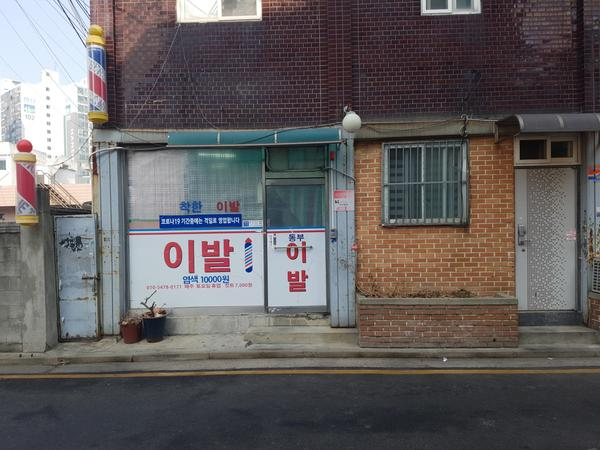

# 동부이발 - 긴 세월의 전통 방식 동네 이발소

본가 갈 때면, 머리 길이를 보고, 이발할 때가 됐다고 생각하면 가면 동부이발.

택시 차고지 옆 건물 1층 조그맣게 위치하고 있다.

여기를 이용한지는 5년 정도 된다.

최초 이용 시기는 1985년 장안동으로 이사왔을 때다.

그 때 주인과 지금은 다르다.

지금이 훨씬 낫다.  이건 그 때는 학생이고, 지금은 성인이라는 차이때문일 수도 있겠다.

장평초, 동대부중, 동대부고 학생일 때까지 그냥 집에서 가장 가깝다는 이유로 여기를 이용했었다.

그 때 위치는 여기가 아닌, 100m 옆이었다.

그러다, 대학생이 되면서 교내에 있는 구내이발소를 이용했었다.

그 당시 커트 이발 요금은 3,000원이었던 것 같다.

사회 생활을 시작하면서부터는 블루클럽을 이용했다.

블루클럽의 워낙에 장단점이 명확해서 싫어하는 사람도 많다.

장점은 신속.

5분만에 이발 완료.

단점은 균일하지 않은 결과물.

미용학원을 나온 견습생의 첫 장소가 블루클럽이라는 소문 때문인지, 요구사항과 결과물이 같을 거라는 기대를 해서는 안된다.

그렇게 이발을 하다가, 어느날 다시 눈에 들어온 동부이발.

전통 스타일 그대로다.

바리깡으로 하지 않고, 일일으로 손으로 가위질을 한다.

샥샥한 하는 가위 소리는 바리깡의 모터소리와는 결 자체가 다르다.

커트 7,000원

면도 2,000원

나의 이발 루틴은

1\. 내 차례에 의자 착석

2\. 흰 천이 목에 걸쳐진다

3\. 이발 크림이 머리에 묻혀진다.

4\. 10여분의 가위 소리

5\. 면도 크림을 젓는 소리가 들린다

6\. 귀와 목덜미쪽은 면도날로 다듬어진다

7\. 흰 천이 제거되고, 의자는 160도로 젖혀진다.

8\. 물 끓는 소리가 들리고, 다시 면도 크림 젓는 소리가 들린다.

9\. 따뜻한 물 수건으로 입 주위를 덮어 모공을 넓힌다.

10\. 5분간 면도칼로 콧수염, 턱수염, 구렛나룻이 제거된다.

11\. 코털가위로 코털이 제거된다.

12\. 의자는 100도로 원위치되고, 목 앞의 수건도 제거된다.

13\. 세면대 앞에 착석한다.

13\. 물 튀는 것 방지 앞치마가 입혀지고, 고개를 쭉 빼서 숙인다.

14\. 머리가 감겨진다.

15\. 머리 감기가 끝나고, 수도꼭지에 물이 나오고, 수건이 옆자리에 놓인다.

16\. 세수하고 수건으로 얼굴을 닦고, 다시 이발 자리에 앉는다.

17\. 이발사가 로션을 내 앞에 기울인다.

18\. 손을 내밀어 한 방을 받아, 얼굴에 바른다.

19\. 드라이와 빗으로 머리가 말려지고, 가르마도 잡아준다.

20\. "수고하셨습니다"라는 인사와 함께 일어난다.

면도포함 9,000원이지만, 이 정도 서비스를 9,000원만 받는 것이 미안하여 만원 한장을 드리고, "감사합니다"라는 인사를 하고 나선다.

이발사님 건강히 오래 이발소를 운영하셨으면 좋겠다.

