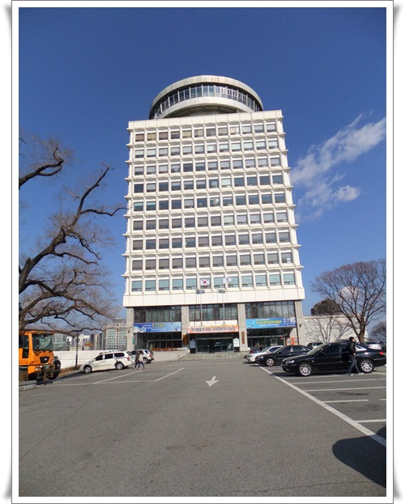
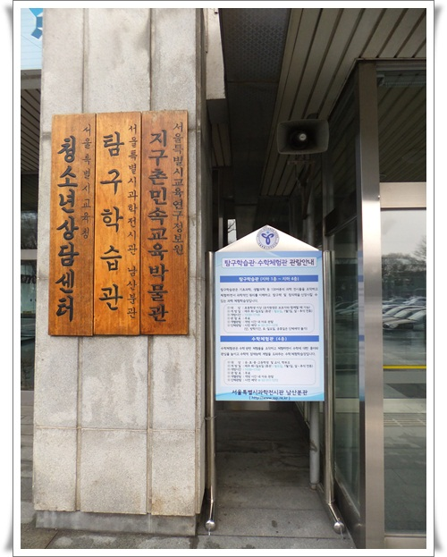
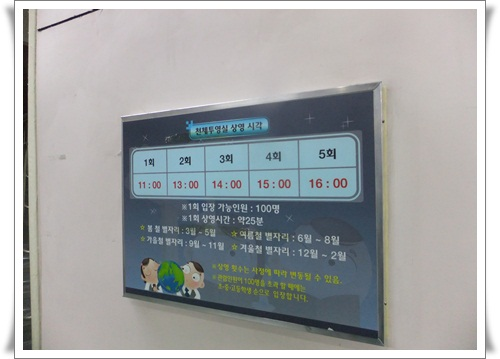
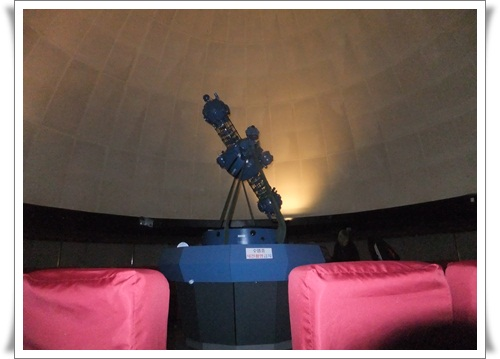
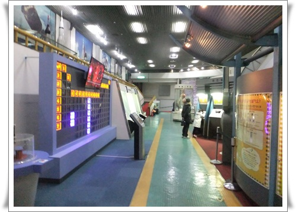
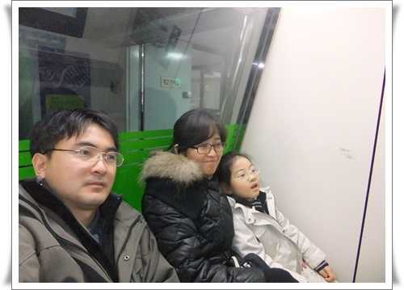

# 남산에 있는 탐구학습관

명동으로 출근한지 어언 2년.

동네 탐험은 어느 정도 마친 상태.

서울시교육정보연구원에 있는 탐구학습관이 딸내미에게 괜찮다 싶어 휴일 탐구학습관으로 갔다.

\- 남산 초입에 있는 서울시교육정보연구원 건물.

\- 이건물 지하에 있는 탐구학습관.

입장할 때 어느 학교에 왔는지 작성하고 들어간다.

딸내미의 유치원 이름을 쓰고 들어갔다.

꽤 크다.

과천에 있는 과학관보다는 많이 떨어지긴 하지만, 이곳의 장점은 아주 한적하다는 것.

그리고 전시되어 있는 초등학교 교과서에 있는 그대로라는 것.

요즘 교과서와는 좀 차이 있을지 모르겠지만, 오래전 학생시절 교과서에 보던 삽화 그대로 기구들이 전시되어 있어 나름 향수도 불러 일으킨다.

\- 이번엔 천체투영실에 들어갔다.

\- 한 40석정도 되고, 상영시간 25분.

의자는 180도로 접혀져 누운 상태로 밤 하늘을 보게 된다.

아주 괜찮았다.

\- 여기저기 많이 전시되어 있다.

\- 해양생물에 관한 영상을 틀어주는 부스에서 함 가족 사진 한 장.

