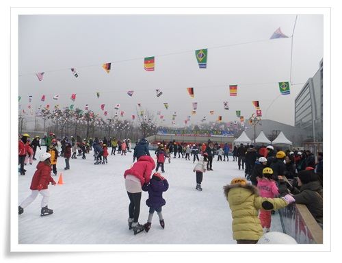

# 성남시청 스케이트장

올해도 딸내미와 함께 스케이트장에 갔다.

성남시청 주차장에 마련된 스케이트장.

이번엔 딸내미 친구와 그 아빠들도 같이 모였다.

다들 성남,용인 거주자라 장소는 성남시청.

스케이트화를 반납않고 훔쳐가는 사람들이 많은지, 도난에 대한 경고 문구도 적혀 있더군.

\- 아이스스케이트장

가뜩이나 추운 겨울답게 빙질은 그럭저럭 괜찮았다.

아쉬운 점은 운영 요원들.

단기 알바생을 모집했기에 그러하겠지만, 그래도 너무 성의가 없거나 예의가 없다.

\- 어느듯 스케이트 3년차인 딸내미.

\- 링크장 중앙에서 연습중인 아빠들과 아이들.

\- 아이들의 집중력은 그리 오래 가지 않았다.

타기 시작한지 채 20분여분만에 링크장을 빠져나간 아이들.

\- 스케이트장 온 기념으로 사진도 찍는 것으로 마무리.

