# 춘천 신포리 얼음낚시

작년에 얼음낚시 갔던 멤버들이 다시 뭉쳤다.

1월 12일 춘천 신포리로 향했다.

집에서 출발한 시각 6시 20분.

신포리 근방의 신포중학교를 목적지로 찍으니, 네비는 2시반 걸린다고 알려준다.

제법 걸리는군.

토요일 아침 경춘고속도로는 차가 많았다.

강촌IC에서 빠져나와 국도로 들어섰다.

아침을 안 먹고 출발했기에 아침을 먹으로 길가에 있던 기사식당에 들어갔다.

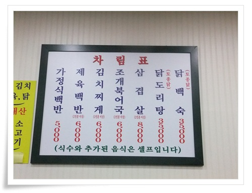

\- 기사식당에 시킨 메뉴는 제육백반.

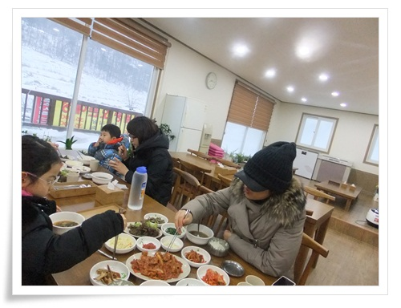

\- 옆테이블 시후네 식구까지하여 두식구 아침 먹는 중.

생긴지 얼마 안된 식당인지 깨끗하고 아주 괜찮게 나왔다.

식당 상호를 찍어두겠다고 생각했었는데 까먹어 식당 이름을 모르겠다.

여xx 기사식당이었는데,,..

작년에는 시에서 지역축체로 지원을 해서 현수막도 있고 했는데, 올해는 그런 지원이 없어졌는지 아무런 안내표시도 없었다.

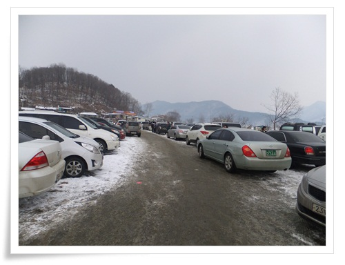

\- 주차장도 작년보다 면적이 줄어 그다지 많은 않은 여행객임에도 주차자리는 비좁았다.

불편한 점은 화장실로 이동식 화장실로 남자1칸, 여자1칸 총 2개뿐.

게다가 문도 안잠기면서 지저분한 점이 애로사항이었다.

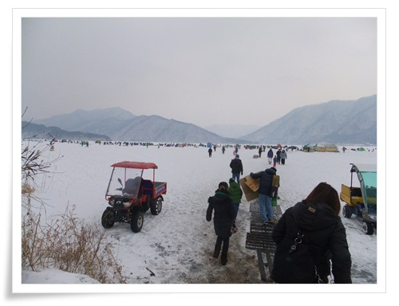

\- 얼음판의 시작점.

짐을 끌고 강 중앙으로 향했다.

\- 흰눈이 쌓인 얼음판.  진짜 겨울 같다.

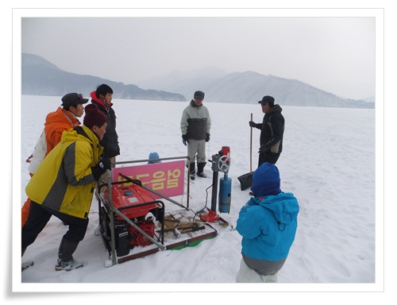

\- 이번엔 강추위 연속이라 얼음 두께가 상당히 두꺼워, 도끼로 얼음을 뚫다가 포기하고 기계를 불렀다.

구멍 하나당 3,000원.

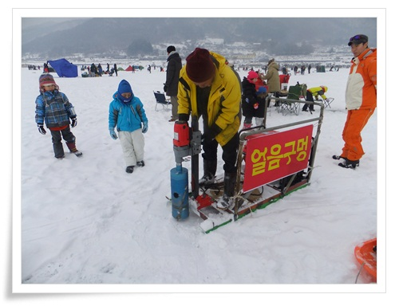

\- 얼음구멍을 파는 기계는 7.5kw 발전기에 드릴을 연결한 장치다.

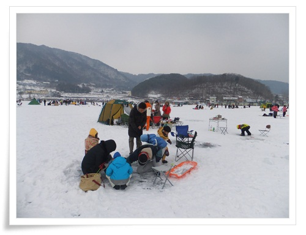

\- 본격적으로 빙어 낚시 시작.

빙어가 출몰하는 시간이 아침 ~10시까지, 그리고 오후 4시 이후라 하여, 고기는 거의 안 잡혔다.

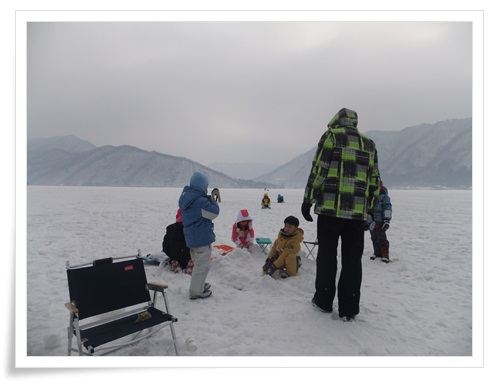

\- 낚시에 싫증난 애들은 눈 장난

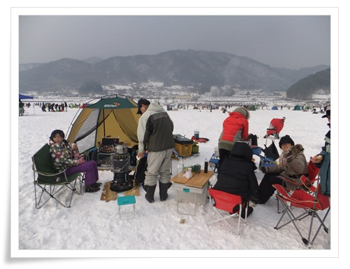

\- 어른들은 의자에 앉아 수다.

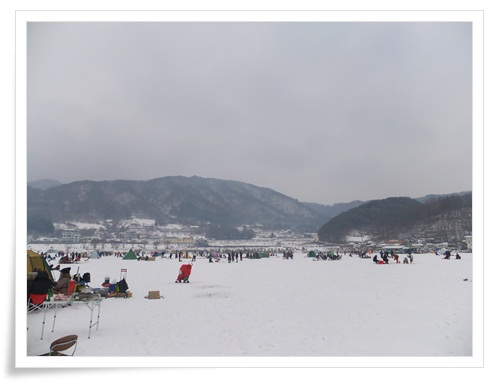

\- 신포리 풍경

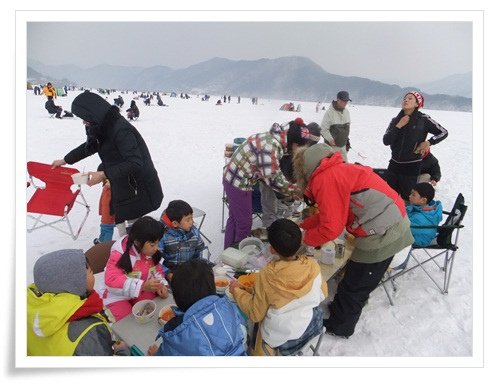

\- 점심시간.  애들 먼저 부대찌게에 식사중.

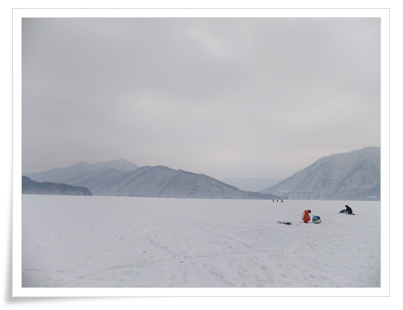

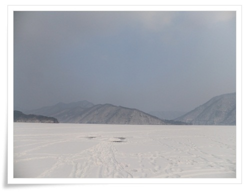

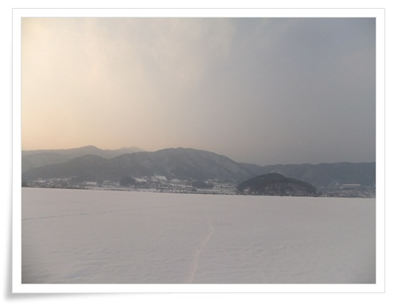

