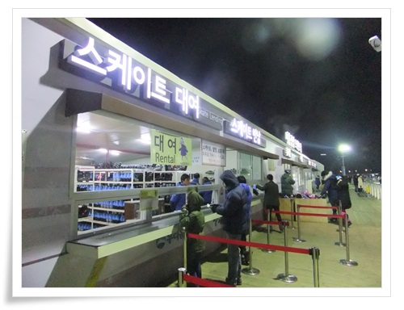

# 서울시청앞 스케이트장

서식지 근처의 문화시설은 다 이용해 보자는 생각을 갖고 있다.

직장이 있는 명동에서 걸어서 10분 거리에 시청이 있고, 겨울에 야외스케이트장이 있다.

겨울이 가기전 스케이트장은 한 번 이용해보자 생각하고, 일찍 퇴근하여 시청으로 걸어갔다.

\- 새로 개장한 쓰나미모양 청사와 그 앞 스케이트장이 보인다.

\- 횡단보도가 없기에 지하보도로 건너가고 있다.

\- 작년보다 스케이트 규모는 좀 줄어든 듯 하다.

\- 매표소

\- 평일은 10시까지, 주말은 11시까지 하는군.

\- 8시 반 표를 끊었다.

스케이트 대여료 포함 1,000원.

\- 260mm 스케이트화를 빌리고,

\- 휴게소에 들어가 스케이트화 신을 곳에 앉았다.  평일 밤이라 사람은 별로 없군.

\- 출근복장인 기지바지 차림에 스케이트화 신었다.

낡고 날도 제대로 안 서있고, 무엇보다 발이 아프다.

\- 가방과 신발은 보관함에 보관.

작년에는 보관함 이용료가 500원이었는데, 올해는 공짜로 바뀌었다.

100원 넣고, 나중에 다시 100원 나오는 구조다.

\- 이제 스케이트장으로 입장.

\- 겨우 30분 탔는데, 힘들더군.

주말이면 사람에 치일텐데, 평일 밤이라 그래도 여유있게 타면서 겨울의 정취를 느낀다.

