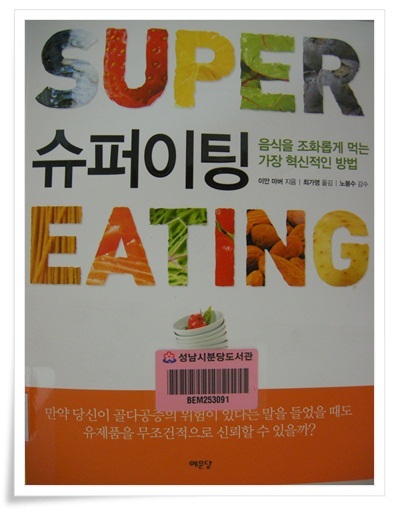

# \"슈퍼이팅\" 제대로 알고 먹는 방법을 설명한 책

분당도서관 희망도서 신청한 것이 처리완료되었다.

냉큼 가 빌렸다.

제목 슈퍼이팅.

제목은 영 눈에 안 들어온다.

그냥 제목만 보고 떠오는 생각은,  슈퍼의 어감이 슈퍼마켓, 슈퍼맨, 슈퍼메가울트라캡숑 이런 거라서, 왕창 잘 먹자는 말인가라고 여겨진다.  내용을 먼저 읽고 책 제목을 거꾸로 유추하자면  잘먹고 잘살기, 사람의 몸에 최적하여 적절하게 먹기 뭐 이런 주제같다.

책을 읽은 소감.

이과에서 적합한 건강 서적.

영양소의 요소별로 설명되어 있다.

각 성분의 장단점이 다 나와 있어, 책 내용에 신뢰감이 간다.

이제껏 다른 건강서적에서 부족한 점으로 보였는 "왜?", "그래서?"에 대한 근거가 충분해 보인다.

식당마다 걸려있는 동의보감, 본초강목 인용문을 볼 때마다 드는 생각이 나쁜 말은 하나도 없구나라는 것.

낙지집에서는 낙지의 효능이, 쭈꾸미집은 쭈꾸미의 효능이 좌악 써 있다.

요즘은 몸에 좋은 것을 먹는게 중요한게 아니라, 몸에 안 좋은 걸 덜 먹는게 중요한 세상이 된 마당에...

어떤 음식,영양소를 어느 정도 먹었을 때 어떤 쪽에 좋은 영향을 미치고, 초과섭취하면 어떤 문제점이 발생하고, 부작용은 뭔지, 그리고 소화액에 분해되어 몸에 흡수되었을 때 대체 어떻게 작용을 하는지가 쉽게 잘 설명되어 있더군..

\- 감기를 달고 사는 내게 관심있는 챕터인 면역에 좋은 음식.

그런데 역시 서양인이 쓴 책이라 홍삼의 존재를 모르는지 안 보이는군.

