# 인왕산 산책

인왕산이 개방된 지 오랜 시간이 흘렀는데도 못 가보다가, 드디어 가 봤다.

원래 일행은 회사 동료 주상영과장과 같이 가기로 했다.

집을 나서려는데, 아내가 딸내미보고 '아빠 따라가라'며 등 떠밀어, 딸내미도 동참했다.

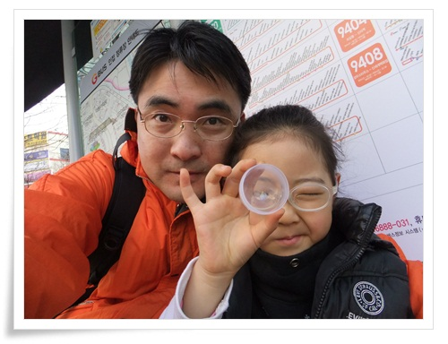

\- 서울로 가는 버스 타기 전 친한 척하며 찍은 사진.

간만에 내 사진을 보니, 턱선은 전혀 찾아볼 수가 없군.

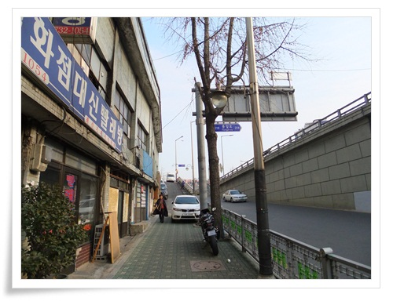

\- 독립문 3번 출구에서 나와 주과장과 만나, 일단 고도가 높은 곳을 향해 걸어 간다.

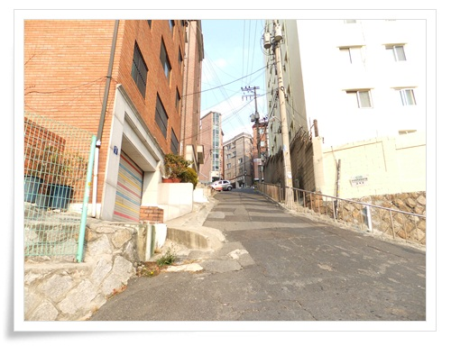

\- 뭔가 가파른 언덕이니까 일단 올라가고 본다.

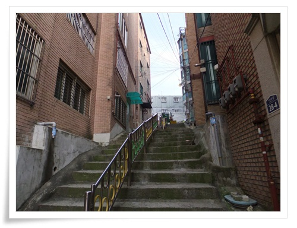

\- 표지판은 없다.  그냥 올라간다.

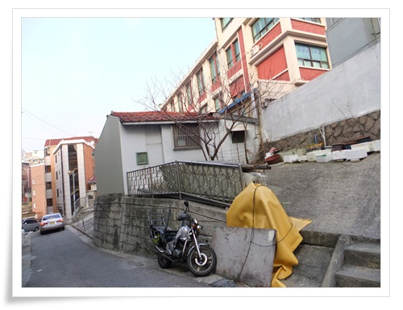

\- 이 골목에서 올라가는 길은 오르쪽 저 계단뿐.  올라간다.

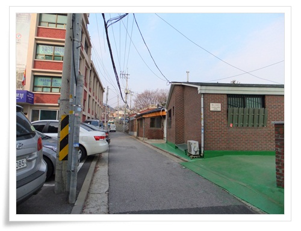

\- 드디어 뭔가 산이 보였다.

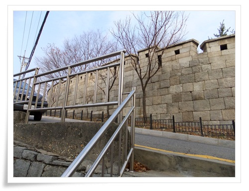

\- 서울 성곽 등장.

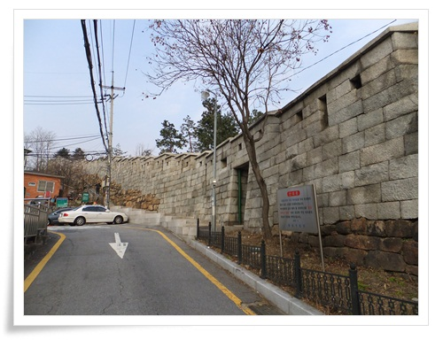

\- 서울 성곽 안쪽으로 들어간다.

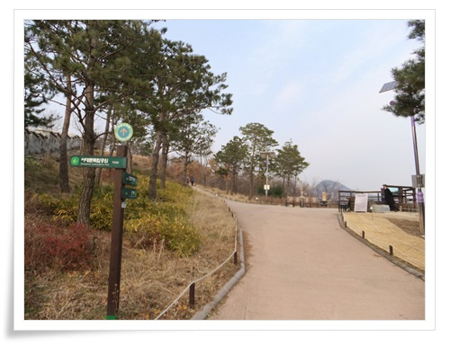

\- 드디어 인왕산 산책길 시작.

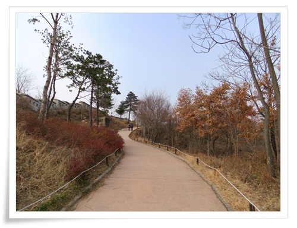

\- 하늘이 참 맑다.

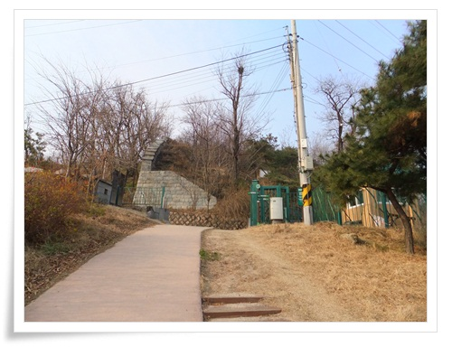

\- 여기까지가 감시자 없는 산책코스인 것 같다.

이후부터는 거의 50미터마다 의경의 상엄한 경비가 시작되었다.

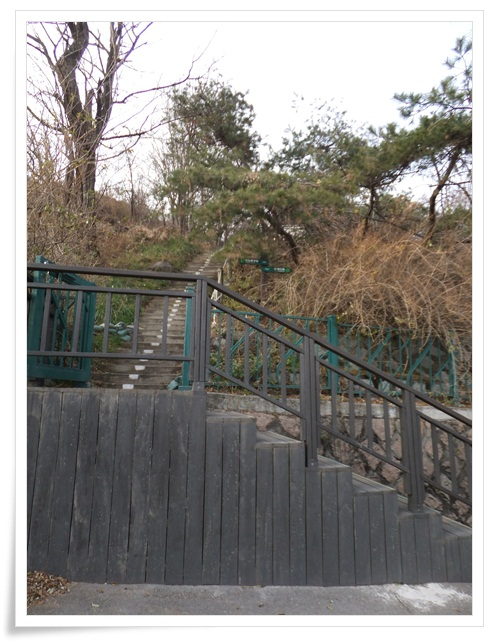

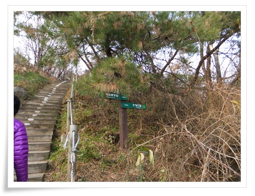

\- 인왕산길이라는 차도를 건너 정상까지 죽 올라가는 계단.

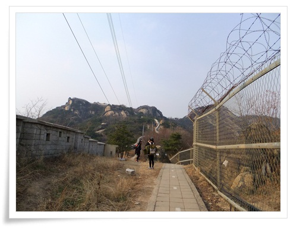

\- 길 옆으로 있는 철조망이 괜히 움츠리게 한다.

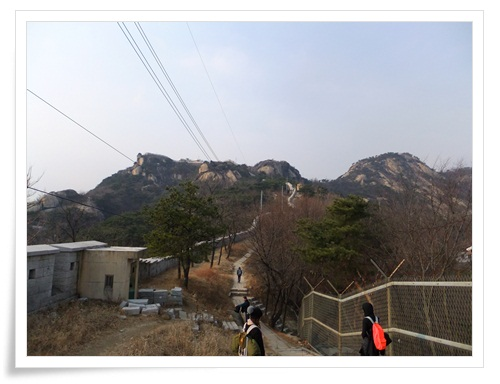

\- 인왕산이 잘 보인다.

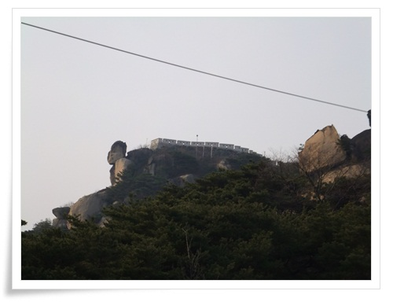

\- 산 왼편 봉우리 바위가 인상적이군.

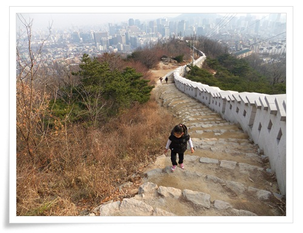

\- 복원한지 얼마 안된 성곽.

그 길을 딸내미가 잘 걸어 올라오고 있다.

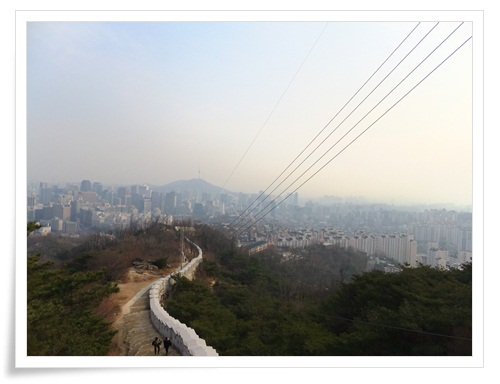

\- 여기서 보니, 점심식사후 자주 산책하던 남산이 저 멀리 보인다.

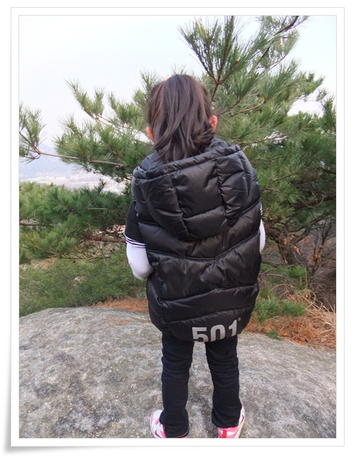

\- 잠시 경치 구경하는 딸내미.

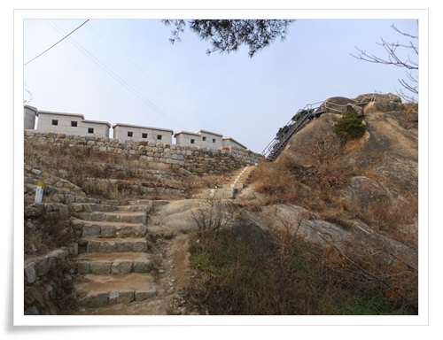

\- 드디어 능선까지 올라왔다.

왼편은 군부대로 막혀 있고, 오른쪽으만 이동 가능.

\- 주요 지점마다 경찰이 배치되어 있다.

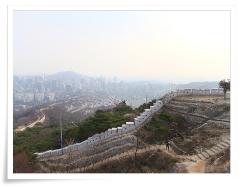

\- 저 성곽을 쌓느라 조선의 백성들 참 힘들었겠다.

그리고, 이 길을 매일 경계근무하는 지금의 군인, 경찰들도 참 힘들겠다.

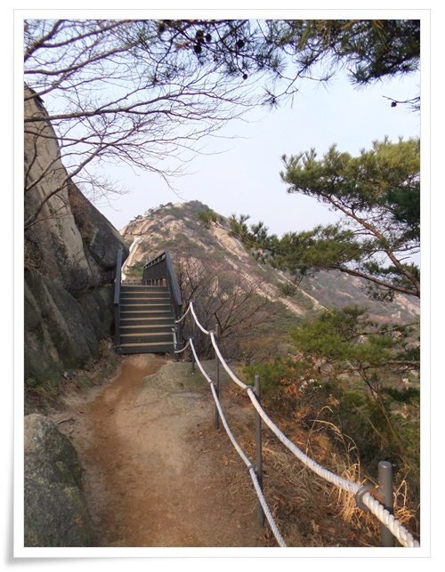

\- 계속 능선을 따라 정상으로 걸어간다.

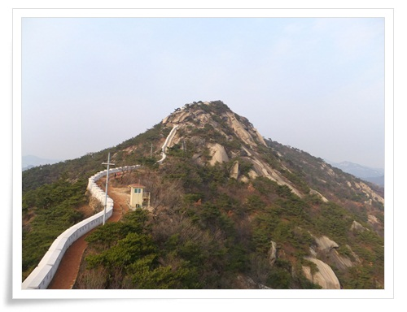

\- 저 앞에 있는 것이 인왕산 정상.

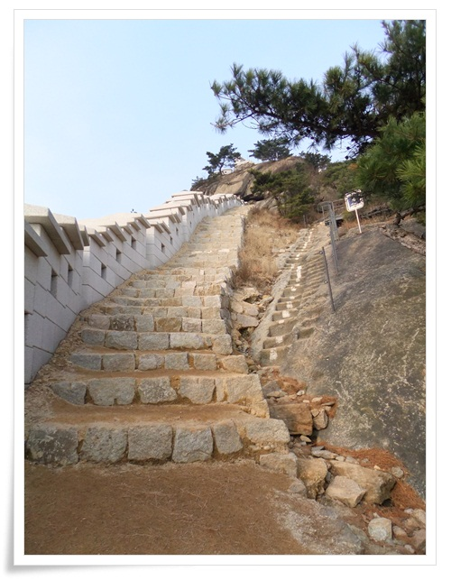

\- 정상 바로 밑 바위는 제법 가파랐다.

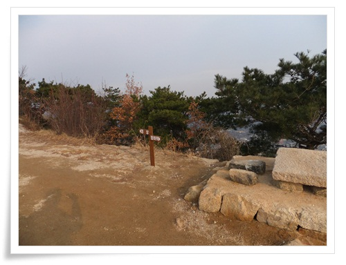

\- 여기가 인왕산 정상.

청와대 방향은 사진 촬영 금지라, 이쪽만 찍었다.

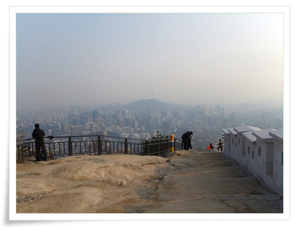

\- 정상 풍경.

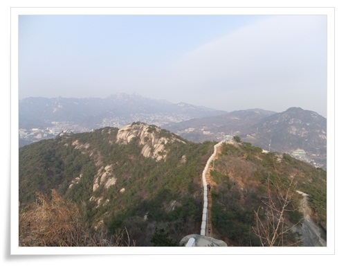

\- 북악산 방향으로 죽 이어진 성곽.

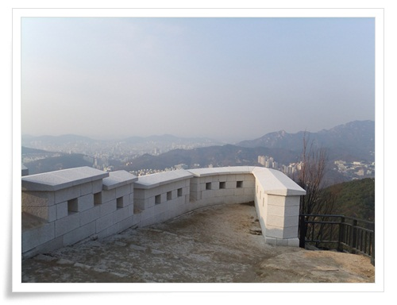

\- 정상에서 바로 내려갈 수 없고 돌아가게끔 되어 있었다.

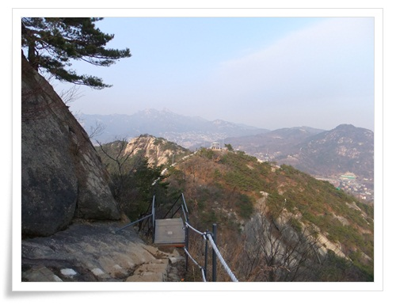

\- 이제 부터 하산길.

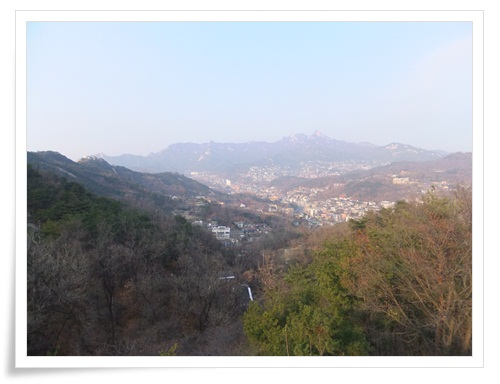

\- 북한산이 보이는군.

\- 곳곳에 있는 철조망이 아쉽긴 하다.

그 옛날 헌법재판소의 "관습적 수도", "경국대전부터 서울"이라는 요상한 위헌판결로 불발된

행정수도 이전만 제대로 되었더라도, 청와대와 청와대를 경비하기 위해 존재하는

이 많은 출입금지 구역은 다 해제되었을텐데 말이다.

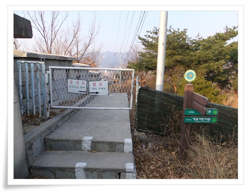

\- 서울성곽 길은 종료되었다.

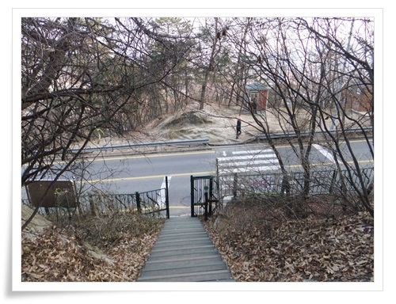

\- 산책로도 종료.

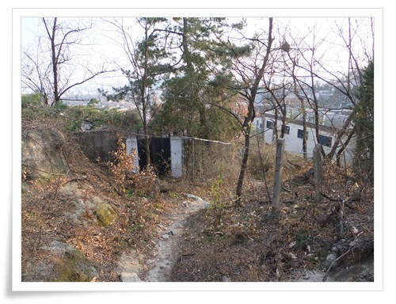

\- 청운동 방향으로 내려간다.

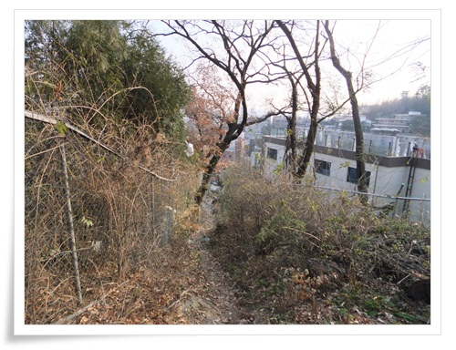

\- 이 길로 별로 사람이 안다닌 길인지 수풀이 우거졌다.

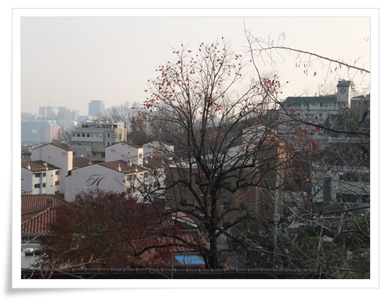

\- 감이 주렁주렁 열린 감나무가 어릴적 시골집을 떠오르게 한다.

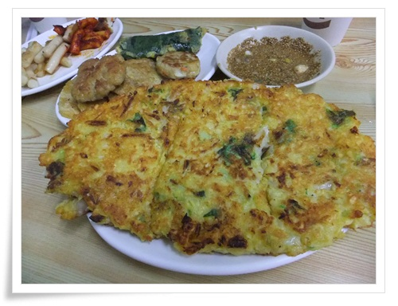

\- 통인시장에서 막걸리와 함께 먹은 전, 녹두전, 떡볶기.

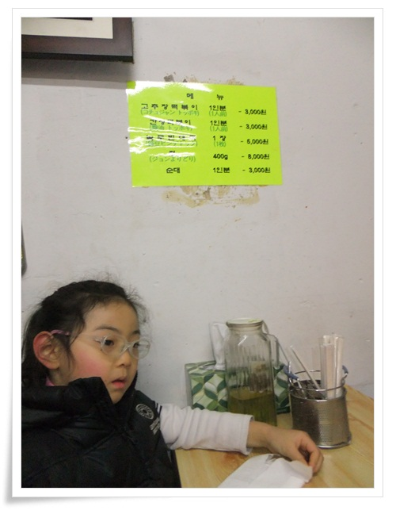

\- 4km 산행을 마친 딸내미의 지친 기색.

-독립문역에서 청운동 통인시장까지 이날 인왕산 산책 코스.

