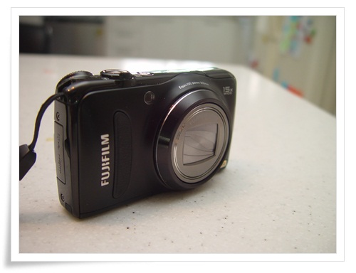

# F300EXR

지난 여름, 방수카메라를 지를려고 했다.

몇번 안가는 물놀이장이지만, 방수팩으로 사진 찍기가 너무 귀찮았다.

하지만 방수카메라와는 인연이 없던지, 두어번의 중고거래는 불발되고 여름은 끝났다.

헌데, 한 번 불붙은 지름 욕구는 여름이 지나도 사라지지 않았다.

방수카메라에 대한 스펙 탐험을 하다보니, 다른 카메라들의 사양도 자연이 비교하게 되었고, 그 중 눈에  들어온 것이 후지 F300EXR.

24mm 광각에 15배줌까지 되는 게 가장 큰 장점.

예전 후지 F40fd를 썼을 때 막 찍어도 잘 나오는 것에 호감이 있었기에 이걸로 정하고 장터매복 시작.

중고로 메모리카드없이 11만원에 샀다.

비교적 얇은 크기로 잠바 주머니에 쏙 들어가는 크기로 항시 휴대하기로 결정.

-F300EXR.  얼마 전 칭다오 여행에 가지고 갔다.

고배율답게 좀 어두운 렌즈이긴 하지만, 그래도 후지답게 잘 찍힌다.

새 디카를 지른 김에 내 디카 역사를 정리해본다.

1\. 올림푸스 카메디아 C-200Z

내 첫 디카.  2001년에 중고로 25만원 정도에 샀다.

보드 타다가 넘어져 망가지면서 다른 디카로..

2\. 캐논 IXY Digital 200

2002년 21만원 정도에 중고로 샀다.

배터리수명이 다 된 터라, 당시 뵨배터리라 불리던 사제 배터리를 3만5천원주고 사서 썼었다.

한창 출장 많이 다닐때 이 디카로 많이 찍었다.

3\. 파나소닉 FZ1

2004년 12배줌이라는 고배율에 혼이 쏙 나가 샀다.

4\. 소니 DSC-F707

큰매형이 2002년쯤에 산 것을 어물쩍 내 것으로 해서 썼다.

실내에서 인물 찍을 때의 색감이 제일 마음에 드는 카메라다.

5\. 펜탁스 Optio MX400

2006년 딸내미 태어난 기념으로 동영상을 찍고자 중고로 22만원주고 샀다.

1년후 허진원씨의 V570과 맞바꿨다.

6\. 코닥 V570

2007년 Optio MX400과 맞바꾼 카메라.

듀얼렌즈 광각이 꽤 좋았으니, 저조도에서의 구린 화질은 별로였었다.

mp3되는 디카로 바꾸려고 팔았는데, 팔고 나서 후회가 드는 기종이었다.

7\. 삼성 Vluu I70

2007년 중고로 19만원에서 샀다.

그때 한창 PDA에 동영상 인코딩해서 보고 했던터라, pmp 기능이 된다는 것에 끌려 샀으나, 뭐하나 만족스런 기능이 없고, 극악의 화질로 나를 안티삼성으로 쐬기를 박게 한 제품이다.

8\. 캐논 400D

내 첫 DSLR.

2007년 동생이 산 것을 가로챘다.

렌즈를 바꾸고 싶은 욕구를 억제하며 오래썼다.

만족스러운 카메라였으니, 어쩔수 없는 그 크기로 놀러갈 때 썩 손에 쥐어지지 않았다.

9\. 후지 F40fd

처음으로 중고가 아닌 새 제품으로 16만원에 산 디카.

2008년 아내가 자기도 디카가 있어야겠다고 하여 사 줬는데, 2년만에 아내가 잃어버렸다.

대충찍어도, 실내에서 잘 나오는 기능에 후지에 대한 신뢰감을 이 때 생겼다.

10\. 니콘 P5000

DSLR은 너무 커, 가볍게 들고 다니면서 외장스트로보도 장착할 수 있는 것이 갖고 싶어 샀다.

2008년 중고로 메모리없이 16만원에 샀다.

11\. 니콘 P5100

2011년 처남소유의 안쓰는 디카 획득.

똑딱이 특유의 긴 셔터랙이 있긴 하지만, 그래도 핫슈와 내 손에 잘 맞는 그립감, 잘 찍혀서 만족하고 있다.

이렇게 정리하고 보니, 참 많이도 바꿔됐구나..

