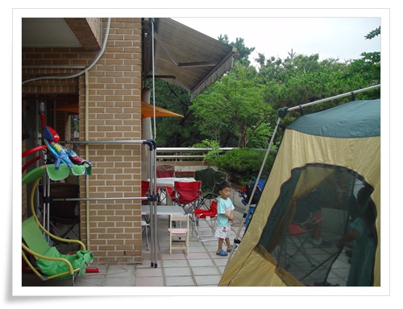
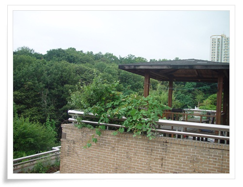
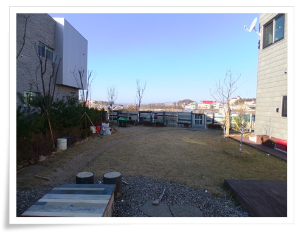
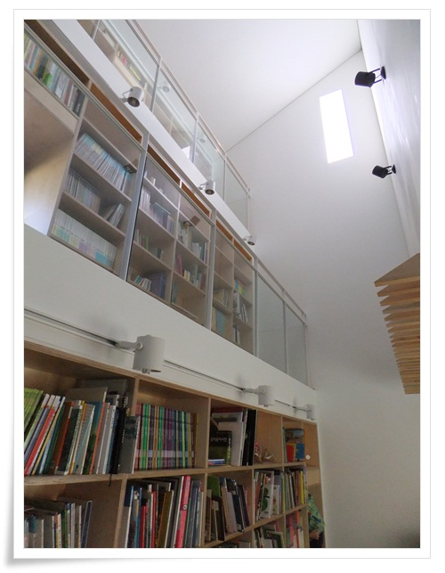

# 마당있는 집에 대한 동경

최근 마당 있는 초대받아 간 두 집.

두 집 모두 마당이 있는 집.

하나는 용인에 있는 테라스가 있는 아파트.  다른 하나는 파주에 있는 전원주택.

\- 아파트 테라스가 마당.

넓은 이 곳에 펼쳐놓은 텐트에서 애들은 놀고, 고기를 구워 먹었다.

어디 강원도 콘도에 놀러 온 듯한 기분.

\- 테라스 단지 아파트.

테라스에서 바라본 앞집과 전망도 괜찮다.

다음으로 가 본 곳 파주.

\- 넓직한 잔디 마당.

저 마당에 비닐하우스하나 설치해 놓고 그 곳에서 먼지나고 시끄러운 작업하면 참 재미있겠다.

\- 2,3층 계단이 책장인 꽤 아기자기한 실내.

하지만 실내는 내 취향이 아니군.

난 그냥 창고스타일이 좋긴 하다.

