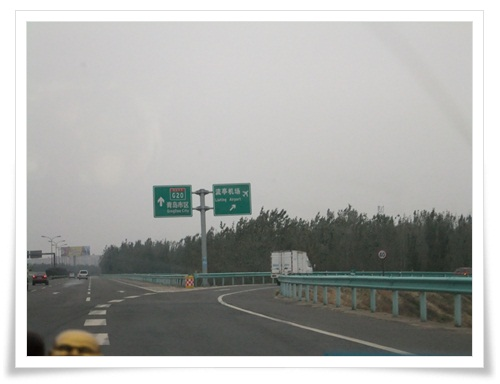
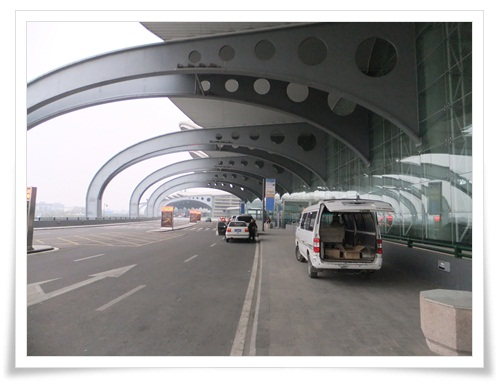
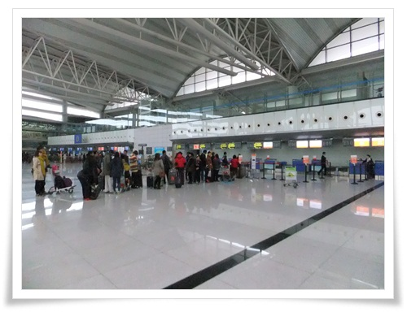
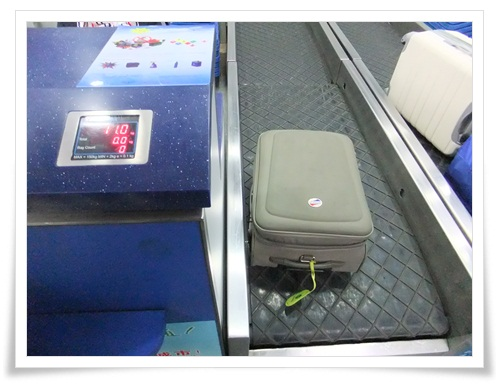
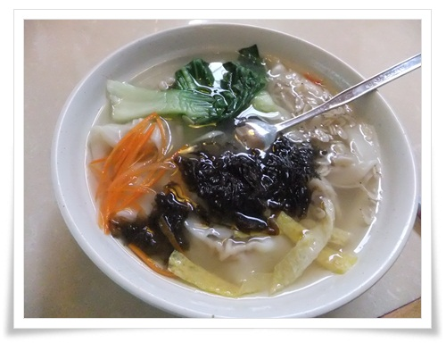
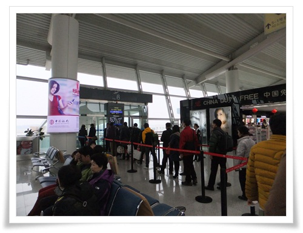
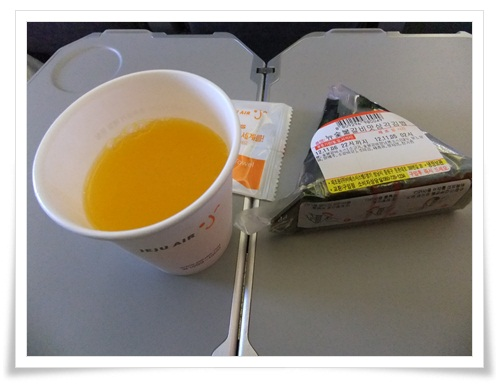

# 칭다오 여행 3일차.  인천공항으로 복귀

2박 3일의 마지막 아침.

월요일이라 회사는 휴가를 내 놓은 상태.

9시 50분 비행기인데, 9시 20분 비행기로 착각을 했다.

그래서 괜히 서둘렀다.

7시에 호텔 로비에 모여, 체크아웃 했다.

7시 10분.  칭다오 류팅공항으로 택시를 타고 갔다.

\- 공항 안내표지.

\- 7시 48분.  공항에 도착

\- 호텔에서 공항까지의 이동 경로

\- 공항은 한산한데, 오직 제주항공 부스만 줄이 길다.

\- 짐은 위탁화물로 맡겼다.

8시 40분. 출국장에 들어섰다.

시간도 많이 남았고, 배도 고팠다.

식당에 들어갔다.

\- 아침으로 먹은 28위안(5천원)짜리 만두국.

저게 제일 싸서 시켰다.

공항 식당에서 먹는 밥이라 비싸고, 그리 맛도 없다.

여기 공항식당의 마케팅 포인트는 "흡연가능".

공항에 흡연실이 없어 흡연 가능하다는 점으로 손님을 끌어 모으고 있다.

9시 22분. 비행기 탑승

\- 제주항공 기내식은 삼각김밥.

12시 20분. 인천공항에 도착했다.

집에 도착한 시각은 오후 3시 10분.

2박3일의 먹자 여행을 끝났다.

입술은 결국 물집이 생겼다.

병원에 가니 먹는 알약과 바르는 연고를 처방해 줬다.

약값 23,000원.

\-\-\-

**3일차 여정**

\\* 06:00 기상

\\* 07:20 ~ 07:50 칭다오 류팅공항으로 이동

\\* 08:30 ~ 09:10 공항식당에서 아침식사

\\* 09:50 ~ 12:20 인천공항으로 이동

\\* 13:00 ~ 15:10 집으로 이동

**3일차 쓴 돈 : 11,520원**

\\* (공동)택비시(호텔->공항) : 89위안/4명 = 23위안(우리돈 3,900원)

\\* (공동)공항에서 식사 : 174위안/4명 = 43.5위안(우리돈 7,620원)

\-\-\-

2박3일간의 칭다오 여행에 들어간 돈을 총 정리해본다.

\\* 항공료 :  172,000원(항공권 49,000 + 유류할증료 + 세금)

\\* 숙박비 : 63,000원

\\* 교통비 : 28,510원

\\* 식비 : 81,810원

\\* 관광비 : 11,210원

\\* 기타(쇼핑) : 17,330원

\\* 약값 : 23,000원 (여독으로 인한 입술물집 약)

**합계: 396,860원**

