# 칭다오에 중국음식 먹으러 간다 1일차

회사 사람들끼리 중국에 가기로 했다.

프로젝트 끝나는 기념으로 놀러가는 것으로, 여행 컨셉은 중국 미식여행.

멤버는 나 포함 네명.

관광이 아닌 순전히 먹는 것만이 목적이어서 항공권이 가장 싼 곳으로 하여, 우리나라에 가장 가까운 칭다오로 했다.

제주항공으로 왕복17만원.  항공권가격으로는 4만9천원으로 올라왔는데, 유류할증료가 붙으니 저렇게 됐다. 전형적인 조삼모사이긴 하다.

토,일,월 이렇게 2박 3일.

토요일 아침 8시 20분 비행기를 타고가서, 월요일 아침 9시50분 비행기를 타고 귀국하는 일정이다.

여행계획을 세웠다.

관광지는 그냥 칭다오맥주공장과 잔교, 타이동거리정도로만 하고 맛집만 검색했다.

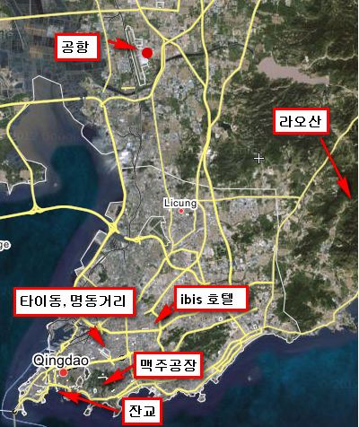

\- 이번 여행의 칭다오 주요 지점을 표시했다.

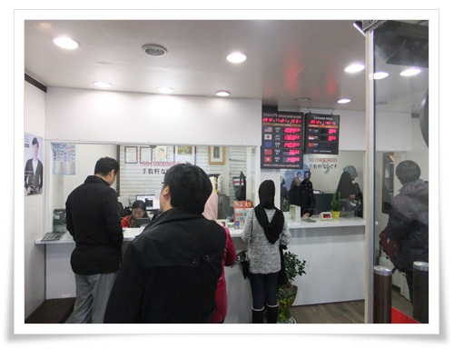

\- 명동 사설환전소에서 20만원을 환전했다.  환율 175원.

인천공항 제주항공 발권하는 곳에서 6시 50분에 만나기로 했다.

공항버스가 한시간정도 가는 것으로 예상하고, 오리역에서 5시 40분 공항버스를 타기로 하고 4시반에 일어났다.

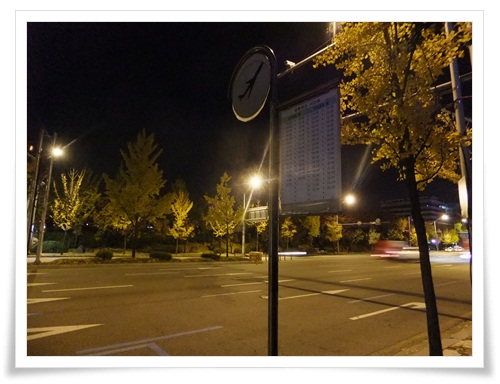

\- 토요일 새벽 5시반. 공항버스 기다리는 중.

인천까지 공항버스는 제법 걸렸다. 1시간 20분이 걸렸다.

공항에 도착한 시각이 7시. 서둘러 갔다.

한명 빼고 다 지각했다.

\- 제주항공 발권하는 중.  이때 시각 7시 24분.

-탑승구에는 거의 마감시간 임박하여 도착했다.

\- 처음 타보는 제주 항공.

\- 저가 항공답게 신문 제공 서비스는 없군.

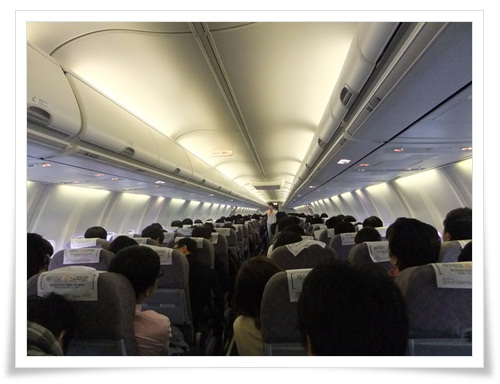

\- 전부 이코노믹석이라 클래스 나누는 칸막이가 없어 시원해보이기는 하다.

\- 이륙후 나온 아침 식사.  빵과 주스.

허기지지만, 산해진미가 가득한 중국에 조금 있으니 도착하니 괜찮다.

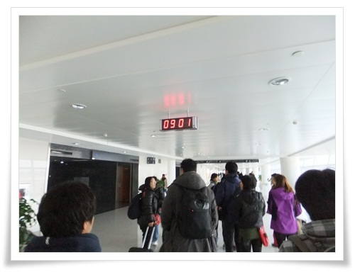

\- 비행기는 공중에 한 50분정도 있었나?  9시에 칭다오 공항에 도착했다.

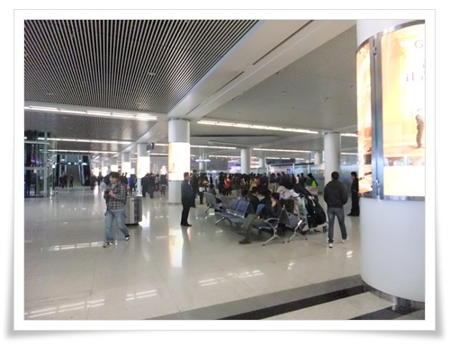

\- 입국심사를 마치고 나서 본 칭다오 공항.  한가로와 보인다.

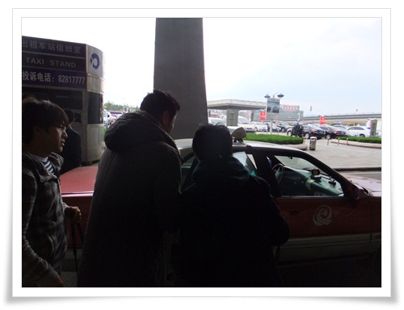

\- 9시 27분.  칭다오 시내행 택시를 탔다.

목적지는 아침겸 점심을 먹을 칭다오 문화거리 근처의 대만식 딤섬 식당이라고 하는 "홍콩노반점".

\- 정겨운 중국 표지판.

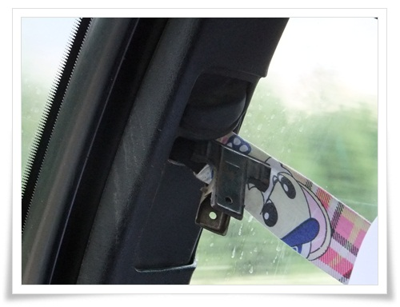

\- 대륙답게 끊어진 안전벨트는 클립으로 고정되어 있다.

\- 택시 옆으로 달리는 삼륜오토바이.

\- 마티즈 뚜껑을 씌운 듯한 삼륜차.

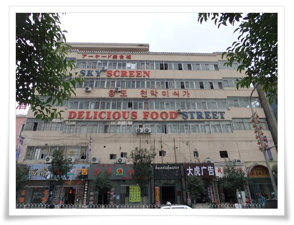

\- 택시에서 내리니 한글 간판도 보인다.

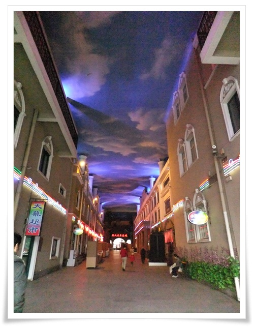

\- 건물 안에 들어가니 내부가 이렇게 되어 있더군.

하지만, 원래의 목표 "홍콩노반점"은 못갔다.

없어졌다고 하더군.

\- 그래서 근처 식당으로 들어갔다.

식당 이름이 "해양대주점"인가 보다.

주문은 그림을 보고 시켰다.

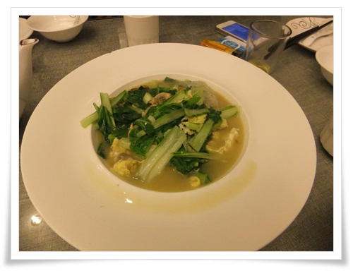

-계란과 청경채로 된 요리.  맛있다.

\- 두부요리.  이것도 맛있었음.

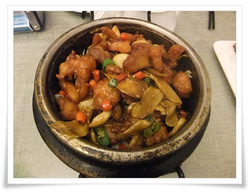

\- 돼지고기 요리인데, 이것도 맛있었고.

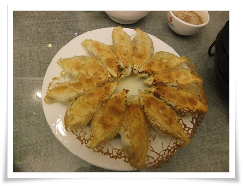

\- 만두. 요것도 맛있었음.

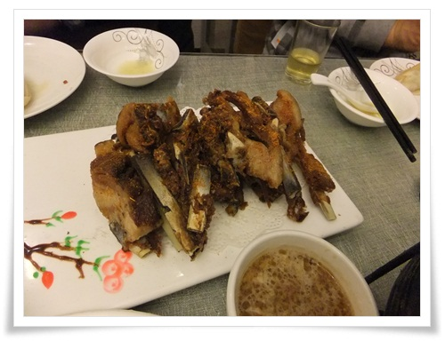

\- 양갈비.  이것도 맛있긴 했지만, 이때쯤 이미 배가 가득 차기 시작해 맛을 음미하지만 못했다.

\- 다들 배불러 퍼져있을 때 나온 동파육.

맛있었지만, 배에 도저히 들어갈 공간이 없어 하나만 먹고 마무리 했다.

\- 식사를 하고나서 옆에 있는 문화거리 구경에 나섰다.

예전 청계천 황학동벼륙시장 분위기다.

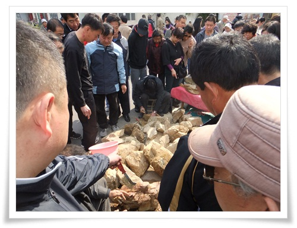

\- 뭘파나 살펴보니 돌을 판다.

\- 여기도 사람들이 모여있길래 보니, 돌을 판다.

칭다오 사람들을 돌을 좋아 하나 보다.

\- 거리에서 본 양꼬치 전문 포장마차.

\- 양꼬치 굽는 포스하며, 무척이나 먹고 싶었지만 배터지게 먹은지 몇분 되지 않은 터라 나중을 기약하며 스킵.

11시 35분.

문화의 거리 구경 다하고, 호텔로 들어가려고 택시를 잡기 시작했다.

빈 택시가 없다. 그리고 택시 자체도 별로 안 돌아다닌다.

한 블럭 더 걸어가 택시를 잡았다.

\- 일반 택시 기본 요금은 9위안.

아까 공항에서 탄 택시는 기본 요금 12위안.

9위안짜리는 엑센트급이고, 12위안짜리는 아반테급 정도 되는 것 같았다.

\- 12시 14분.  호텔 도착.

여행전 예약한 ibis 호텔이다.

1박에 31,000원짜리.

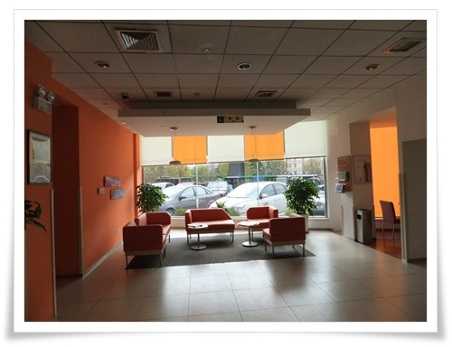

\- 로비 내부는 깨끗하다.

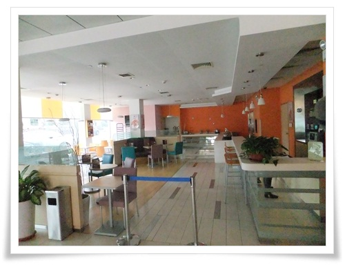

\- 로비에 식당도 있다.

하지만 우리 일행은 조식 미포함으로 예약했기에 이용할 기회는 없었다.

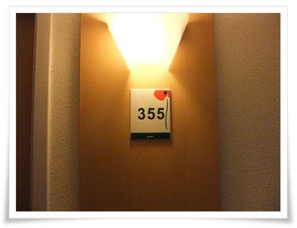

\- 내 방 355호.

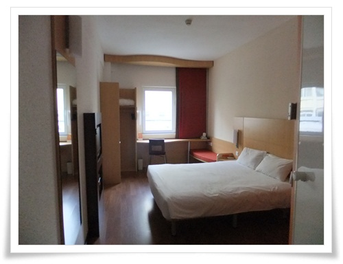

\- 내부도 넓고, 깨끗하다.

\- 창 밖의 풍경은 옆 건물 옥상이로군.

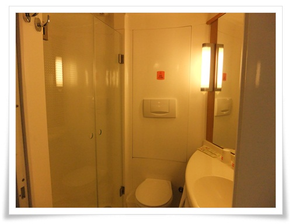

\- 화장실.  내부에 비치된 것은 세수비누와 칫솔, 샴푸.

헤어드라이기는 없더군.

\- 냉장고도 없고, 제공되는 것은 생수와 녹차.  끝.

13:00.

호텔 로비에 모였다가 칭다오맥주공장으로 향했다.

13:37.

칭다오맥주공장, 맥주박물관에 도착.

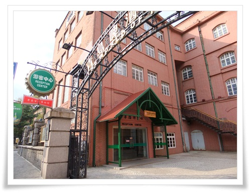

\- 여기가 칭다오맥주박물관 입구.

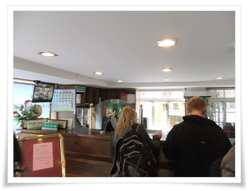

\- 매표소

\- 입장료는 1인당 50위안(우리돈 만원).

맥주2잔과 땅콩안주가 기본 제공된다.

\- 맥주공장에 들어섰다.

관람객은 오른쪽에 있는 박물관만 입장 가능한 것 같다.

\- 박물관에서 예전 맥주제조 시설이 전시되어 있다.

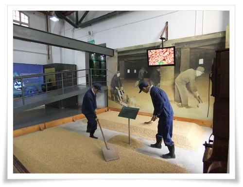

\- 저게 맥주원료인 보리를 준비하는 작업인가 보다.

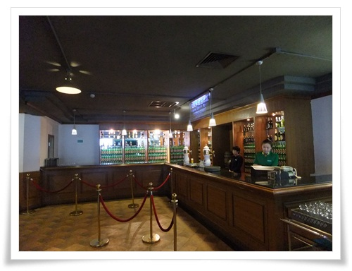

\- 중간 홀에서 맥주를 준다.

1인당 딱 1잔만 준다.

정제하기 전 맥주인데, 아주 맛있다.

\- 맥주와 땅콩.

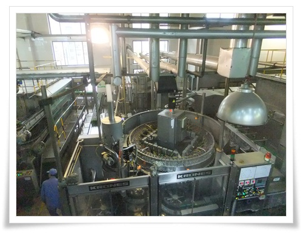

\- 실제 제조하는 시설도 볼 수 있다.

\- 자동화된 시설이라 그런지 노닥거리는 직원들의 모습들만 보인다.

\- drunken house라고 한 재미난 방이 하나 있었다.

저 TV가 내부를 보여주는 것인데, 저게 있는 줄 모르고 내부에서 중년의 아저씨 네명이 철없이 놀았다.

\- 내부에서 이런 자세 취하는 놀이를 하며 놀았다.

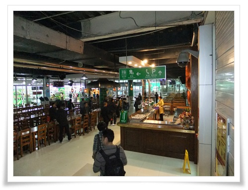

\- 마지막 맥주 시음장소.

\- 여기서는 안주없이 맥주만 준다.

이전 맥주와 달리 정제한 dry 맥주라고 한다.

맛은 아까 꺼가 나은 듯 하다.

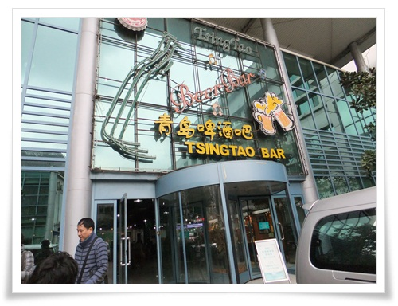

\- 맥주를 마시고 나서 나오니 끝이다.

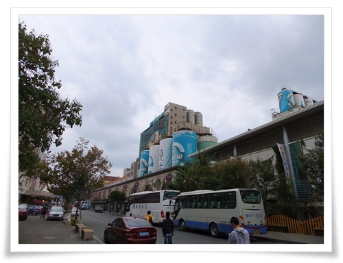

\- 칭다오 맥주박물관이 있는 거리가 맥주거리다.

죄다 호프집이다.

14시 49분.

칭다오의 그래도 유명한 관광지라고 하는 잔교로 가기 위해 택시를 탔다.

택시 기사는 계속 TV타워가 관광하기 좋은 곳이니 그쪽으로 가자고 강권을 해 댔다.

그냥 잔교나 가자고 했더니, 미터기가 고장났으니 내리라고 하여 내렸다.

칭다오 자체가 택시잡기가 어려운지 계속 빈 택시를 못 잡았다.

그러다 그냥 삼륜택시를 탔다.

삼륜택시는 안에 미터기가 없었다.

어째 타고 가는 내내 불안했다.

불안을 곧 현실이 되었다.

\- 저 앞의 삼륜 택시를 타고 잔교에 왔다.

15:15.

잔교에 도착했다.

얼마냐고 먼저 물어보면 더 크게 바가지 쓸 것 같아 그냥 10위안을 내밀었다.

미터기 달린 택시로 추정해 봤을 때 15위안정도 나올 것 같았다.

택시기사 역시나 큰 소리를 내며 50위안을 내라고 했다.

비싸다고 항의했고, 택시기사는 여전히 큰 소리.

난 더 못 준다고 하고 내렸다.

한참을 실랑이하다 10위안 더 주고 끝냈다.

\- 이게 잔교.

예전 독일식민지 시절 군용 부두로 만든 거라고 한다.

\- 이렇게 사진인화프린터로 사진찍어주는 사람이 있다.

\- 옆에는 굴 따는 사람들도 많았다.

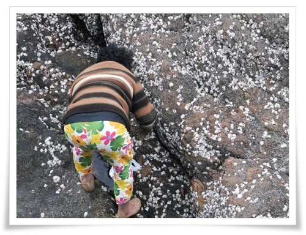

\- 이렇게 다닥다닥 붙어 있는 굴을 캐더군.

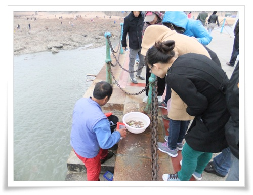

\- 얼마나 캤는지 구경하기도 하고.

\- 잡은 것을 팔기도 하나 보다.

\- 잔교 옆 해수욕장.

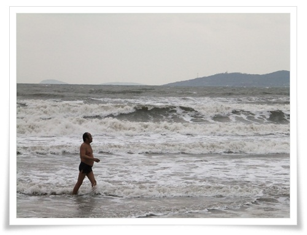

\- 꽤 쌀쌀한 날씨인데, 수영하는 사람도 있더군.

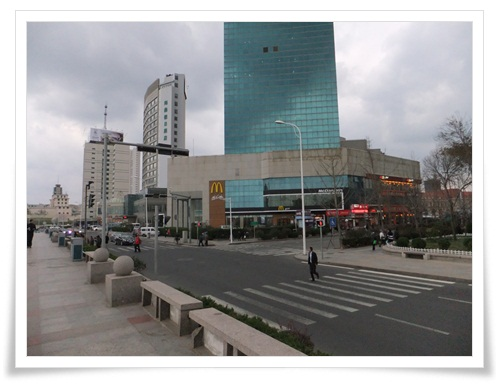

\- 추운 바닷바람에 몸을 녹이고자 맥도날드로 들어갔다.  15시 54분.

\- 커피 메뉴.  아메리카노 보통이 15위안(우리도 3천원).  비싸군.

16:58분.

칭다오의 명동이라고 하는 타이동거리에 도착했다.

\- 타이동.  월마트,KFC,맥도날드가 다 모여있더군.

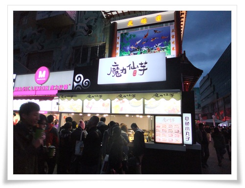

\- 뭔가 맛집인듯 사람들이 많은데, 못 먹어봤다.

\- 좁은 골목에 사람이 가득하길래 들어갔다.  주로 옷가지를 팔더군.

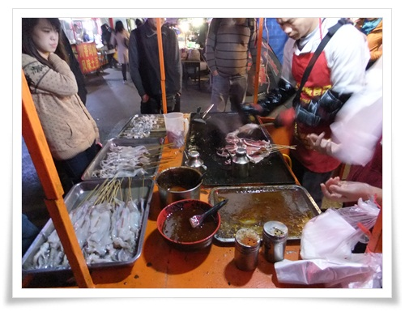

\- 맛있는 길거리 음식.  오징어 꼬치를 사 먹었다.

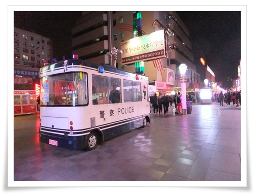

\- 중국의 이동식 경찰부스.  꽤 괜찮아보인다.

17:55.

깜깜해졌다.

저녁을 만두로 유명하다는 식당 춘화루 가기로 했다.

미리 지도로 표시해 놓은 위치는 5.4광장 가기 전 위치여서 택시를 탔다.

\- 택시가 내려준 곳.

썰렁하다.

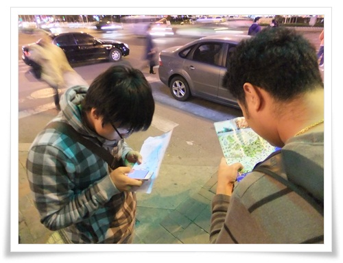

\- 지도를 보며 이게 맞나, 어디가 춘화루일까를 살펴봤다.

또다시 택시를 탔지만, 여전히 춘화루는 없었다.

지도에 식당을 잘못 표시해놨었던 거였다.

아까 출발했던 타이동이 오히려 춘화루에 더 가까웠다.

18:59.

아무것도 먹자고 할 때쯤, 한국말이 들렸다.

칭다오 유학생으로 보이는 두명의 청년이 있길래, 어디 괜찮은 식당을 소개시켜 달라고 했다.

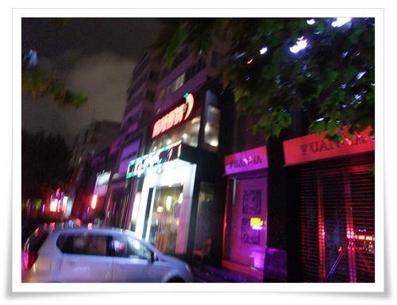

\- 청년은 바로 옆에 있는 저 고추모양 간판이 있는 식당이 맛있다고 했다.

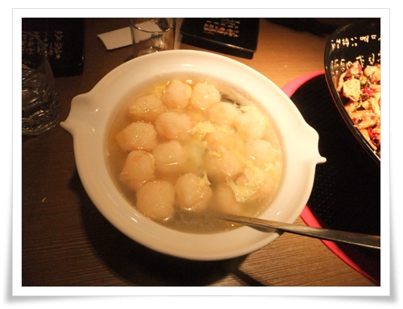

\- 완탕.  맛있다.

\- 매운 해산물볶음.  역시 무지 맛있다.

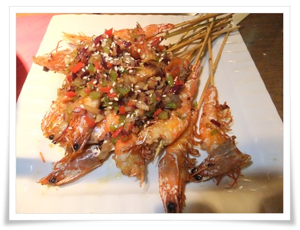

\- 새우요리.  역시 맛있다.

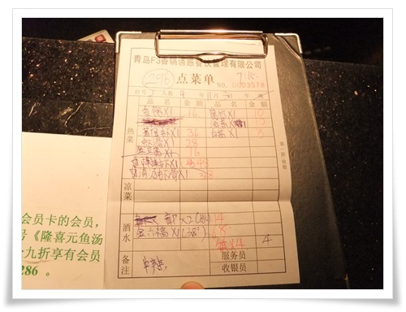

\- 계산서.  제법 많이 먹었군.

21:20

저녁 식사를 마치고, 호텔로 복귀했다.

근처에 마트가 있는 것을 봐 둔 터라 나 혼자 마트로 향했다.

\- ibis 호텔 근처에 있는 RT 마트.  영업시간 08:00 ~ 22:00

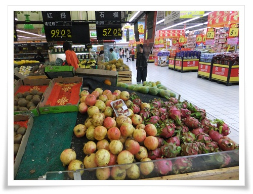

\- 마트에서 눈에 들어온 것.  석류.

원래 망고스틴을 찾아다녔지만, 제철이 아니어서 없어, 대신 석류가 있었다.

\- 호텔방에 들어와 석류를 쪼개 먹었다. 맛있다.

22:30.

석류를 다 먹고, 샤워하고 취침.

새벽부터 돌아다녀 제법 피곤한 하루였다.

\-\-\-

**1일차 여정**

\\* 04:30 기상

\\* 05:40 ~ 07:00 인천공항으로 이동

\\* 08:20 ~ 08:40 칭다오 공항으로 이동

\\* 09:30 ~ 10:00 칭다오 문화거리 홍콩노반점을 향해 이동

\\* 10:10 ~ 11:20 식당에서 아침식사

\\* 11:20 ~ 11:40 칭다오 문화거리 구경

\\* 11:50 ~ 12:15 호텔로 이동

\\* 12:15 ~ 13:00 체크인하고 호텔에서 짐 풀기

\\* 13:00 ~ 13:30 칭다오 맥주공장으로 이동

\\* 13:40 ~ 14:40 맥주공장 관람

\\* 14:50 ~ 15:15 잔교로 이동

\\* 15:15 ~ 16:00 잔교 구경

\\* 16:00 ~ 16:40 맥도날드에서 커피

\\* 16:40 ~ 17:00 타이동으로 이동

\\* 17:00 ~ 18:00 타이동 구경

\\* 18:00 ~ 18:20 춘화루를 찾아 헤매기1(타이동-> 택시로 이동)

\\* 18:35 ~ 18:45 춘화루를 찾아 헤매기2(택시로 좀 더 남쪽으로 이동)

\\* 18:45 ~ 19:10 춘화루를 찾아 헤매기33(걸어서 밍징루 골목 헤맴)

\\* 19:10 ~ 21:00 밍징루에서 저녁식사

\\* 21:00 ~ 21:20 호텔로 복귀

\\* 21:30 ~ 22:00 RT 마트에서 쇼핑 후 호텔 복귀

\\* 23:00 취침

**1일차 쓴 돈 :** **합 56,800원**

\\* 공항버스 : 12,000

\\* (공동)택시비(공항->문화거리) : 95위안 (2만원)

\\* (공동)점심 : 325위안 (6만원)

\\* (공동)택시비(문화거리->호텔) : 17위안

\\* 호텔 보증료 : (100위안, 나중 돌려받음)

\\* (공동)호텔 근처 편의점에서 캔커피 : 15위안

\\* (공동)택시비(호텔->맥주공장) : 15위안

\\* (공동)맥주공장 입장료 : 200위안(1인당 50위안)

\\* (공동)택시비(맥주공장->잔교) : 20위안

\\* 잔교에서 갈매기 줄 빵부스러기 : 1위안

\\* (공동)잔교 근처 맥도날드에서 커피 : 64위안(아메리카노 2개, 카푸치노, 라떼)

\\* (공동)택시비(잔교 -\>  타이동으로) 1차 : 17위안

\\* (공동)오징어 꼬치구이 : 10원(30개)

\\* (공동)택시비(산둥로 -\> 춘화루를 찾아 차이나뱅크 근처) 2차 : 11위안

\\* (공동)택시비(춘화루를 찾아) : 9위안

\\* (공동)저녁식사 : 296위안

\\* (공동)택시비(식당->호텔) : 9위안

\\* RT마트에서 석류랑 먹을 것 : 60.4위안(12,000원)

**소계**

\\* 우리나라 교통비 :  12,000

\\* 중국 교통비 : 193위안(95+17+15+20+17+11+9+9)/4명 = 49위안(우리돈 8,450원)

\\* 식비: 385위안(15+64+10+296)4명 + 60.4 = 157위안(우리돈 27,420원)

\\* 관광: 200위안/4명+1 = 51위안(우리돈 8,930원)

