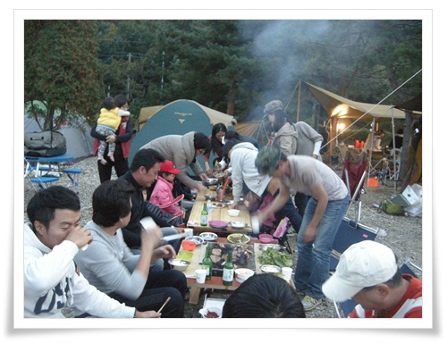
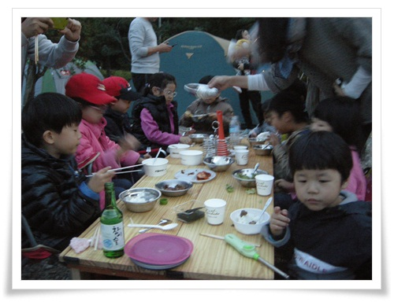
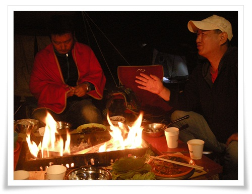

# 용인 문수산 캠핑

10월 13,14 주말 1박2일로 야영에 나섰다.

이번 장소는 집에 그리 멀지 않은 곳.

용인시에 있는 문수산오토캠핑장.

1박에 3만원씩.  비싸긴 하다. 수요에 비해 공급이 딸리니 비싸도 예약은 힘들다.

총 7식구 대규모로 움직였다.

가을이기에 이번에는 전기장판도 가지고 갔다.

그리고 식탁과 화로 테이블을 만들 나무 자재를 싣고 갔다.

도착하고나서 제일 처음 한 것은 식탁 만들기.

한달전 아파트에 버려진 원목책장이 재료.

식탁 다리를 에어타카로 고정했는데, 썩 좋지는 않았다.

다음에는 에어타카보다는 그냥 피스로 결합시켜야겠다.

직소로 톱질하는 것도 시간이 오래 걸리니 힘들더군.

체인톱을 사고 싶다는 욕구가 올라온다.

\- 저 위 식탁과 바로 앞 화로테이블이 이번 야영의 내 작품.

\- 7식구, 10명의 애들이 사용한 식탁.

\- 고기 다 구워먹고, 이제 식탁을 다시 부셔 불피워 열기를 쬐면서 술 먹는 중.

화로 테이블을 부족한 자재로 만들다 보니 많이 엉성했다.

그래도 화로테이블이 아주 유용했다.

예전 화로테이블이 없었을 때는 고기 굽는 사람 혼자 고기 구워 일일이 식탁으로 전달했었는데, 이번엔 식당 고기집에서 고기 구워먹듯이 아주 편안했다.

그래도, 캠핑때마다 고기를 구워먹어서 그런가, 슬슬 고기가 질리는 듯 하다.

