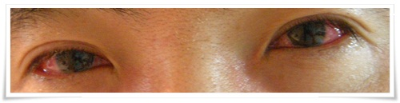

# 유행성 결막염 체험기

이제껏 안과는 처음 안경 쓸 때 시력검사하러 간 게 전부였었는데, 생전 처음 눈병이란 걸 걸려 안과라는 곳을 가게 됐다.

병명 유행성 결막염.

이 병의 잠복기는 5일.

증상은 충혈,눈꼽,안구통.  그리고 어린이에게는 인후통을 동반한 감기증상도 같이 올 수 있음.

증세기간은 2~3주.

전염은 접촉에 의해.  그리고 강한 전염성.

치료법은 안약.

D-1일 금요일.

몸은 특별히 이상한 점은 없었으나, 안구가 좀 건조한 듯한 느낌이 있었다.

퇴근하여 잠자리에 들면서부터 오한이 찾아와, 또 환절기 감기에 걸렸구나라는 생각을 했다.

D일 토요일 유행성결막염 발병.

목젖이 부었는지 새벽부터 숨 쉬는게 원활하지 못해 잠을 설치면서 깼다.

두통과 코막힘, 침넘길때 목 통증, 온몸이 쑤시는 근육통.

감기 걸린지 얼마나 됐다고 또 걸리나하며 허약체질을 한탄하며 거울을 보는데 눈이 시뻘겠다.

설마 눈병인가라는 생각은 들었지만, 그냥 감기로 인한 머리의 열때문에 일시적으로 눈이 충혈된 거겠지 여겼다.

이비인후과에 갔다.  코와 목이 많이 부었다는 설명을 들었고, 주사 맞고 3일치 약 처방.

D+1일 일요일.

감기도 더 심해졌고, 눈은 이제 뜨기도 힘든 상태.

\- 거울로 볼 때는 이보다 훨씬 빨갰는데, 사진으로 보니 좀 덜해보이는군.

눈물은 쉼없이 나와 눈꼽을 제조해냈고, 흰자위는 시뻘겋게 되어 꼭 레지던트이블에 등장하는 좀비와 같았다.

눈은 따갑고, 뭐가 낀듯한 이물감, 그리고 눈알을 잡아 뽑는 듯한 통증이었다.

D+2일 월요일.

코내부 비강이 통통 부었는지 코로 숨쉬지 못했고, 두통과 숨쉬는게 힘들어지다보니 잠을 한숨도 못 잤다.

충혈을 더 심해져 이제 흰자위에 흰부분은 안보이고 그냥 빨갛기만 했다.

안구통으로 눈도 못 뜨겠어서 출근 포기.

먼저 이비인후과부터 먼저 갔다.

급성부비동염(?)이라고 한 것 같다.

항생제가 포함된 약을 처방받고, 신풍린코마이신주사와 동광덱타손주사를 맞았다.

주사가 어떤 주사인가 검색해보니 신풍린코아신주사는 부비동염과 인두염, 동광덱타손주사는 알러지성비염에 효능이 있는 거라고 나오는군.

그리고 안과에 갔다.

내 눈을 본 간호원은 대기자명단에 손대지 말라고 하고, 직접 써줬다.

진료를 받으면서도 전염의 위험이 있으니 아무것도 손대지 말라고 주의를 줬다.

병명이 나왔다.  유행성 결막염.

낫는데 2~3주가 걸린다고 한다.

그리고 최고 절정은 발병후 7~8일째가 된다고 했다.

처방은 플루메토른이라는 점안액.

유행성 결막염을 검색해봤다.

증상중에 "어린이에게는 인후통을 동반한 감기증상..."  이란 말이 있더군.

제길, 난 어린이도 아닌도 이런 힘든 감기증상을 동반받다니..

이런 저주받은 허약체질이 있나..

D+3일 화요일.

나아진 점은 별로 없었지만, 이틀연속 휴가를 낼 수 없어 출근했다.

눈병 전염을 시키지 않으려 내 자리에 꼼짝않고 앉아 있었고, 내 주위에 사람이 근접하는 것을 막았다.

자리에 앉아는 있었지만, 힘든 시간이었다.

D+4일 수요일.

상태는 더 안 좋아져, 또다시 출근 포기.

이비인후과와 안과 재방문.

D+5일 목요일.

눈병과 감기는 절정은 지난 듯 함.

눈물이 계속 나오는 것은 멈췄다.

오후부터는 눈의 충혈상태도 서서히 호전되었다.

D+6일 금요일.

눈 색깔도 약간만 충혈된 상태.

코와 목 상태도 붓기가 좀 빠진 듯.

일찍 퇴근하여 이비인후과 가서 연휴간 먹은 약 처방 받음.

4일치 항생제가 포함되었다.

D+7일 토요일.

아내에게 눈병을 점염시켰다.

아내의 한쪽 눈 충혈시작.

D+8일 일요일.

눈의 충혈기는 거의 정상으로 돌아옴.

눈의 쉬 피로해짐은 있음.

D+9일 월요일.

아내의 눈병은 절정으로 치닫기 시작.

D+15일 토요일.

감기와 눈병은 이제 완치된 듯 함.  아내는 여전히 눈병 중.

결막염의 후유증인지 시력저하가 있는 듯 함.

전보다 잘 안 보임.

눈병은 초등학생 애들이나 걸리는 것인 줄 알았는데, 걸려보니 정말 힘들었다.

어느 질병인듯 힘들지 않겠느냐마는, 눈병은 특히 사람을 추잡스럽게 만들어버리는 듯 하다.

눈병은 이제 걸리지 말아야겠다.  열흘을 아무일도 못하고 그냥 보냈다.

