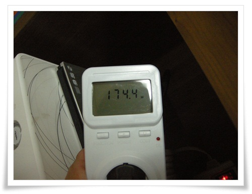
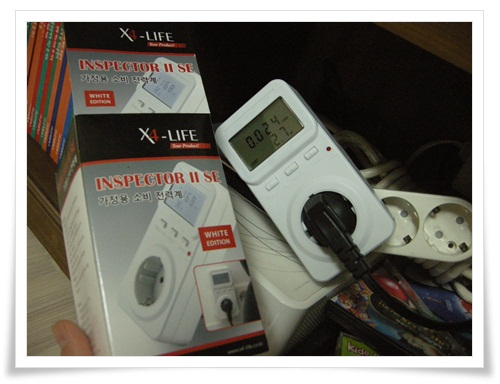

# 
- 2012/09/21 08:36

전기료가 맞는 말이지만, 아직 내 입에는 전기세가 자연스럽다.

하긴, 세금에나 있는 누진제도가 가정용 요금에만 있어, 서민에게는 요금이 아닌 징벌이라는 말이 나오듯이 세금이상이라 할 수 있다.

"측정할 수 없으면 개선할 수 없다"이 있듯이, 일단 뭐가 전기를 많이 잡아 먹는지 측정을 해 보기로 했다.

처음 생각한 것이 멀티미터로 교류 전류를 측정해서 계산해 보려 했다.

그런데, 내가 가진 멀터미터는 교류 전류 측정 기능이 없었다.

인터넷에서 살려고 해보니 교류 전류 측정되는 멀티미터는 비쌌고, 게다가 mA급이 아닌 10A 급 교류전류계는 산업용 장비로만 있어 비쌌다.

그래서 산게 가정용 소비전력계라고 하는 Inspector 2.  가격 33,000원.

기능은 전압,전류,전력,주파수,전력량이 측정할 수 있고, kW당 요금을 입력해 놓으면 몇원어치 썼는지 표시할 수 있다.

그런데, 생김새는 그리 고급스럽지가 않군.   그리고 설명서가 영 부실하다.

우리집 평균 전기 사용량이 200kW 정도.

뭐가 많이 잡아 먹는지 측정을 시작했다.

\- 먼저 42인치 LCD TV 동작시 전력.  174W.

\- 한시간 TV 시청했을  총  0.024kWh.  전기료는 2.7원.

TV가 많이 잡아 먹을 줄 알았는데, 생각보다는 적었다.

거실에 항상 대기상태로 해 놓은 컴퓨터의 대기전력이 2W,

그리고 항상 커져있는 공유기가 3.5W.

항상 콘센터에 꽂여 있는 핸드폰 충전기를 측정해봤다.

무부하상태일 때도 전기를 똑같이 소모하지 않을까 싶었는데, 충전중이지 않을 때는 대기전력이 거의 0에 가까웠다.

좀 더 측정을 해 보고, 전기세 감소하는데 효과적인 전략을 짜 봐야겠다.

