# 일본 출장 롯본기

9월9일 일요일부터 12일 수요일까지 3박4일의 출장 일정이 꾸려졌다.

벌써 일본만 6번째 가는 거군.  6번 가는 동안 도쿄, 그 중에도 미나토구를 못 벗어나 새로 보는게 없군.

급하게 가는 출장이라 일요일 첫 비행기를 타기 위해 5시 50분에 출발하는 공항버스를 탔다.

환전도 공항에서 했다.  5천엔 환전했다.  환율은 100엔에 1,500원.  역시 공항이 비싸긴 하군.

8시 40분 김포행 아시아나 비행기를 타고 하네다공항에 도착한 시각은 11시.

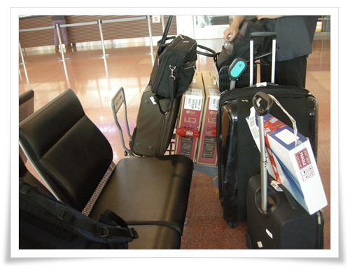

\- 이번엔 제법 많은 짐들을 가지고 갔다.

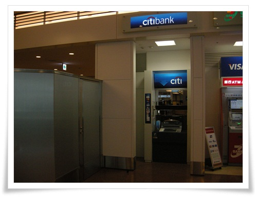

\- 하네다 공항 환전소 옆에 있는 씨티은행 ATM.

씨티은행이 출금수수료 1달러만 내면 유리한 환율로 뺄 수 있다고 하니, 많은 돈 환전할 땐 그냥 일본에 와서 출금해야겠다.

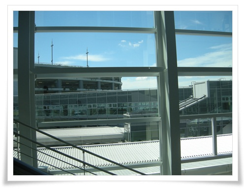

\- 우리나라는 가을날씨로 접어들었는데, 일본은 뜨거운 하늘이다.

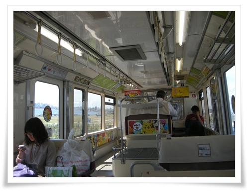

\- 하마마츠쵸행 모노레일을 탔다.

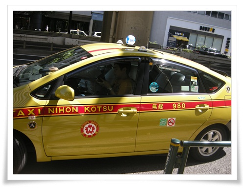

\- 하마마츠쵸에서 택시를 타고 목적인 아카사카로 이동.

택시비가 1,300엔 정도 나왔다.

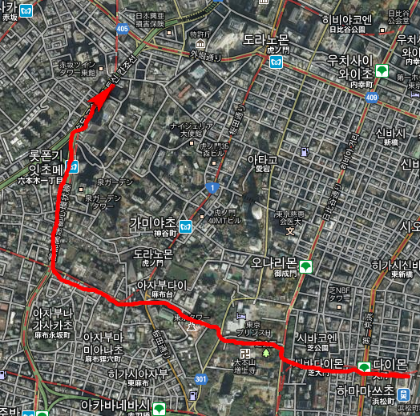

\- 모노레일 종점인 하마마츠쵸와 아카사카까지의 이동 경로.

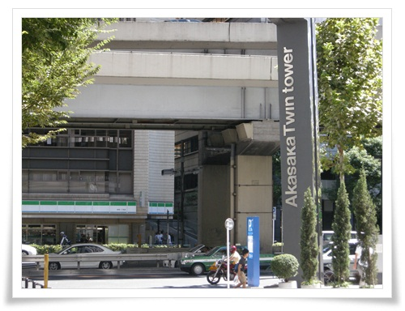

\- 아카사카 트윈타워

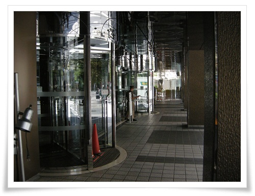

\- 휴일이라 외부인 출입이 안되어, 법인 직원이 내려올 때까지 기다렸다.

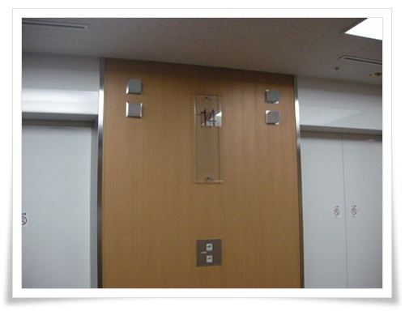

\- 사무실 14층.

\- 사무실 회의실에 짐을 풀어 본격적으로 일할 준비를 한다.

늦은 점심을 먹기 위해 식당을 찾아 갔다.

사무실 뒷쪽에 식당가들이 많이 있는데, 일요일이라 영업하는 곳은 많지 않았다.

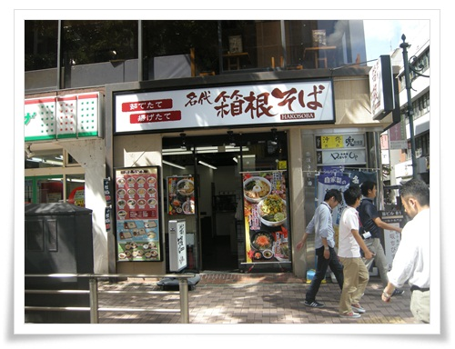

\- 점심 먹으로 간 곳은 "箱根소바", 상근소바, 하코네소바.

하코네가 온천으로 유명한 지역명이니까 그쪽 스타일로 요리하는 소바집인 것 같다.

600엔짜리 카레/모밀면 세트를 주문하여 먹었다.

에어콘도 나오지 않아, 실내 온도 33도인 회의실에서 저녁 식사 없이 밤 11시까지 일했다.

당장 내일인 월요일에 보여줄 작업을 해야하였기에..

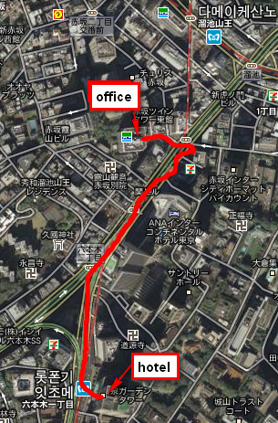

\- 사무실에서 호텔 빌라폰테뉴 롯본기점까지의 거리.

캐리어를 끌고 호텔로 걸어가 늦은 체크인을 했다.

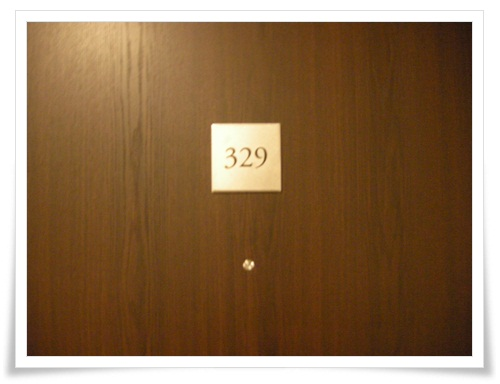

\- 이번에 묵은 빌라폰테뉴 롯본기 329호실.

시오도메 객실보다 더 좁고, 더 낡았다.

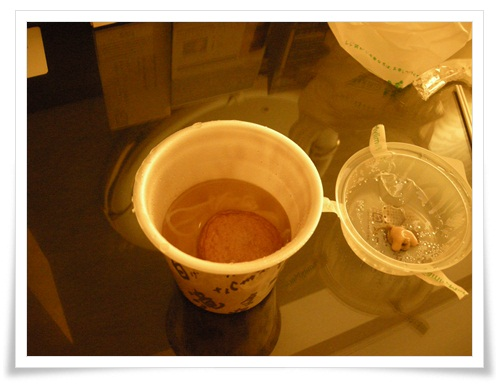

\- 매우 늦은 저녁.  편의점에서 산 어묵.

역시 일본에서 먹은 것 중 어묵이 제일 맛있다.

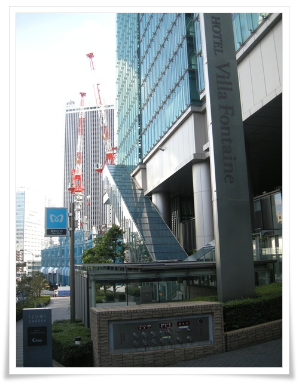

\- 롯본기 이초메 역 바로 앞에 있는 숙소 빌라폰테뉴.

IZUMI Garden이라는 건물에 있다.

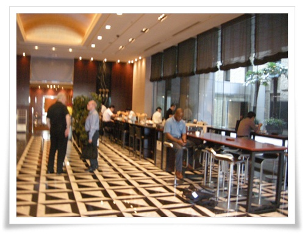

\- 아침식사는 호텔 로비에서 간단한 뷔페식.

아침식사 시간은 7시부터 9시반까지.

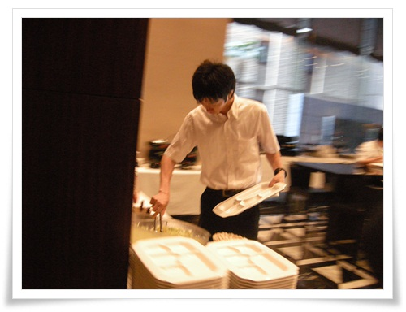

\- 이렇게 식판들고 먹는 방식.

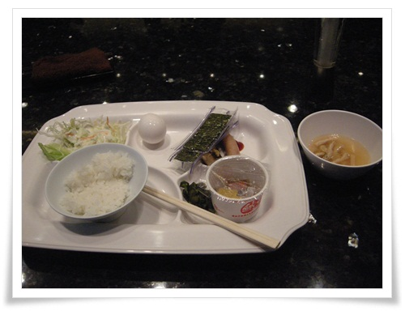

\- 나의 아침식사.

낫또와 날달걀을 밥에 비벼 김에 싸 먹는게 내 입맛에 딱 맞다.

아침식사를 마치고, 8시 40분에 호텔 로비에 모여 사무실로 출근.

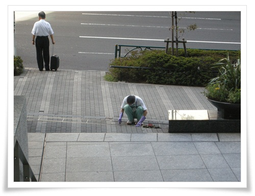

\- 호텔 로비에서 보도 블럭 청소하는 사람을 아주 열심히 일하는 본다.

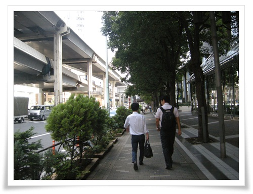

\- 아직 더워지긴 전 선선한 아침 공기를 마시며 출근하는 길.

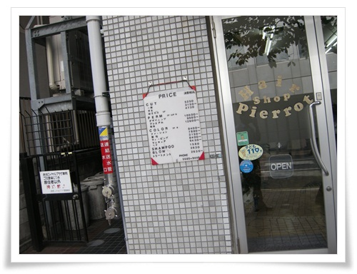

\- 출근길 옆 이발소에 가격표가 있어 보니, 커트가격 5,250엔(학생은 3,150엔).

우리돈 8만원이라는 어마어마한 가격이군.

하긴 내가 블루클럽만 다녀서 그렇지, 시내 미용실도 제법 비싸다고 하더군.

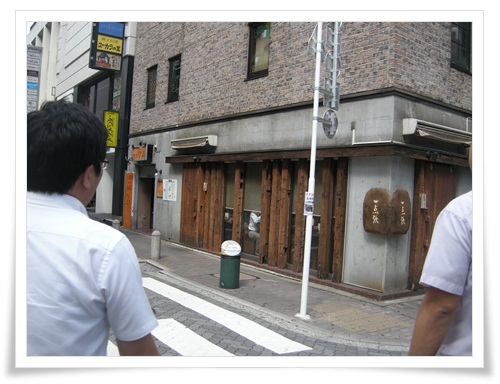

\- 점심은 아카사카의 라멘으로 유명하다는 식당으로 갔다.

식당명을 "이찌뎅쵸"라고 읽어야 하나?

일본어 사전 돌려보니, "전문점"이라는 뜻인것 같다.

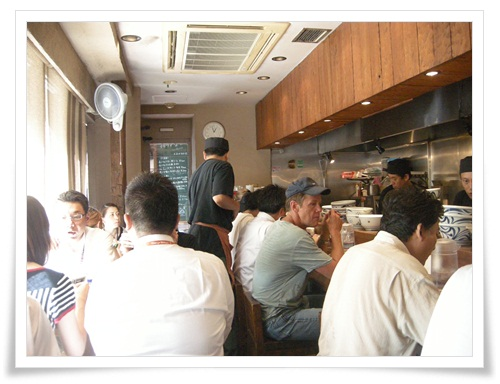

\- 좁은 식당 내부는 만원이다.

일본 라멘이 내 입맛에는 맞지 않은 음식이라 내게는 그냥 그런 편.

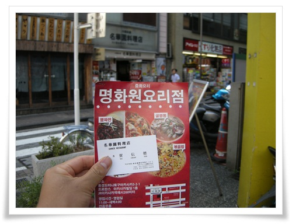

\- 식사를 마치고 밖에 나오는데, 근처 명화원이라는 한국식 중화요리식당 사장이 팜플렛을 건넨다.

밤에도 배달되니까, 꼭 찾아달라고..

둘째 날도 저녁은 밤 12시 퇴근하면서 편의점에서 산 어묵으로.

산책한 시간도, 별 볼 만한 장소도 없는 곳이라 아침 식사후 간단히 동네 한바퀴만 돌았다.

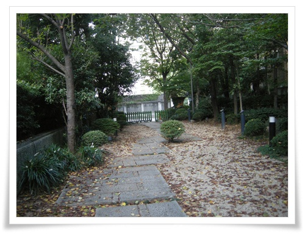

\- 호텔 뒷편 산책로.  몇10미터 안되는 곳인데, 이곳도 무슨 공원이라고 이름을 붙여놨더군.

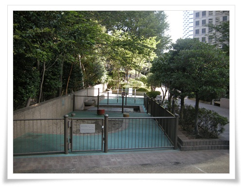

\- 이 공원에 있는 놀이터.  무척 작다.

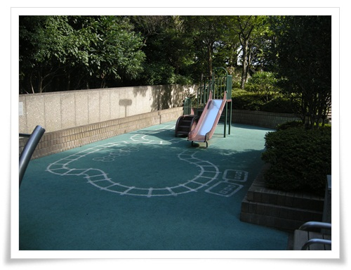

\- 미끄럼틀앞에 그려진 것은 어렸을 때 한 오징어 놀이랑 비슷해 보인다.

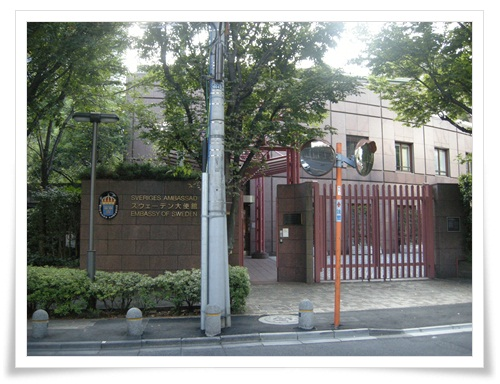

\- 스웨덴 대사관도 있군.

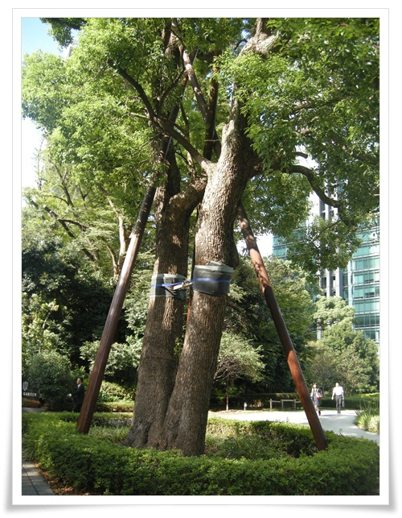

\- 지진과 태풍이 많은 탓인가, 큰 나무들도 이렇게 단단히 지탱을 해 놓았군.

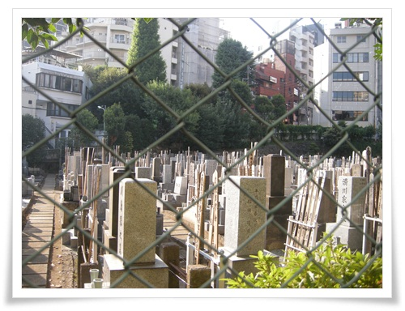

\- 도심 한가운데 있는 묘지.

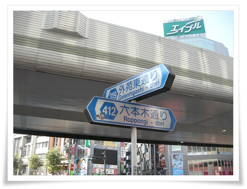

\- 롯본기 거리

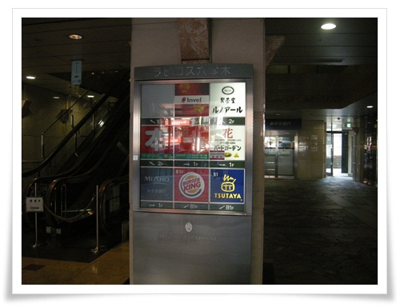

\- 롯본기 사거리 건물에 제법 큰 서점이 있는 것 같은데 불행히 서점 영업시간에 들를 시간이 없군.

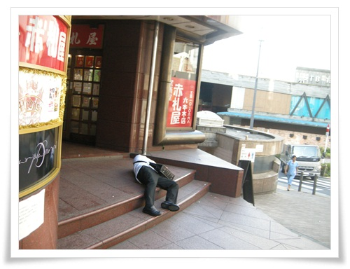

\- 환락의 거리답게, 출근시간인데도 아직 쓰러져 있는 사람들도 심심찮게 보인다.

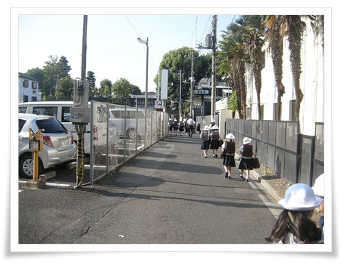

\- 등교하는 초등학생들.  저 모자도 교복에 포함되는 것인가 보다.

\- 셋째날 점심은 법인장님이 쏘는 초밥집.  "우마이스시깡".

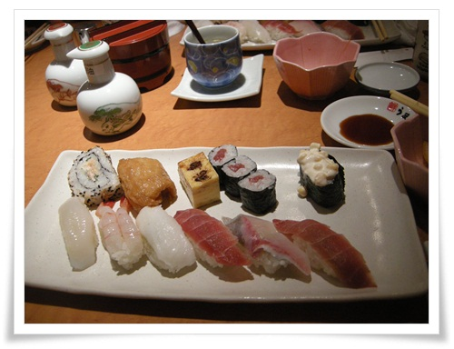

\- 점심 특선인 1,300엔짜리 초밥정식.

같이 나온 녹차도 아주 맛있었고, 참치국물로 맛있었다.

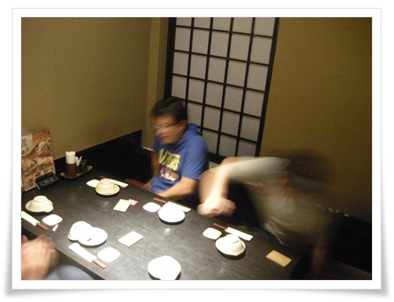

\- 마지막 날 밤은 롯본기 뒷 골목에 있는 한 이자카야에서 저녁 겸 술을 마셨다.

귀국은 하네다발 낮 12시05분 비행기.

아침을 먹고 호텔 뒷 동네로 나섰다.

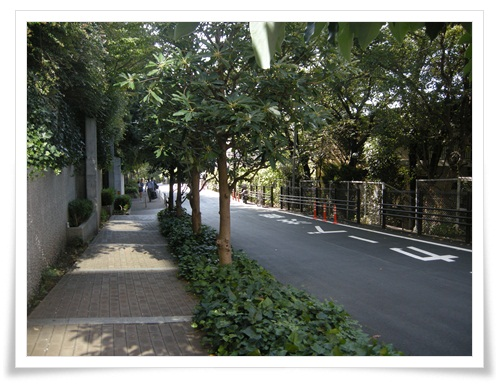

\- 한적한 골목.

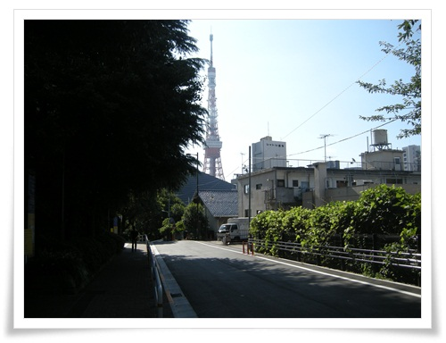

\- 저 앞에 있는 도쿄타워.

지도상으로 봤을 때 도쿄타워와의 거리는 한 1.5km 정도 되는 것 같았다.

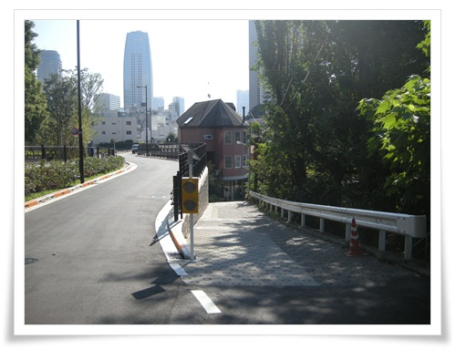

\- 갈림길에서는 뭔가 신기한 게 있을 것 같은 오른쪽 길로..

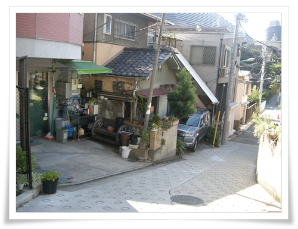

\- 이게 평범한 일본의 주택가인지는 모르겠다.

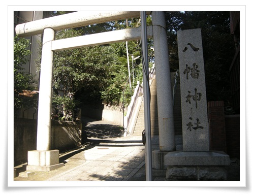

\- 길가에 보인 "팔번신사".  하찌망 신을 모신 신사라고 한다.

일단 들어가 본다.

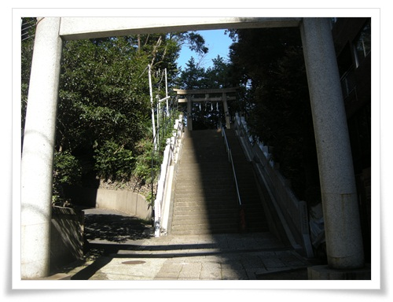

\- 신사로 올라가는 계단이 있고.

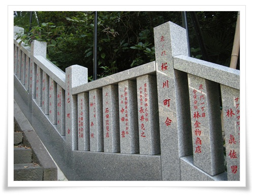

\- 계단에서는 뭔가 시주한 사람 이름처럼 보이는 글자들이 새겨져 있다.

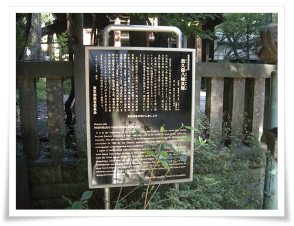

\- 하찌망 신사에 대해 소개한 글.

하찌망이 막부의 수호신이라고 하고, 12세기부터 널리 퍼졌다고 한다.

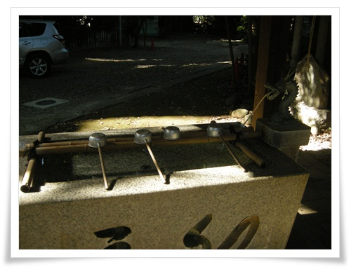

\- 뭔가 약수터처럼 보이는 것도 있고.

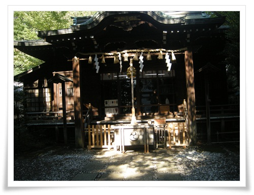

\- 이게 본당인가 보다.

\- 무슨 금방울과 손잡이가 있는데, 무엇을 상징하는지 모르겠군.

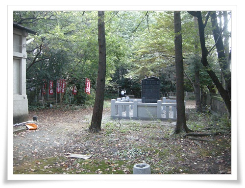

\- 도쿄 한 복판에 그래도 이런 공간이 있군.

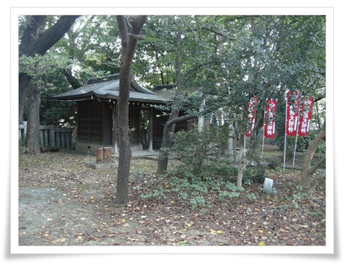

\- 건물 상태로 보아, 그리 썩 잘 관리되는 것 같지는 않다.

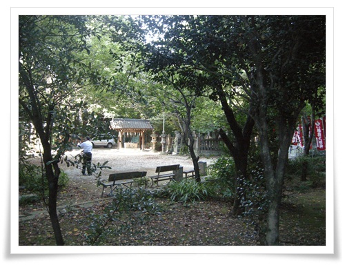

\- 나와, 혼자 체조하는 저 두사람만이 신사에 있었다.

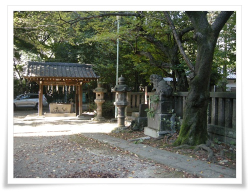

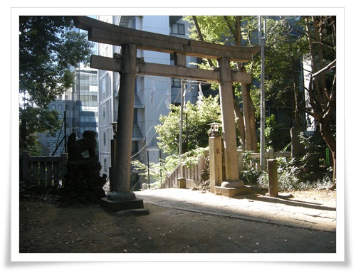

\- 이게 올라왔던 정문.

\- 이게 후문인가 보다.

                                  \- 신사옆에 있는 거대한 건물.  지도에서 보면 피라미드 모양인데, 건물명이 霊友会釈迦殿.

불교 법당이라고 하는군.

\- 소학교도 있다.

\- 마지막 날 아침 산책 코스

