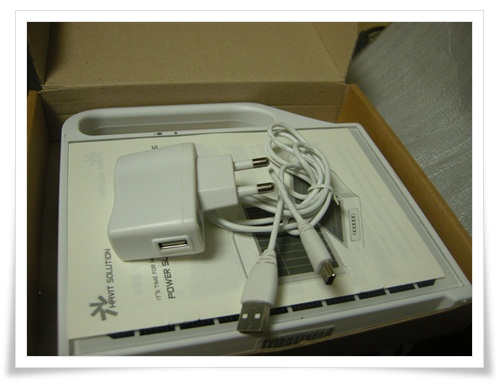
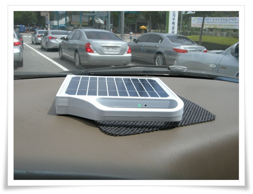
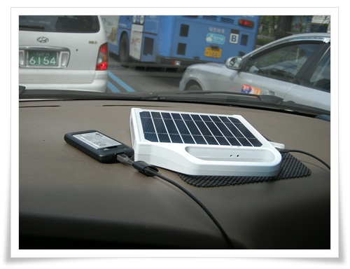

# 태양광충전기 파워슬레이트 600

요즘 발전기가 땡기긴 했다.

근래 자주 보고 있었던 것은 3KW 짜리 엔진발전기.  3KW짜리 엔진발전기만 있으면 어디를 가던 내가 가진 모든 전기제품을 가동시킬 수 있을 거라는 그냥 행복한 상상 때문.  쓸데도 없으면서 괜히 가지고 싶다는 소유욕때문에...

자전거로 만드는 자가발전기도 관심이 갔다.  주로 구식 동그란 세탁기의 모터를 자전거 페달에 연결하여 만들다더군.

그래서 아파트에 누가 세탁기 버리지 않나 살펴보는 것도 요즘 습관중 하나.

[지난번 지른 휴대용자가발전기](../10909110.html) 에 이어 지른게 바로 이 태양광충전기.

제품명 PowerSlate 600.

생소한 제품답게, 구글에 검색을 해 봐도 사용기하나 검색되지 않았다.

한글로 된 것도 유일하게 쇼핑몰 하나만 검색될 뿐.

이 쇼핑몰에서 파는 가격은 [8만5천원](http://www.starman.co.kr/index_content.jsp?pagename=content&p_code=CZZ00030&sort=m5&sort_id=c501c502).  제법 비싸다.  하긴 솔라판넬과 리튬배터리 가격이 있으니 그 정도 가격이란게 이해가 되긴 하지만, 그래도 선뜻 구매할 만한 가격은 아니다.

이걸 만드는 회사에 다니는 예전 직장 사람이 모임때 한번 가지고 왔길래 구경해 봤다.

신기하게 생겼길래, 직원빽으로 원가에 좀 사게 해 달라고 하여 샀다.

지름은 같이 질러야 하는 법.

왕년 유티때 같은 지름 멤버였던 진원씨에게 같이 지르자고 꼬드겼다.

그 시절 둘이 서로서로 뽐뿌질해가며 질러댔었다.

명절때면 건강식품을 질렀고, 반품몰을 통해 테이블파라솔을, RC헬기도, 전동그라인더도, USB메모리도,..

그러다 서로 지리적으로 떨어지다보니 자연 지름이 줄어들긴했다.

나는 껍데기뺀 알맹이만 받고, 진원씨껄로는 그래도 껍데기까지 달라하여 2대를 샀다.

\- 개봉모습.  본체, 설명서, usb충전기세트 이렇게 되어 있다.

\- 신제품은 항상 검수요원을 통과해야 한다.

고급스러움하고는 거리가 있어 보이는 외관이다.

\- 랜턴 빛이 기대이상으로 상당히 밝다.

이거 만든 쪽에서도 자랑거리인지 상품소개에서도 " **상상이상의 밝음**"이라 되어 있군.

캠핑가면 한번 써 먹어 봐야겠다.

\- 태양으로 진짜 충전되는지 보기 위해 차 대쉬보드 위에 올려놓으니, 충전중이라는 초록색 LED가 들어온다.

\- 500mA USB 출력은 제대로 되는지 검사.  배터리 충전기에 불 들어온다.  동작하나 보다.

제품 스펙

3W PV 판넬 : 중국산이라 함.

\- 3W 5V출력이니까 최대 출력 전류는 3/5=600mA.

4,400 mAh 리튬이온전지 : 삼성꺼라 함.

\- 내 핸드폰 배터리가 1,500mA니까, 이걸로 2번정도 완충시킬 수 있겠군.

\- 3W 판넬로 이걸 완충하려면 4,400/600 = 8.  이론상 8시간 걸리는군.

6개 LED 120루멘 : LG이노텍꺼라 함

\- 상당히 밝음.  4,400mA 내장 배터리로 10시간 연속사용가능하는군.

500mA USB출력단자

\- 표준 USB 출력이긴 한데, 요즘 일반적인 충전기가 1A인것을 감안하면, 충전시간이 제법 걸리겠다.

     그리고 아이패드는 충전불가겠고..

케이스 : 마감이 좋지 않음.  싼티가 난다.

