# 정선 덕송리 2박3일 여행

1994년이후 18년만의 서울 낮최고 기온을 기록중인 폭염중에 정선으로 피서를 떠났다.

올해는 휴가운이 좋다.

여지껏 휴가시즌만 되면 더 바빠져, 휴가다운 휴가를 보낸 기억이 별로 없었는데, 이번엔 때 맞춰 프로젝트도 한가해졌다.

그 덕에 휴가에 임하는 마음도 편하고, 날씨도 우기가 아닌 건기로 푹푹찌는 폭염으로 진정 피서라는 명칭에 어울리게끔 되었다.

그리고 여름 휴가를 두번에 걸쳐 가는 호사까지 누리게 되었다.  첫 휴가는 경북 영덕. 이번에는 강원 정선.

딸내미 또래 식구 모임중 한 아버지의 초대로 [작년 충북 진천에 놀러갔다](../10762474.html) 왔었는데, 이번에도 그 분의 초대로 강원 정선으로 갔다. 그 분 이모님이 정선에 사시는데, 그 집이 조양강 바로 앞에 있어, 그 집 마당에 천막치고 2박 3일 놀기로 했다.

8월 첫주가 초극성수기라 모든 숙박시설과 야영장은 꽉 찬 상태에서 여유롭게 여행을 한다는 것은 어지간한 호사라 할 수 있다.

8월3일 금요일 아침 4시에 일어나 최종 짐을 차에 싣고 5시 정선을 향해 출발했다.

그 새벽 시간에도 영동고속도로는 부분 정체였다.

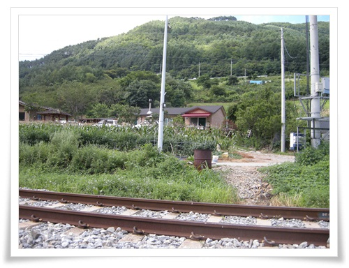

\- 정선읍 덕송리에 있는 집

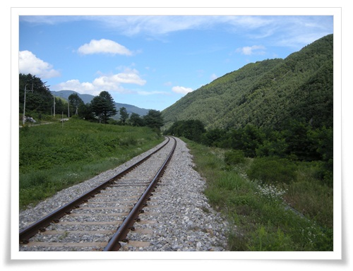

\- 집 앞으로 하루에 4번 기차가 다닌다는 철로가 있다.

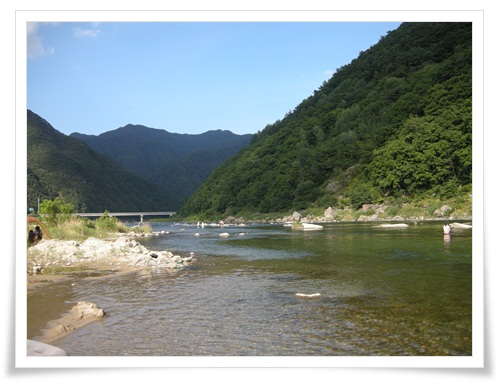

\- 그리고 철도 바로 너머에 있는 조양강

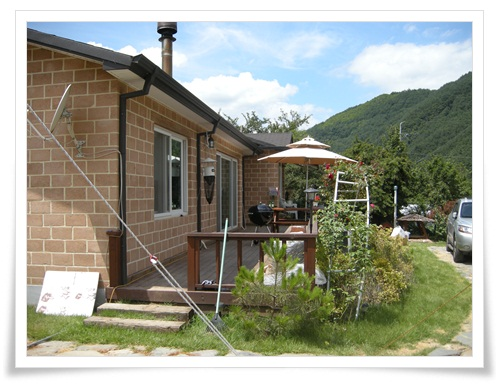

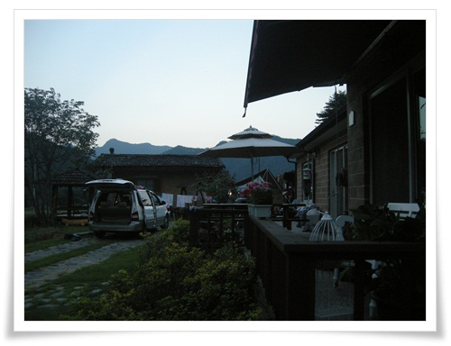

\- 어닝천막과 잔디, 그리고 가지런한 돌이 있는 마당, 멋지다.

강원도 정선군 정선읍 덕송리.

그림같은 곳이다.  멋진 풍광에 멋진 집.

그 때문에 주인분도 매 주말마다 아시는 분들이 놀러 오신다고 한다.

부럽다는 생각이 든다.

생활비 걱정만 없다면, 이런 집에서 자급자족하며 살고 싶다.

경운기 한대 질러 산길을 쏘다녀보고 싶고, 시끄러운 소음을 내는 컴프레샤도 맘껏 돌리며 뚝딱뚝딱 장비 만지는 일도 해 본텐데 말이다.

이번 여행에 집에서 목공하고 남은 나무를 몽땅 가져갔다.

야영을 할 때 가장 아쉬운 것이 바로 테이블.

테이블이 있어야 좌식 생활을 원활히 할 수 있는데, 문제는 캠핑용 테이블은 비싸기도 할 뿐더러, 부피도 많이 차지한다.

가져간 컴프레셔와 에어타카로 테이블 2개를 만들어 사용했다.  이것도 1회용 테이블로서 마지막 날 태우고 올 생각이었다.  \\다행히 이 집에서 이런 재활용되는 나무를 남겨두면 유용하다고 하여 남겨두고 왔다.

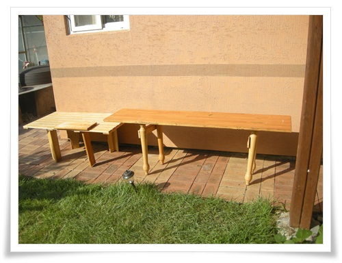

\- 이번에 만든 식탁 2개.

제법 유용하게 썼다.

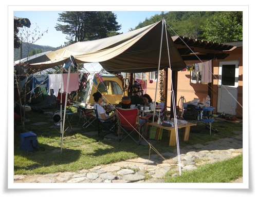

\- 우리의 베이스캠프

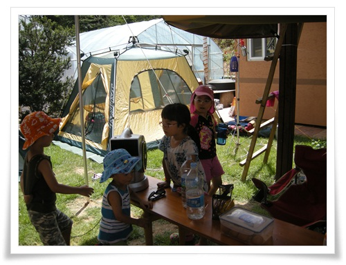

\- 모두 7살인데 딸내미와 그 친구들.

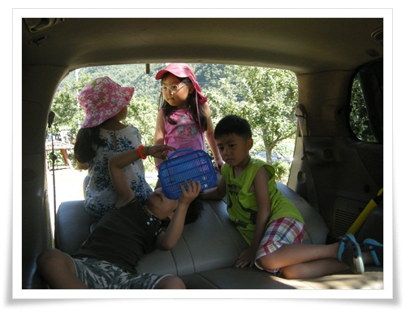

\- 내 차 의자들을 다 젖혀 놓았더니, 내 차 안에서 논다.

점심을 먹은 후 다 같이 조양강 개울가로 갔다.

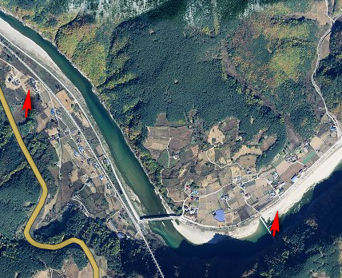

\- 왼쪽이 집, 오른쪽 화살표가 첫날 오후 논 개울가

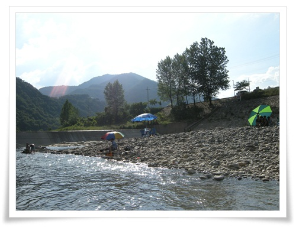

\- 오후를 보낸 조양강 개울가

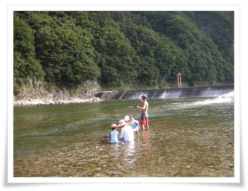

\- 다른 두 가장은 고기잡는 중

다슬기가 많이 있는 곳이라, 스노클링 착용하고 다슬기를 잡았다.

수렵 채집 활동은 인류의 기본적인 생본 본능으로 DNA속에 각인되어 있어서 그런가, 시간 가는 줄 모르게 재미있었다.

다음날 피서지는 항골계곡.

정선읍 북평면 북평리에 위치하고 있다.

예전 탄광공장이 있었다 한다.

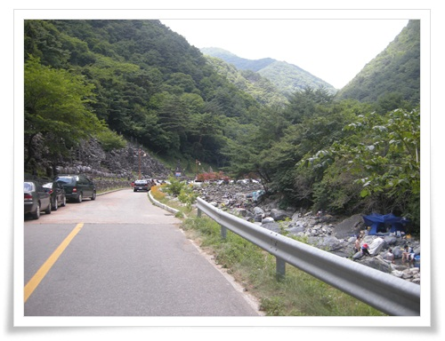

\- 항골계곡

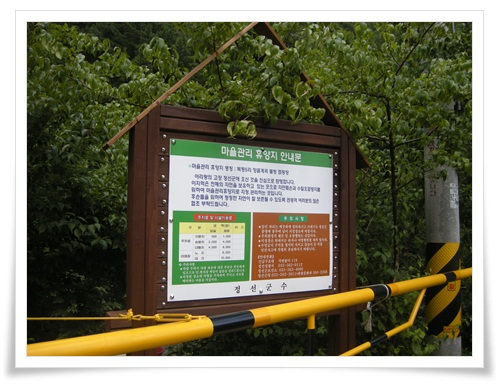

\- 마을휴양지라고 하니 이곳 북평리에서 자체적으로 운영하는 것인가 보다.

야영장 이용료 만원, 노지는 6천원.

입장료도 있다고 하는데 징수는 안하는 것 같다.

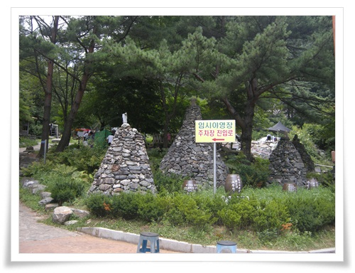

\- 임시야영장이란 말로 보아 휴가철 좀 더 넓였나 보다

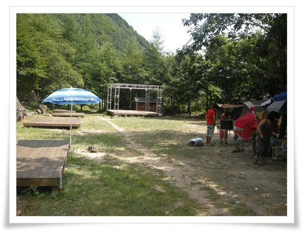

\- 이곳이 야영장.

오토캠핑장이 아니어서 그런가 빈자리가 보인다.

\- 야영장 끝에 있는 민가.

경치 좋은 곳에 위치해 있다.

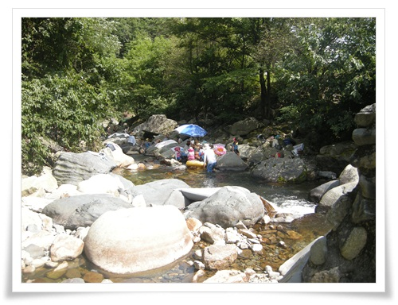

\- 우리가 자리를 잡은 곳은 주차장 바라 옆 계곡.

시원한 그늘 밑에서 말 그대로 피서를 했다.

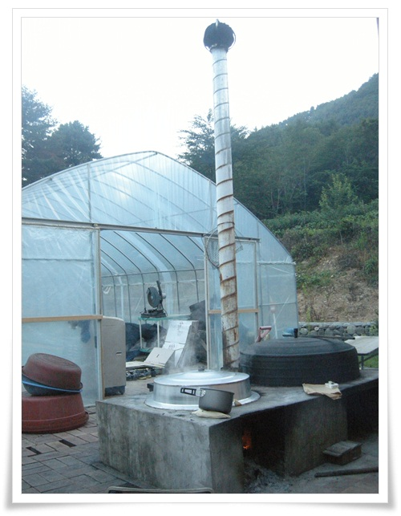

\- 마지막 밤 저녁 메뉴는 닭백숙.

가마솥에 닭 삶는 중.

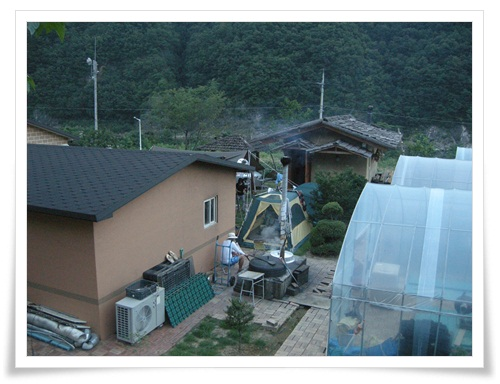

\- 마지막 밤, 기억하고자 풍경을 남겼다.

참 멋진 집이다.

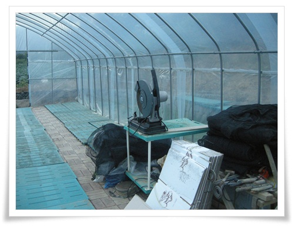

\- 비닐 하우스에는 탐나는 원형톱도 있고.

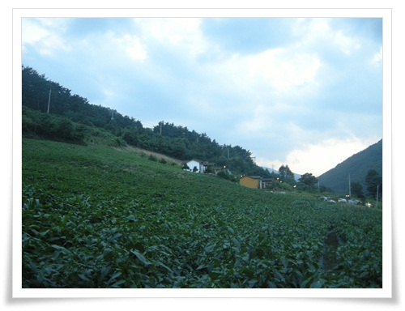

\- 집 뒤에는 고추, 옥수수, 콩이 심어져 있다.  그 옆으로 '언덕위에펜션'이 있다.

-참나리꽃도 보이고.

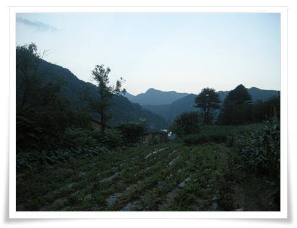

\- 암튼 이렇게 마지막 날 저녁해는 저물었다.

