# 아파트에 버려진 가구로 뒤주 만들기

아파트에 가구가 버려져 있으면 반사적으로 하는 행동이 가구로 다가가 나무 재질을 살펴보는 것이다.

거의 대부분이 MDF나 파티클보드 재질이라 그냥 돌아온다.

그러다 거의 1년 만에 원목으로 된 서랍장이 버려져 있었다.

낼름 주워왔다.

이걸로 뭘 만들어 볼까 하다가, 아내가 안에다 물건을 일단 쳐박아놓을 수 있는 뒤주 같은 것을 만들어 달라고 했다.

그래서 뒤주로 만들어 봤다.

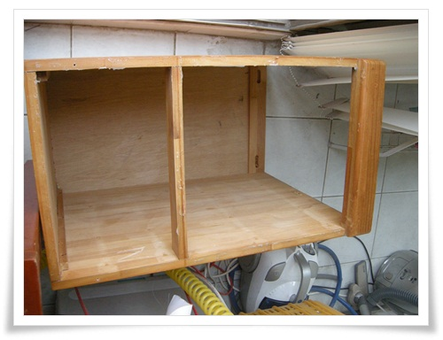

\- 먼저 서랍과 부속물을 제거하고 사포질을 했다.

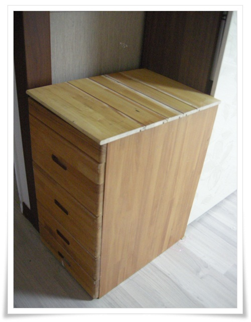

\- Version 1.0

서랍겉을 그대로 살리고, 위에 덮을 것은 서랍내부 나무와 타카로 집성했다.

만들고 놨지만, 영 폼이 안난다.

그러다 며칠 안 지나, 아파트에 장농이 버려져 있었는데, 문짝이 무려 원목이었다.

한 밤중에 드릴들고 나가 문짝을 떼 왔다.

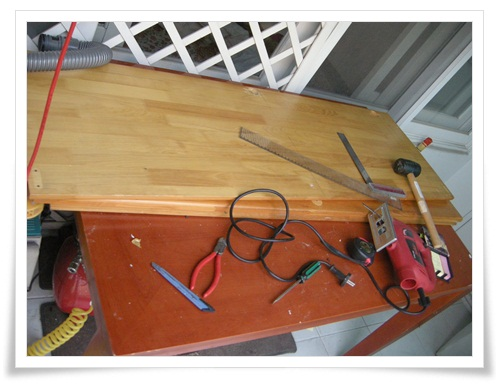

\- 문짝으로 뒤주 뚜겅과 앞뒤주면을 교체하기 위해 작업 시작.

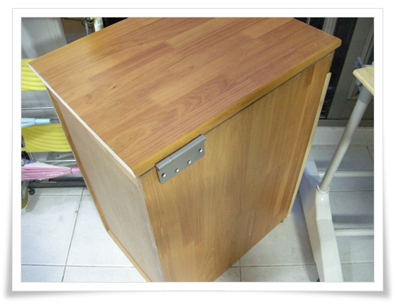

\- 윗 뚜껑이 열리도록 경첩을 달았다.

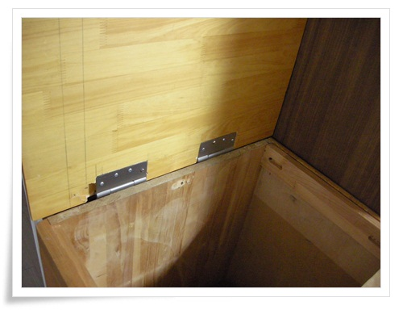

\- 경첩달고 뒤주 개방 모습.

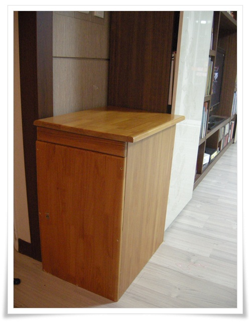

\- 뚜껑과 앞뒤면 교체, 경첩이 장착된 Version 2.0

하지만 여전히 모습이 찐따같다.

버그로 상판 치수 오류로 간격이 안 맞고,

경첩의 두께를 계산하지 않아, 뚜겅을 닫으면 경첩만큼 공백이 있다.

그래서 버그 픽스 작업 시작.

가장 난이도가 있는 경첩 두께만큼 홈을 파는 작업부터 시작.

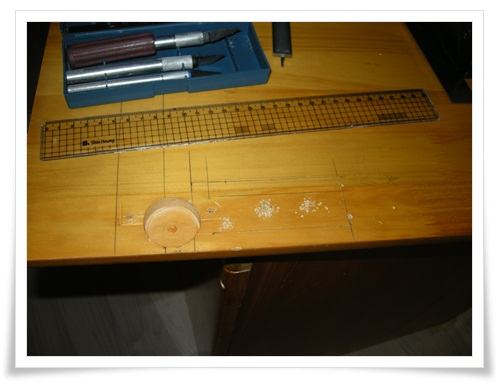

\- 경첩 들어갈 자리를 표시.

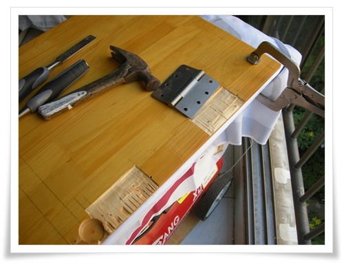

\- 그리고 끌과 망치로 홈파기 시작.

소음으로 베란다에서 할 만한 작업이 아니었다.

아파트 밖으로 가지고 나가 놀이터에서 홈을 파냈다.

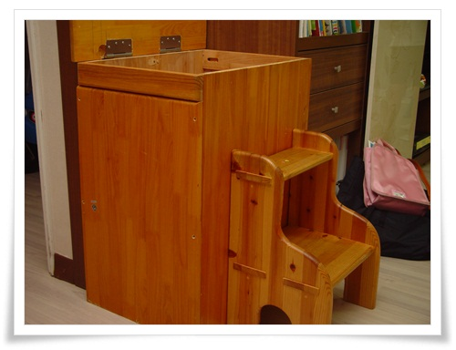

\- Version 2.1  경첩홈만큼 속을 파내 상판이 딱 들어맞도록 수정한 완성작.

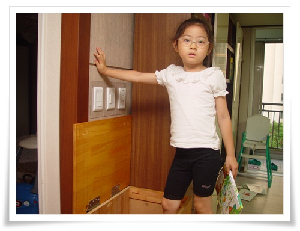

\- 전문 품질관리요원이 등장하여 테스트를 시작한다.

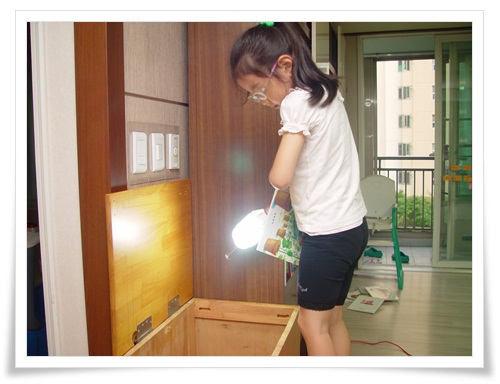

\- 꼼꼼한 점검을 위해 작업등과 책을 들고 들어간다.

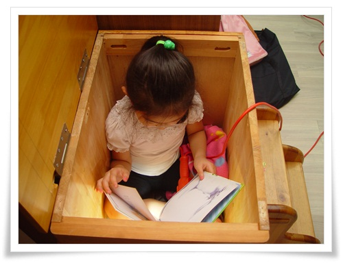

\- 들어가 불켜고 책 세권 봄으로써 성능 시험 완료.

