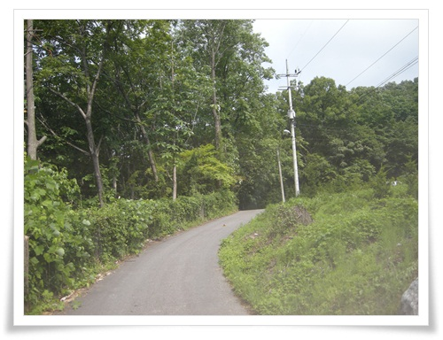
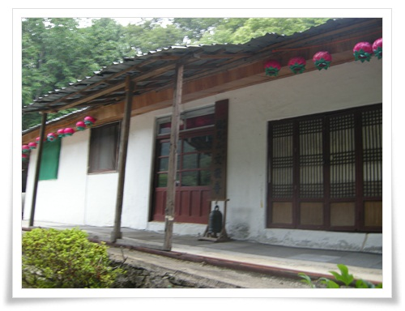
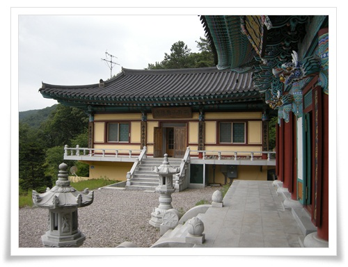
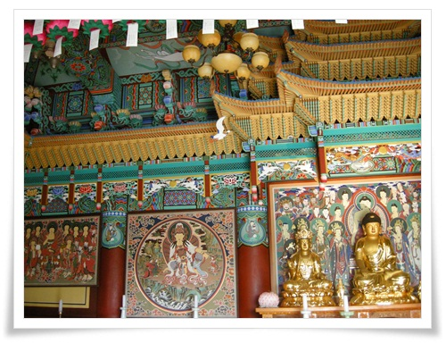
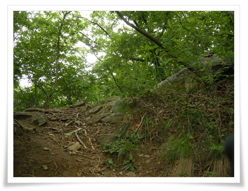
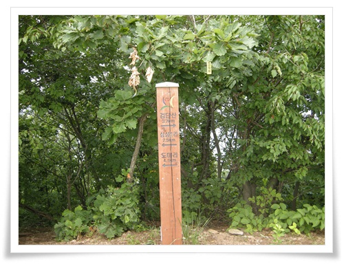

# 광주 용마산 그리고 각화사

가평쪽 산을 가볼까 하며 광주를 지나 가는 중, 용마산 등산 안내도라는 것을 발견하였다.

광주시와 하남시의 경계에 있는 산이 용마산이다.

중랑구에 있는 용마산은 어렸을 때 많이 올라가본 터라, 동일 이름을 가진 산을 보니 호기심이 발동했다.

게다가 6번 국도를 타고 서울 빠져 나갈 때 한강 너머로 보이는 산이 궁금하기도 했었던 차에 바로 차를 돌려 용마산으로 향했다.

\- 용마산 입구는 이 표시석에부터.  각화사라는 안내판을 따라 갔다.

\- 이 동네가 광주시 남종명 삼성리

\- 왼편에 주말농장으로 보이는 밭들이 있다.

\- 삼성리 마을.

\- 마을길을 따라 각화사로 향했다.

\- 마을에서 이제 산으로 올라가는 길.

\- 처음 나온 것은 일반 민가처럼 보이는 문경사

\- 문경사

\- 문경사 본당

\- 문경사에서 좀 더 올라가니 각화사가 나왔다.

\- 각화사 본당 아래 주차를 했다.

\- 각화사 대웅전

\- 대웅전과 사무실 두개의 건물로 단촐하지만 제법 화려하다.

\- 대웅전 오른편에 약수물

\- 대웅전 앞 마당에서 바라보는 풍경이 좋다.

\- 대웅전에서 삼배를 드리고, 불상을 본다.

대웅전이니 가운데가 석가모니불 좌우로 문수보살, 보현보살이겠군.

\- 화려한 대웅전 천장.

저 천장의 기와도 무슨 명칭이 있다고 배웠는데 기억이 안난다.

\- 각화사 오른편으로 계단이 나 있다.

\- 계단을 다 올라가면, 관리가 안된 터가 있다.

\- 대웅전 뒤에 있으니 아마 칠성각 정도 되는 것 같은데, 관리는 안되는 것 같다.

\- 사무실 왼쪽에 있는 화장실 앞 길을 따라 용마산을 오르기 시작한다.

\- 이쪽 길은 등산객이 별로 없는지, 풀이 제법 많다.

\- 바위도 제법 있고, 길이 그냥 동네 뒷산 수준은 아니다.

\- 제법 가파른 길을 따로 올라갔다.

\- 용마산과 삼성2리 표지판.

\- 용마산 정상

\- 용마산 정상에서 검단산까지 3.7km

보통 등산객들은 검단산에서 용마산으로 걷는다고 하는군.

\- 용마산 정상에서 보이는 한강

\- 저 멀리 두물머리도 보인다.

\- 저 빨간핀이 각화사.  그리고 저 산이 용마산.

