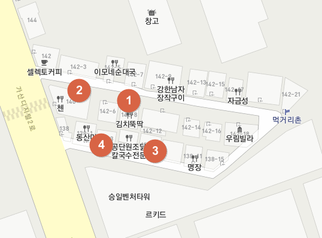
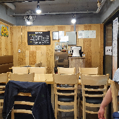
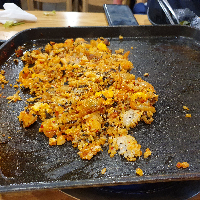

# 직장인의 가산 주변 식당 탐험 - 구이명가

가산이 다른 동네에 비해 맛집이 없는 편이다.

그래도 다년간의 가산 생활을 하면서 발굴해 맛집을 공개한다.

일단 아래 4군데를 집을 추천한다.

고기가 땡길 때 이중 3번 구이명가가 좋다.

미리 초벌구이를 해서 먹는 것은데, 맛도 좋고, 양도 만족스럽고, 주인장의 서비스 정신도 좋다.

추천메뉴는 A세트에 볶음밥.  A세터 시키면 된장찌게와 계란찜이 기본으로 나온다.

그렇게 고기에 집중한 후, 돼지 기름에 밥 볶아 먹는 것으로 마무리하면 최고다.

월요일 저녁 찾은 구이명가.

이태월클럽 코로나 확진 여파로 손님은 우리말고 없었다.

