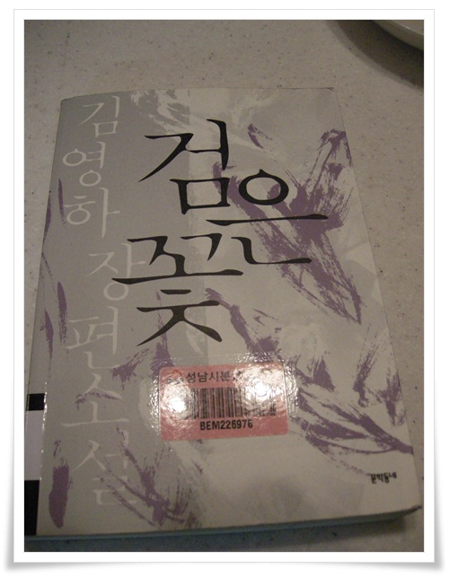

# 김영하의 검은꽃

팟캐스트를 듣게 된 첫 계기가 '김영하의 책 읽는 시간' 이었다.

소설가가 아나운서보다 더 좋은 목소리를 책을 읽어주는 것을 듣는데,  아주 편안한 시간이었다.

그 팟캐스트중 한 에피소드가 바로 김영하 저자가 쓴 '검은꽂'이란 소설편이다.

봐야지 하면서 도서관에서 책을 검색해 보면 매번 대출중이라 빌려 볼 수가 없었다.

그래서 분당도서관으로 도서관을 옮겨 드디어 대출했다.

멕시코 최초의 조선 이민자를 소재로 하여, 과거 애니깽이라는 영화가 떠오르는 소설이었다.

먹고 살기 위해, 그리고 상실해가는 국권앞에서 생존을 위해 계약 이민을 떠나러 배를 타는 사람들이 나온다.

다양한 사람들이 등장하지만, 그 중 주인공보다는 이종도라는 황족이 내게 더 나와 동일시되었다.

몰락한 사대부 왕족으로 생존, 그리고 현실 도피를 위해 대책없이 식구를 데리고 멕시코행 이민선을 탄 인물 이종도.

과년한 딸과 아들을 데리고 있으나 현실 적응도 못하고 받아들이려고 하지도 않는 모습에서 저 시대에선 내 나이인데도 그럴 수가 있겠구나라는 묘한 감정이입이 되더군.  이유는 아마도 나이가 비슷하기 때문인 듯 싶다.

경제의 을사조약이라는 한미FTA가 이미 발효되었고,

그리고 진정한 을사늑약이라 불리는 최근의 한일군사정보협약를 하려는 정부를 둔 지금의 시대 상황을 보면 역사는 과연 되풀이되는가라는 생각도 든다.

