# 5번째 일본 도쿄 출장

갑작스런 일본 출장.

벌써 5번째 일본이다.  이로써 일본이 이제껏 내가 제일 자주 가 본 나라였던 중국일 제치고 1위 등극.

매번 똑같은 도시 도쿄.

6월 25일 오후 3시반 비행기로 출국하여 27일 12시 비행기로 귀국하는 2박 3일 일정.

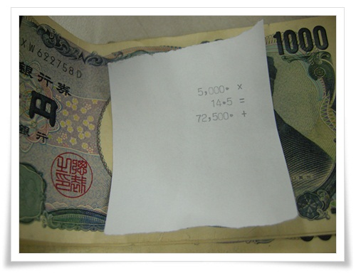

\- 회사 출근하여 5,000엔 환전했다.

환전은 명동 사설환전소.

사설환전소가 은행보다 훨씬 환율이 좋다.

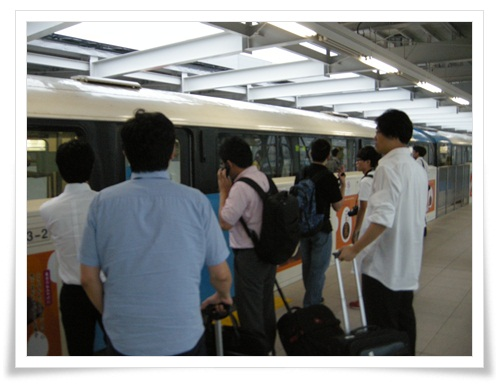

\- 여느때처럼 하네다공항에서 하마마츠쵸까지 가는 모노레일 탑승.

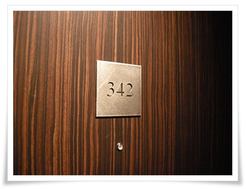

\- 호텔은 이번에도 빌라퐁텐 시오도메.

이번 내 방은 342호.

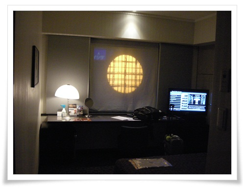

\- 342호실 내부.

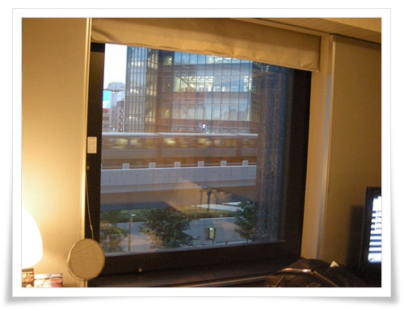

\- 창 밖으로는 시오도메역 전철이 보인다.

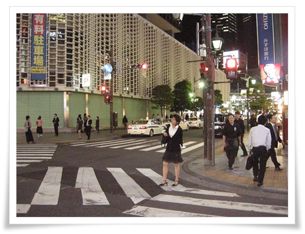

\- 저녁식사는 시오도메인근의 최대 유흥가인 심바시역 근처로.

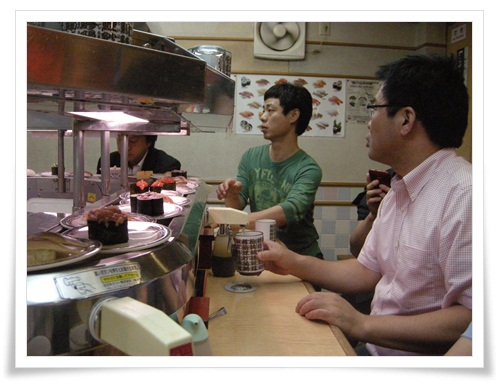

\- 고르고 골라 들어간 곳은 회전초밥집.

난 초밥은 안 좋아하는데,..

각 자리마다 녹차나오는 꼭지가 있다.

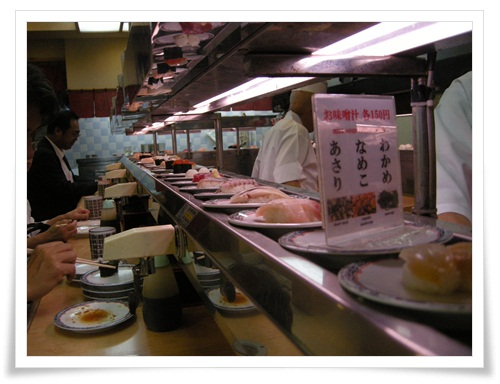

\- 초밥 한접시에 150엔.

내 입맛엔 썩 맞지 않는다.

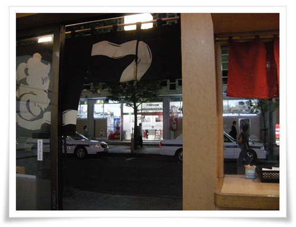

\- 저녁식사를 마치니, 북적이던 심바시 거리도 한산해졌다.

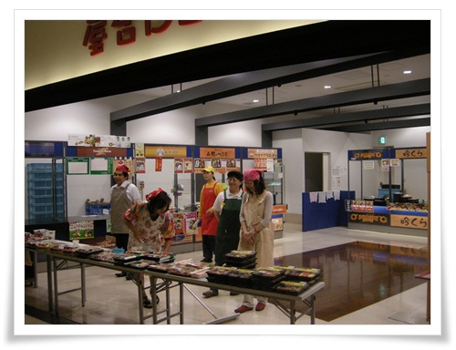

\- 2일차 점심시간.  점심때면 대부분의 매장에서 이렇게 도시락을 판다.

그래서 흰 비닐봉지에 도시락 사가지고 사무실 들어가는 회사원으로 북적이는데, 아직까지도 이 모습이 낯설긴 하다.

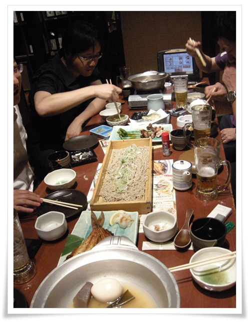

\- 이번 출장은 그래도 여유가 있어 저녁에 술 먹을 시간도 있었다.

역시 심바시 근처의 이자카야.

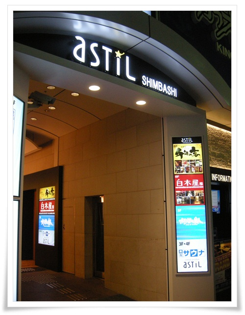

\- 11시가 넘어 2차로 들어간 곳이 이 건물 6층 이자카야.

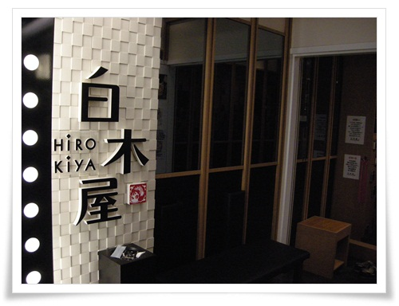

\- 여기는 새벽 3시까지 영업하는 곳이라 하더군.

비교적 술값도 싸다고 한다.

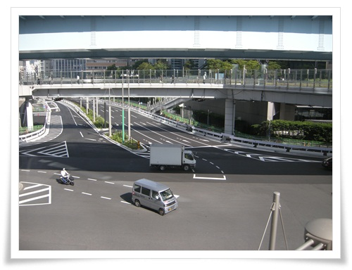

\- 아침 식사후 산책 시간.  일본 도로가 깨끗하기는 하다.

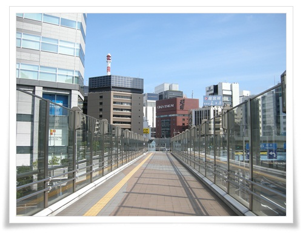

\- 좋아하는 와사비과자를 사러 돈키호테 가는 길.

\- 돈키호테 긴자9

일본 출장자체는 비교적 여유 있었으나, 출발할 때도 회사 출근했다가 출국하고, 귀국할 때도 김포공항에서 다시 회사 출근하여 야근하여 정작 피로는 국내에서 쌓인 듯 하다.

