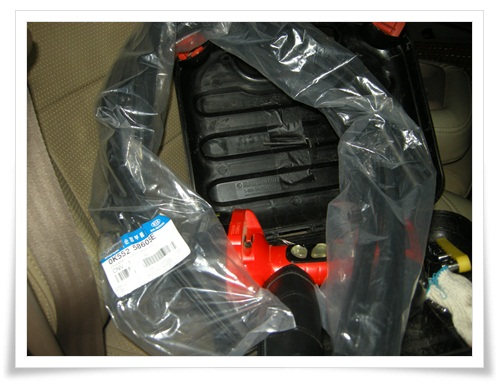
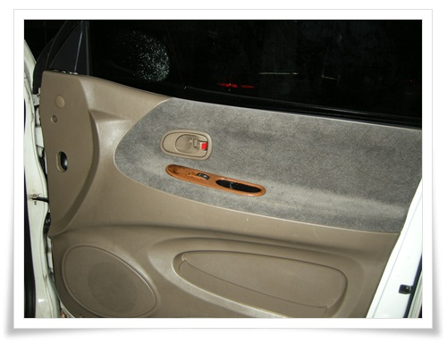
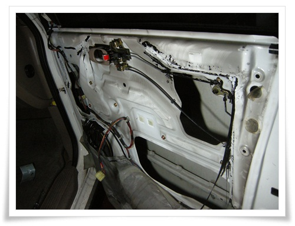
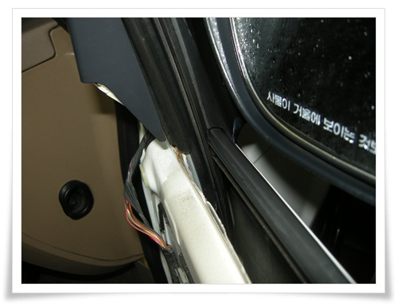
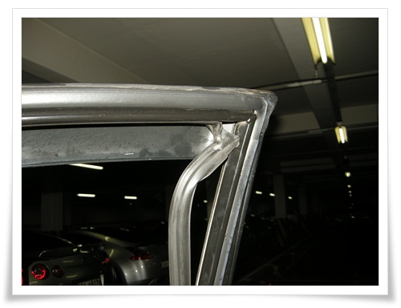
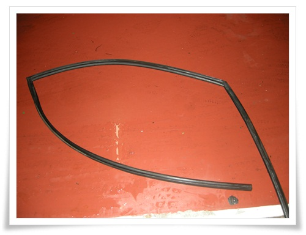
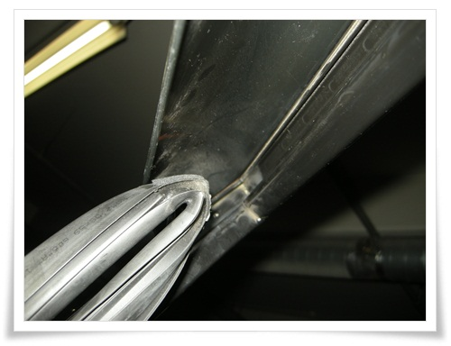
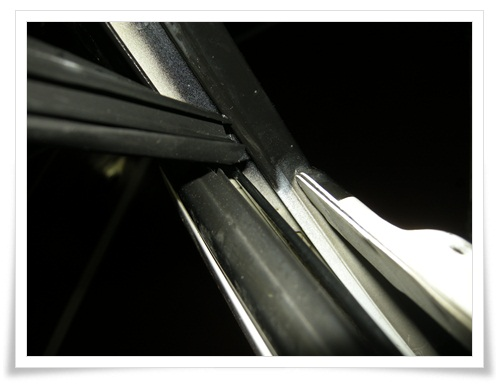

# 카니발 힘없이 올라가는 창문 수리

카니발 조수석 창문 한번 내렸다 올릴려면 한 세월이다.

살 때부터 그랬긴 했으나, 귀차니즘에 내비두고 있다가 드디어 맘 먹고 고쳐보기로 했다.

아예 안 움직이는 게 아닌, 느릿느릿 올라가는 것이 문제이므로 이건 모터보다는 고무의 문제라고 판단되었다.

모터는 전기,기계 부품으로 되면 되고 안되면 안되지 느릣느릿하지는 않기 때문에 모터가 문제일 가능성은 없다.

문짝의 창문은 좌우 고무에 밀착된 상태로 올라가고 내려가기  때문에, 고무가 경화되면서 마찰력이 커져 오래된 차들의 고질적인 문제점이다.

이 유리를 가장자리를 감싸는 고무 부품 명칭은 "글래스 런".  현대모비스상의 부품명은 "챈널-글래스 런"

부품번호 0K55258605D.  같은 부품번호지만 좌우가 다르므로 살 때 왼쪽인지 오른쪽인지 알려야 한다.

주문은 온라인 부품몰인 IFMOTORS에서 했다.

배송비 포함 13,760원.

\- 주문한 다음날 글래스런 부품 도착.

작업은 지하주차장에서 시작.

작업을 하기 위해 문짝부터 뜯어야 한다.

\- 조수석 문짝.

볼트를 다 푼 후, 도어트림 밑쪽을 살짝 뜯은 후 위로 들어올려야 한다.

그걸 모르고, 그냥 확 뜯어재꼈다가 플라스틱 고정나사 2개를 분질러 먹었다.

\- 도어트림 제거.

문짝 뜯어놓고 보니, 예상보고 쉬어 보이지 않아 보였다.

\- 비닐막도 제거.

\- 먼저 창문을 완전히 내린 후 틈 사이로 구조 파악.

\- 그 다음 기존 글래스런 제거 시작.

2000년식이니, 13년된 고무로군.

\- 그 다음, 고무를 힘껏 쭉 뽑아 낸다.

\- 제거한 글래스런.  만져보니 많이 딱딱하긴 하다.

이제 새로 산 부품을 장착할 차례.

\- 먼저 우측 상단부터 집어넣어 자리를 잡았다.

\- 그 다음, 문 틈새로 철판과 유리 사이로 고무를 집어넣는다.

여기서부터 사투 시작.

연한 고무를 사이에 밀어넣는게 쉽지 않았다.

힘을 준다고 해서 들어가는것 아니고..

\- 그래서 잘 미끄러지라고 주방세제를 고무와 유리, 철판에 뿌리면서 다시 시도.

이렇게 고무 집어넣는데만 1시간 가량 사투를 하여 결국 마무리했다.

완료하고 창문 올리는 버튼을 누르니, 시원스레 잘 올라간다.

글래스런 교체를 비록 이렇게 처음 해보기는 했지만, 다음에 한다고 해서 잘 할 것 같지는 않다.

제법 난이도가 있는 작업이다.

다음에 또 이럴 일이 있으면, 그냥 힘없는 창문 그 상태로 타거나, 그냥 카센터 가야겠다.

