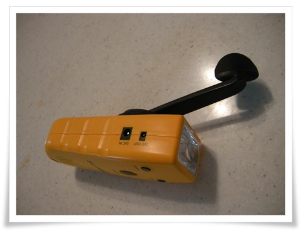

# 휴대용 자가발전기 SPF100

몇달전 집 근처에 반품샆이 생겼다.

가끔 들러서 뭐 신기한 것이 없나 살펴 본다.

최근 가 보니, 휴대용자가발전기라고 씌여 있는 것이 놓여져 있었다.

가격은 7,000원.

재밌겠다 싶어 샀다.

모델명 SPF100

제조사가 이피루스.  지금은 없는 회사인 것 같다.

출시년도 2004

출시 당시 가격 48,000원.  꽤 비싸군.  안 팔릴만 하군.

기능

손전등, FM라디오, DC out으로 핸드폰 충전, 사이렌 음향

크기 60 x 150 x 40mm

무게 254g

\- 저 손잡이를 열심히 돌리면 LED에 불이 켜져 손전등이 되고, 라디오도 나오고 한다.

그당시 비싼 출고가답게 마무리가 그리 허접하지는 않더군.

샀으니 용도를 생각해보는데, 캠핑갈때 들고 가야겠다.

