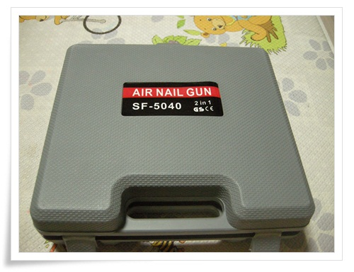
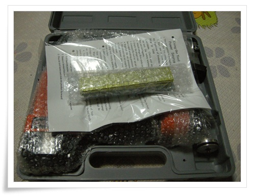
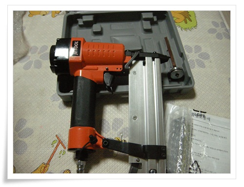
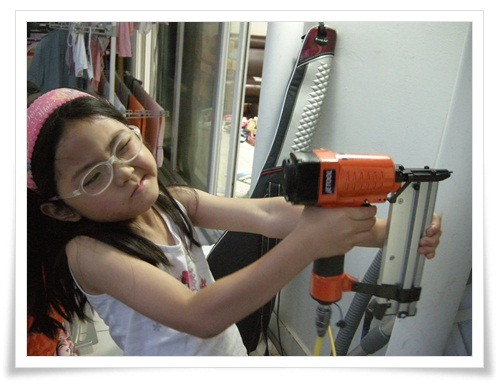
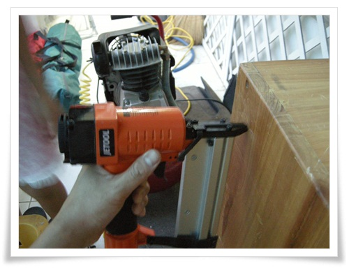
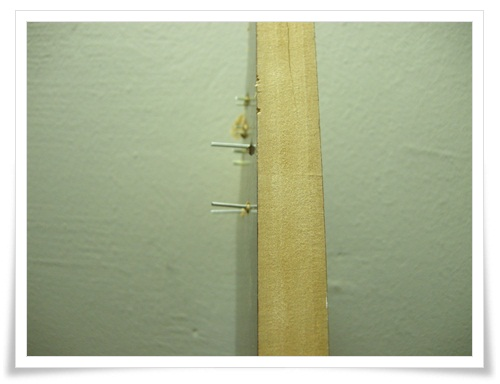

# SF-5040 2in1 에어타카

공구에 대한 욕심이 낳은 또 하나의 지름.

바로 에어타카.

지름의 이유는 뭐 그냥 에어타카를 가지고 싶었을 뿐이다.

일단 에어타카에 필이 꽂이니, 바로 에어타카가 대한 자료 조사와 동작 동영상 관람.

선지름후합리화라도 지르기 전 지름에 대한 명분을 만들어 보았다.

_최근 좌탁을 만들면서 직각을 제대로 못해 비뚤어졌다.  지그와 대형 클램프가 없는 상태에서 나사못 박기는 쉽지 않다.  한손으로 두 목재를 잡고 한손으로 구멍뚫는데 나름 난이도 있는 작업.  만약 에어타카가 있다면 훨씬 수월하게 작업을 할 수 있을 것이다._

에어타카에 대한 자료 조사.

못처럼 생긴 1자형 핀을 쓰는 것이 있고, 스테플러처럼 ㄷ자형 핀을 할 수 있는 종류가 있었다.

그리고 목재용이 있고 콘크리트용이 있다.  콘크리트용은 꽤 비싸다.

그리고 사용할 수 있는 핀의 길이마다 제품이 다른게 긴 핀을 사용할 수 있는 것일 수록 비싸다.

언제나처럼 값싼 마데인 차이나로 선택했다.

제품 광고 문구를 보니, " **더이상 값비싼 국산을 선택하십니까?  중국제도 괜찮습니다.**"라는 문구가 있었다.

학창 적에 국산품 장려운동을 교육받은 세대로서 격세지감을 느낀다.

1자핀은 50mm까지 ㄷ자편은 40mm까지 사용할 수 있는 에어타카로 선택했다.

구매전 평을 살펴 봤다.

평은 상당히 안 좋았다.

이렇게 구매평이 안 좋은 제품도 참 오래간만에 본다.

악평의 대부분은 " **튼튼하지 않아 천번정도 사용했더니 공기압이 센다**"라는 것.

어차피 에어타카는 초보자가 사용하는 게 아닌 전문자가 사용하는 공구다 보니 그냥 단순 소요욕구만 있는 내 눈높이와는 다른 것 같다.

나야 멋진 소리로 "슈욱~탁~"하며 못이 박히는 것이고, 천번까지 사용할 것 같지는 않았다.

내게 있어 공구는 실용적인 목적보다는 그냥 명품백을 사랑하는 여자들처럼 그냥 공구 자체를 사랑할 뿐.

옥션에서 배송비포함 31,000원에 샀다.

\- 도착한 에어타카 SF-5040

\- 구성은 에어타카와 핀, 그리고 여분의 실린더

\- 저가 중국제품답게 마감이 썩 깔끔하지는 않았다.

\- 신상 전문 평가위원 딸내미의 착용샷.

시끄러운 콤프레셔를 돌여야 하기에, 주말이 될 때까지 기다렸다.

\- 생각보다 그리 크지는 않았다.

주말이 되어 컴프레셔에 연결하여 동작 시험에 들어갔다.

에어타카를 쥐니 나도 전문가가 된 듯 한 느낌.

뿌듯하다.

\- 20mm MDF 판에 발사한 결과.

멋지다.

