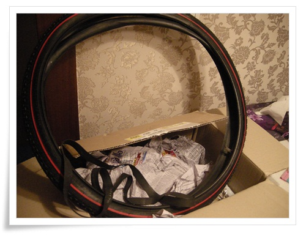
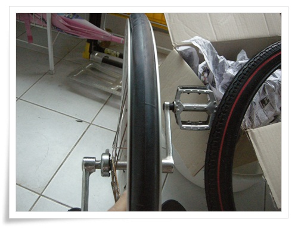
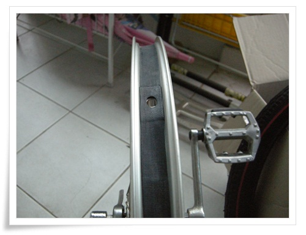
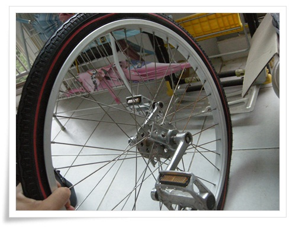

# 외발자전거 타이어 교체

간만에 외발자전거를 타고나서 보니 타이어에서 실밥이 터져 나왔다.

더이상 타이어 교체를 미룰 수 없게 되었다.

사실 튜브에 실펑크 난 상태에 접어든지 어언 5년이 넘어었다.

그래서 타기전 항상 바람을 먼저 넣고 탔었다.

타이어를 살펴보니, 자전거 타이어도 자동차처럼 인치와 폭으로 표기되어 있었다.

내 외발 자전거 타이어규격은 24인치. 1.75

외발자전거라 혹시 외발자전거 전용만 가능할까 우려했으나, 다행히 외발자전거라도 특이하는 사이즈를 사용하는 게 아니라서 인터넷 쇼핑몰에서 구입가능했다

.

제일 싼 제품으로 선택했다.

타이어 만원.

튜브 5천원.

림보호고무 천원.

총 16,000원.

\- 배송된 타이어와 튜브, 그리고 고무

\- 교환준비시작.  기존 타이어는 트레드자체가 없군.

교환은 아주 간단했다.

그냥 포크에서 바퀴 빼고, 그 바퀴에서 타이어와 튜브 빼서 교체.

\- 먼저 림보호고무부터 장착

\- 그리고 새 튜브와 타이어 장착

교체후 바람을 넣고 시험주행을 했다.

고작 타이어만 바꾸었을 뿐인데, 몸이 적응을 못했다.

왜 이렇게 낯선지..

이제 타이어도 교체했으니, 다시 한번 동네 아이들의 주목을 받는 아저씨로 주행을 해야겠다.

