# 레간자 연료필터와 에어콘필터 갈기

아내 운전연습용으로 산 레간자가 꽤 오래 버티고 있다.

작년 엔진 오일 갈때 정비기사가 연료필터도 갈아야 한다고 했었지만, 얼마나 더 타겠어 하며 버텼는데, 최근 시동이 잘 안 걸린다고 하여 연료필터를 갈기로 했다.

물론 직접.

연료필터를 갈 때는 연료필터와 함께 리테이너도 보통 같이 교환한다고 한다.

이유는 리테어니가 플라스틱인데, 보통 빼다가 부러지기 때문이라고 한다.

주문은 smpart.co.kr에서 했다.

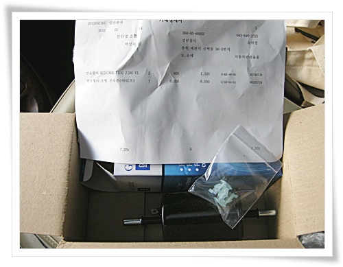

\- 연료필터-레간자용 6,050원, 연료필터 리테이너-소횽(2개) 1,.20원,

배송료 3,000원.  도합 10,370원.

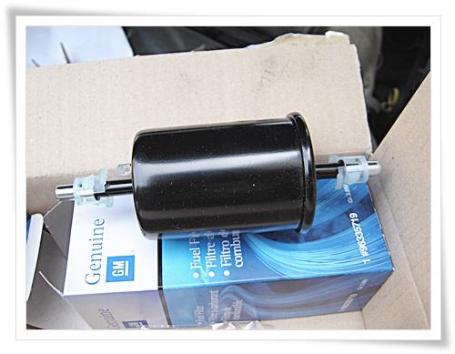

\- 새 연료필터.  왼쪽이 연료탱크방향, 오른쪽이 엔진방향

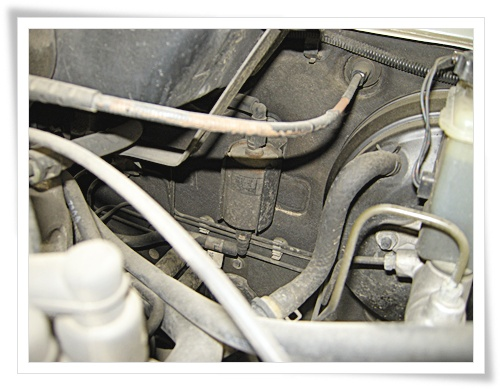

\- 엔진룸을 열고, 연료필터 확인.  중앙쯤에 위치하고 있군.

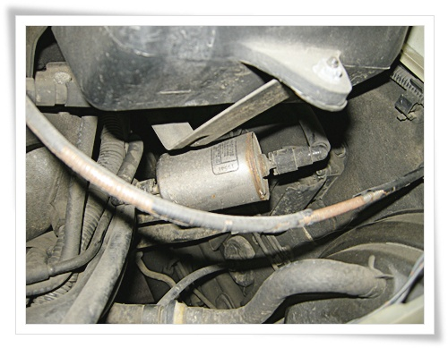

\- ()형 걸쇠에 그냥 걸려있으므로 앞으로 푹 빼면 빠진다.

그런데 호스 길이때문에 작업 공간이 안나온다.

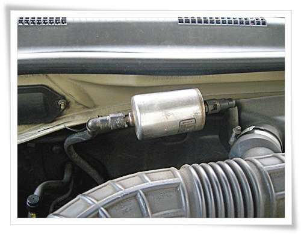

\- 반대편에서 잡아 빼니, 작업이 수월하게 될 공간이 된다.

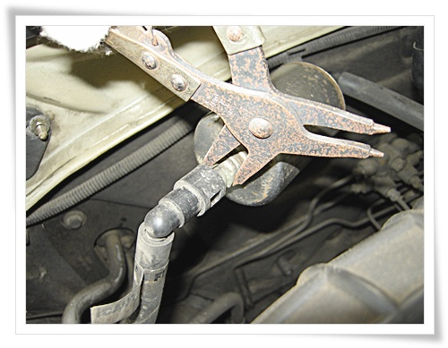

\- 스냅링플라이어로 리테이너 눌러 호스 탈거.

역시 누를 때 리테이너가 부러지는군.

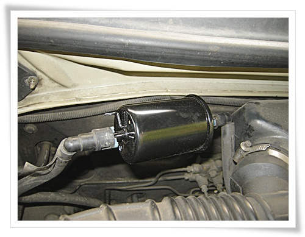

\- 새 연료필터에 호스 연결.

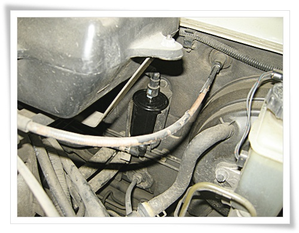

\- 위치로 원위치로.  장착 완료

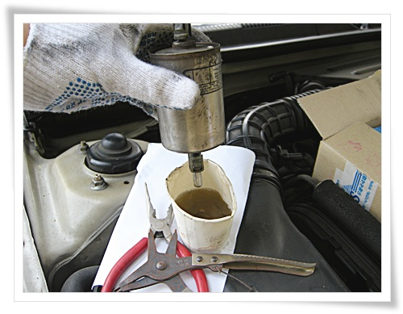

\- 기존 연료필터에는 휘발유가 들어있으로 재활용하게 위해 빼는 중.

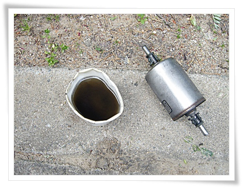

\- 기름 다 빼니, 종이컵 80%정도 차는군.

기름 색깔을 보니 시커먼게 필터내부가 엄청 더러웠나 보다.

에어콘필터도 교환했다.

에어콘필터는 2년전 허진원씨가 줬는데, 그 당시 필터 교체한 지 얼마 안되어 이제껏 보관만 하고 있다가 여름도 되고 하여 교환했다.

\- 허진원씨가 준 에어콘 필터.

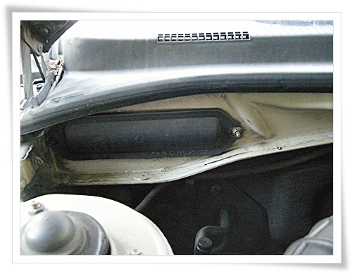

\- 에어콘필터의 위치는 조수석쪽.

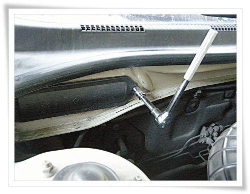

\- 10mm 복스로 플라스틱 커버를 벗긴다.

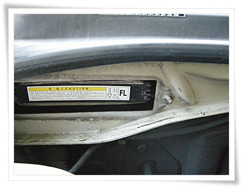

\- 플라스트틱커버 벗기니 나타난 에어콘 필터.

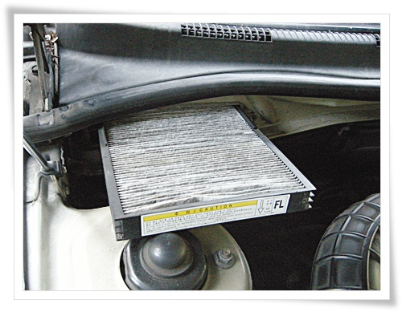

\- 앞으로 쭉 잡아빼니, 충분히 지저분한 내부가 드러난다.

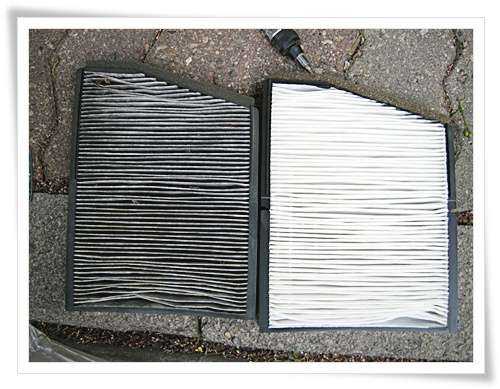

\- 2년된 에어콘 필터와 새 에어콘 필터.

