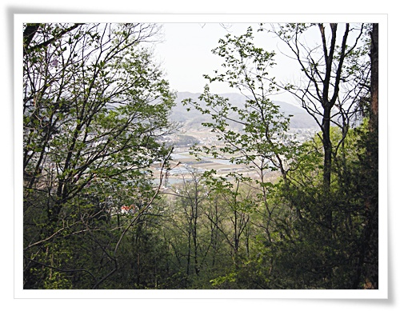

# 용문면 금곡리 엘리시아 펜션으로 워크샾

팀워크샾 장소가 양평군 용문으로 정해졌다.

양평, 가평은 내가 좋아라하는 동네다.

특히 양평의 용문면은 내가 초등학교 5학년을 보낸 장소로 추억이 깃든 곳이기도 하다.

그래서 이번 용문면으로 워크샾을 간다기에 새삼스레 예전 초등학생 시절을 기억나기도 했다.

한달에 한번 자연보호활동으로 용문산으로 전교생이 가서 쓰레기 줍던 일과 여름이면 냇가에서 수영하던 일들.

오전 근무를 마치고 양평으로 향했다.

비록 워크샾이긴 하지만, 날씨 좋은 평일에 교외로 나가는 일은 설렌다.

\- 양평 가는 도중 들른 예봉산 중턱.

이 장소를 좋아라 한다.

여기서 서면 북한강, 남한강, 두물머리가 한 눈에 다 보인다.

\- 남한강을 따라 가는 길.

\- 회사에서 용문산 금곡리까지의 이동 경로.

\- 숙소 2층 베란다에서 바라본 풍경.

펜션에 애들용 물놀이장과, 족구장도 있다.

\- 다음날 아침 식사 장소.

\- 1차 회의시간 후 오른 산책길.

\- 나지막한 산이라 오르기에 부담없어 보였다.

\- 산자락에 위치한 마지막 농가.

이런 집이 딱 내 체질이라 생각되어 여기서 살고 싶더군.

멋진 농기계와 창고도 있고, 소도 키우고, 바로 위에 산도 있고,..

\- 흐드러지게 핀 찔레꽃.

이 꽃 이름을 몰라 인터넷 겅색을 통해 알아냈다.

장미과의 관목으로 고도가 높지 않은 지역의 양지바른 산기슭, 골짜기, 냇가에 분포하며,

봄부터 이른 여름까지 흰색 꽃을 피우며, 가을에 붉은 열매를 맺는다는군.

\- 푹신푹신한 산길이라 걷는 느낌이 참 좋다.

\- 얼마 걷지 않아 능선이 나왔다.

\- 능선에서 바라보니 앞산이 보인다.

\- 산책 경로.  이 뒷산 이름이 갈지산이라고 나와있군.

