# 4번째 일본 출장

얼마안되는 기간에 꽤 자주 일본을 간다.

벌써 네번째 일본 출장.

4월 24일 15:30분 비행기로 출국하여, 그 다음날인 25일 22:30분 귀국하는 일정.

호텔에 짐을 풀고, 저녁을 먹으러 제법 멀리있는 신주쿠로 향했다.

같이 간 김병국과장이 자신의 일본인 친구와 같이 만나는데 합석하기로 했다.

\- 신주쿠까지의 이동 경로.  신바시역까지는 걸어갔고, 아카사카미쓰케에서 환승했다.

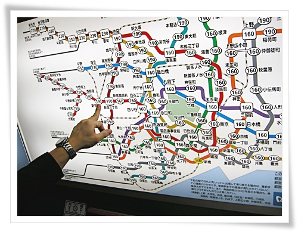

\- 전철노선표와 요금을 확인.  요금은 190엔.

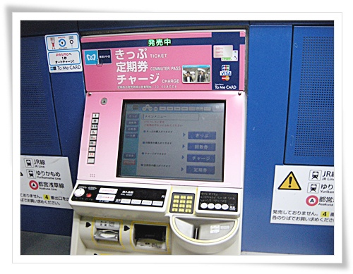

\- 발권기에서 190엔을 눌러 표를 뽑고.

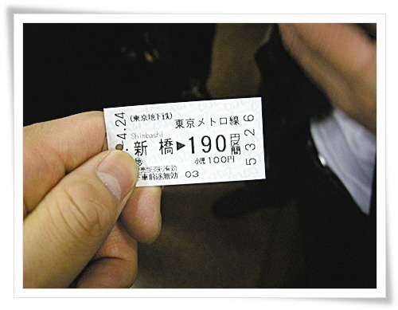

\- 190엔짜리 전철표.

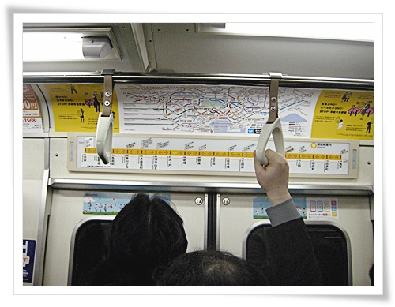

\- 노선도를 잠시 보고,

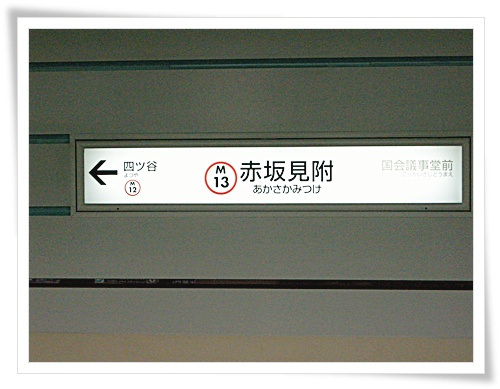

\- 환승역인 아카사카미쓰케역에서 내려

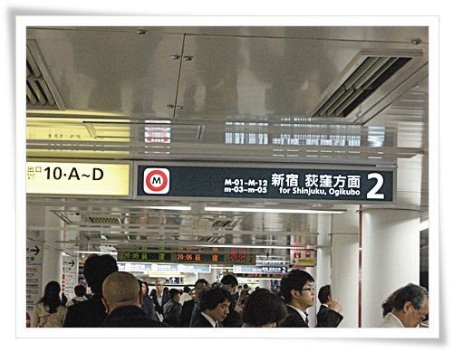

\- 신주쿠로 가는 전철로 환승.

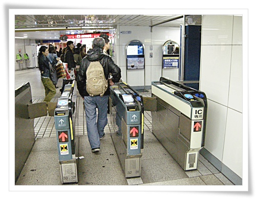

\- 목적지 신주쿠역에 도착.

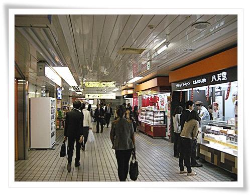

\- 지하도가 많이 복잡하다.

\- 백화점 지하공간으로 보이는곳까지 왔다.

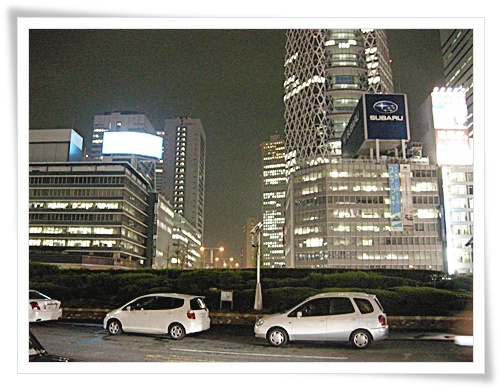

\- 신주쿠역 지상으로 나왔다.

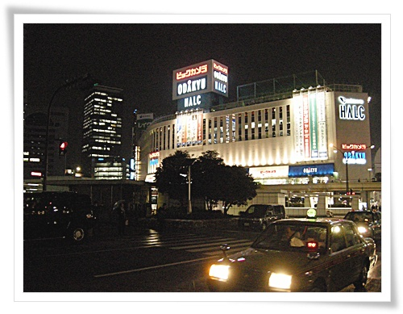

\- 신주쿠 주변 풍경.

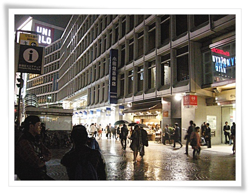

\- 비오는 날인데도, 꽤나 번잡한 동네다.

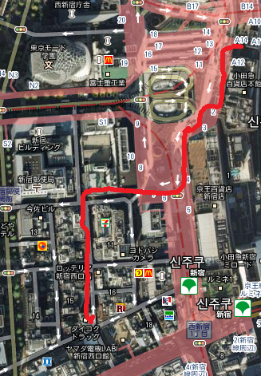

\- 신주쿠에서 김과장 친구분이 안내하는 술집까지의 이동 경로

우리말을 배워서 할 줄 아는 분이서, 별 무리없이 즐거운 자리였다.

그리고 조금 배운 일본어도 써 볼 수 있었다.

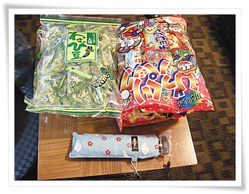

\- 호텔로 돌아가기 전 잡화점인 돈키호테 들러 산 것들.

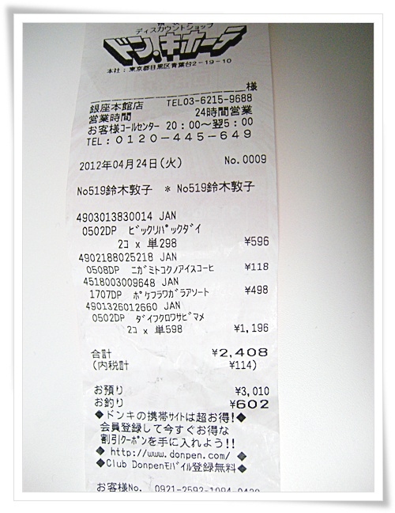

\- 와사비과자가 598엔, 딸내미한테 줄 불량식품같이 생긴게 118엔, 초소형 우산이 498엔이군.

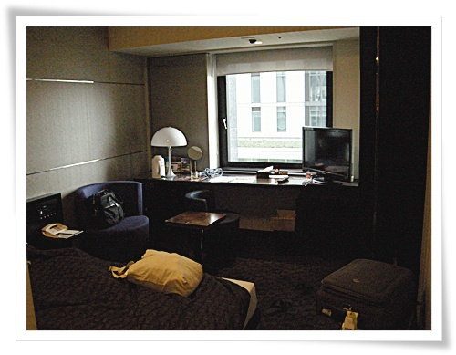

\- 하루밤 머문 내방 빌라퐁텐 호텔 318호.

하루에 9,500엔이다.

이 방에서 일본에 온 이래 처음으로 지진을 경험해봤다.

아침 5시반경, 막 잠에서 깨려고 하고 있는데, 침대가 흔들거렸다.

아, 이게 바로 지진이구나 하며, 지진을 좀 더 충분히 느끼려했지만, 한 5초 흔들거리다 말더군.

첫 지진의 느낌은 놀이기구를 타는 느낌.

이날의 지진은 진도4라고 하더군.

좀 더 강한 지진을 경험해봤어야 하는데...

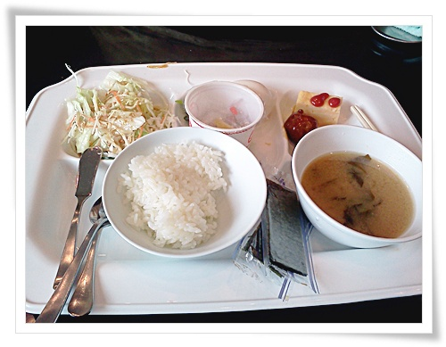

\- 빌라퐁텐호텔에의 아침식사.

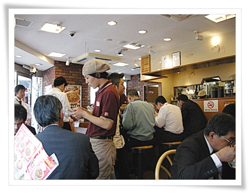

\- 점심때 간 일본의 김밥천국이라 불리는 쓰키야

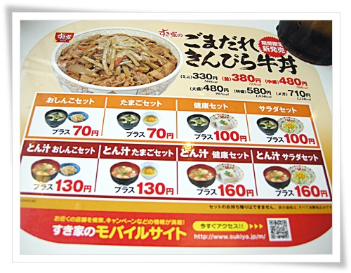

\- 여기서 내가 좋아하는 메뉴는 치즈소고기덮밥.

380엔 + 미소된장국 해서 합 450엔.

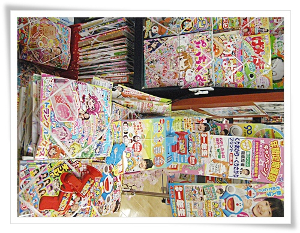

\- 점심식사후 들른 Carreta Mall에 있는 서점의 잡지 코너.

잡지의 왕국답게 잡지가 많다.

애들용 잡지도 이렇게 종류가 많다.

부록이 탐나더군.

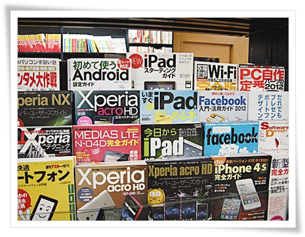

\- 그리고 무슨 핸드폰 종류별로 잡지가 있는 것도 대단하다.

