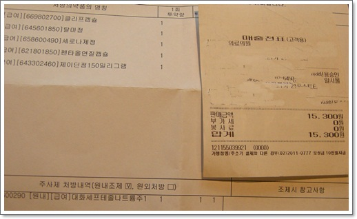

# 손가락에 박힌 가시가 빼 보려 병원 가다 

얼마전 만든 독서테이블에 페인트 칠을 해 보겠다고, 베란다에서 사포질부터 시작하여 하도제, 페인트까지 칠하고 나서 뭔가 손가락이 아파 살펴보니, 가시가 박힌 듯 했다.

손가락에 가시 박히는게 종종 발생하는 일이라, 이번에도 빼 보겠다고 커터날과 핀셋을 들었다.

맨눈으로는 잘 안였다.

만져봤을 때 통증이 느껴지는 곳 근처에 있을 거라 짐작되어, 칼로 이러저리 헤짚어 보지만 결국 찾는데 실패.

그리고 벌써부터 시력 노화가 시작되었는지, 잘 보이지도 않고,..

아내가 해 줬으면 좋으련만, 남의 살 헤짚는 것에 겁을 먹어서 못해, 내 한 손으로만 해 보려 했지만 포기.

그래서 인터넷 검색을 해 봤다.

검색되는 결과는 손가락에 얼음을 대고 있으면 가시가 나오는다는 좀 효용성이 없는 이야기와, 병원가라는 이야기.

이런 것으로 병원에 간다는 것을 생각을 못 해봤지만, "손톱 밑에 가시든 줄은 알아도 염통에 쉬 쓰는 줄은 모른다" 말처럼, 이 사소한 게 엄청 신경씌이고 불편하여, 결국 병원을 가 보기로 했다.

그런데 이럴때는 어떤 병원에 가는 것일까가 궁금해지더군.  칼을 쓰는 거니까 외과일까?

회사 근처에 있는 건강진단전문으로 하는 병원에 갔다.

접수대에 '손가락에 박힌 가시 뺄 수 있나요?' 하니까 된다면서, 피부과로 대기번호를 발급해줬다.

아, 가시는 피부에 박히는 것이니까, 피부과에서 처리하는구나..

피부과에서는 뭐 내가 했던 것과 크게 다른 것을 없었다.

커터칼대신, 메스와 가위로 가시가 박힌 것으로 추정된 지점을 약 5mm정도 절개하고, 알콜솜으로 닦아냈다.

의사에게 물어보니, 손가락에 가시 박혔을 때 굳이 빼려고 하지 않아도 된다고 한다.

가만 두면, 고름형태로 부풀어 올라 저절로 제거되거나, 그냥 피부와 한몸이 된다고 한다.

그거 쪼금 쨌다고, 항생제 주사와 약까지 처방해주는군.

총 진료비 15,300원.

이제 이럴때 의사가 어떻게 처치하는지 봤으니, 다음에는 좀 더 과감하게 직접 해 봐야겠군.

