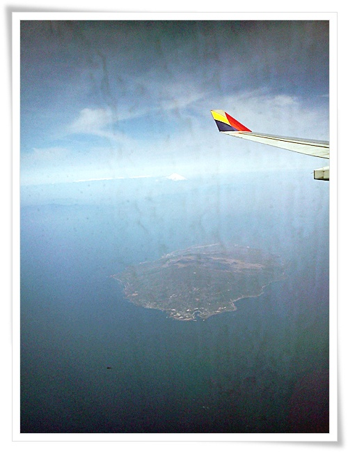
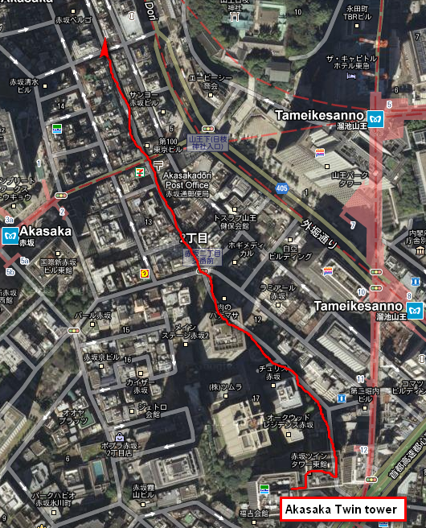
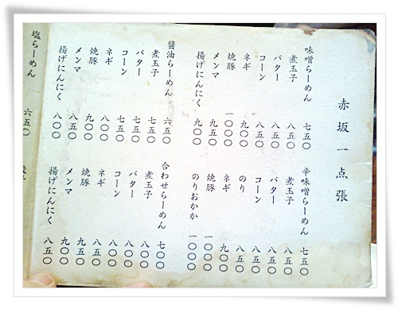
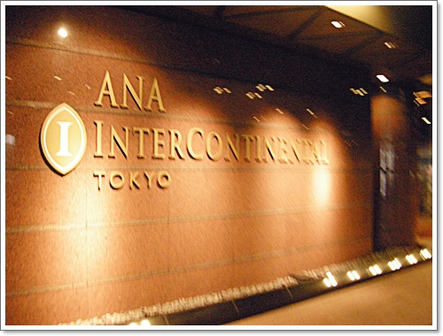
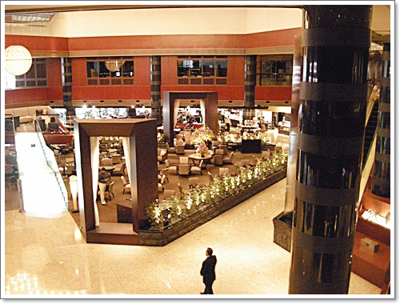
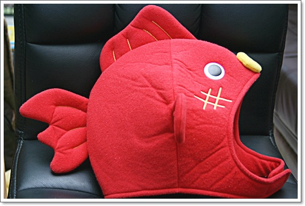
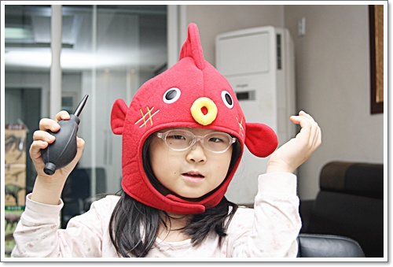

# 1박2일 일본 출장

이제까지의 출장중 가장 짧은 1박2일 출장을 갔다 왔다.

4월 10일부터 11일까지의 일본 출장.

4월 11일이 총선이라 어떻게는 투표를 하고 싶었는데, 결국 투표도 못했다.

같이 출장간 멤버들이 어떻게 성향이 비슷하여, 다들 이에 대한 불만을 가진채 일본으로 향했다.

\- 하네다행 아침 8시 40분발 아시아나  비행기.

이 비행기를 타기 위해 3시간 자고 일어났다.

\- 도착 즈음, 창문 너머로 후지산이 보였다.

11시 회의라, 10시 반 하네다 공항에 도착하자마자 빠릿빠릿 움직였다.

하마마츠쵸역까지 모노레일을 탔다.

\- 하마마츠쵸에서 목적지 사무실까지 택시로 이동 경로.

11시부터 2시까지 회의한 후, 법인 사무실과 호텔이 있는 있는 아카사카로 이동했다.

아카사카 사무실에서 짐을 풀고, 늦은 점심을 하러 나갔다.

밥 먹으로 간 곳은 사무실에서 1km 정도 떨어진 위치의 라멘집.

\- 사무실에서 점심 먹으로 이동한 경로.

라멘집앞에 조그만 신사가 있더군.

\- 라면집 메뉴.

\- 이번 숙소는 특급호텔은 Anna International 호텔.

\- 특급 호텔이라 내부가 괜찮았다.

방도 컸다.

이번에 묶은 방번호 1130호.

방은 좋은데, 방에 머물었던 시간은 씻고 잠잔 7시간밖에 안된게 아쉽더군.

\- 이번 출장에서 산 물고기모자.

사유리의 식탐여행에서 사유리가 쓰고 나온 모자.

일본에서 산 거라 제법 비쌌다.  1580엔.  우리돈 25,000원정도 되는군.

\- 딸내미에게 사유리모자를 씌웠다.

얼굴이 모자 가득 차야 하는데 안차서 그런가 사유리가 쓸 때의 그 귀여운 느낌이 안 드는군.

4.11 총선 검표가 다 끝난 새벽 1시에 집에 돌아왔다.

결과는 안 좋더군.

내가 투표를 안해서 결과가 이렇게 나왔나라는 생각도 드는게, 영..

투표도 의무로 해야 하는데 말이다.

예비군 훈련이 불참하면 형사고발되듯이, 투표도 불참시 제재가 가해져야 투표날 출장을 보내는 회사도 줄어들 것이고 말이다.

