# 롯본기 돈키호테 산책

세번째 일본 출장.

1박2일 일정으로 도쿄에 온 다음 날, 여태까지의 행태대로 산책을 나섰다.

이번 출장은 좀 준비할 게 많아, 일요일 출근한 이래, 총 3일간 도합 9시간정도밖에 못잔터라 이번 산책은 일어나기가 좀 힘들었다.

Anna International Hotel 주변을 지도로 보니, 롯본기가 제일 유명한 지역같았다.

롯본기가 우리나라 이태원같은 곳으로 밤이 북적되는것이어서 아침에는 그다지 구경할 것은 없겠지만은, 동네 탐험겸 산책으로 호테을 나섰다.

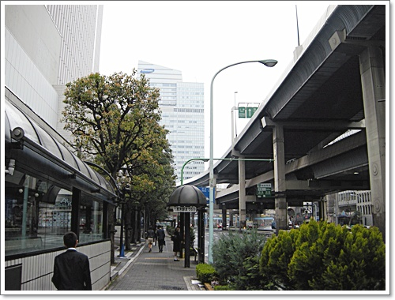

\- 호텔을 나와 롯본기 방향으로 걷는다.

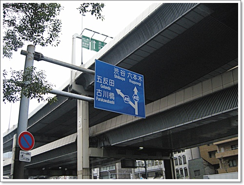

\- 롯본기방향 표지판을 보고.  롯본기는 한문으로는 육본목이군.

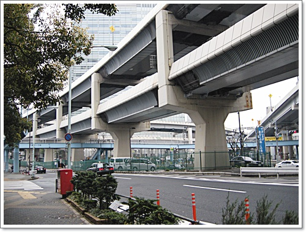

\- 일본 고가도로는 2층으로 되어 있군.

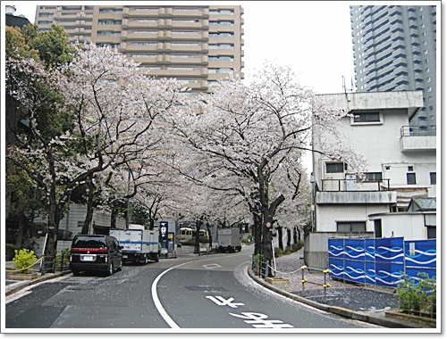

\- 이제 지기 시작한 벗꽃이지만, 제법 이쁘게 펴있다.

도쿄는 지난주가 절정이었다고 하더군.

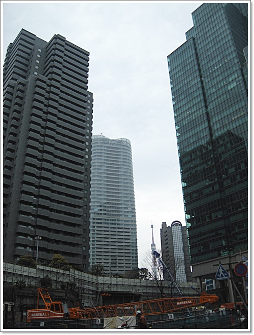

\- 건물들이 참 높다.  뭔가 공사중이다.

\- 롯본기 쪽을 향해 언덕을 올라간다.

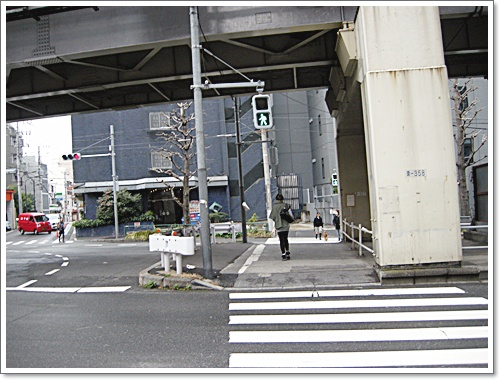

\- 횡단보도도 건너고.

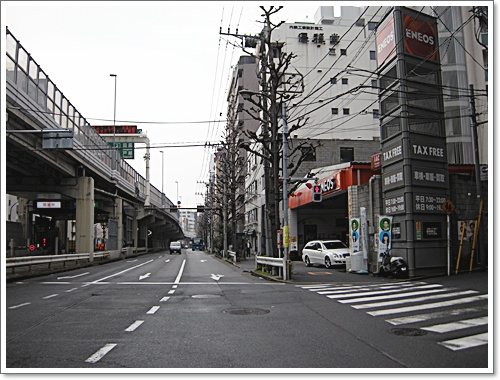

\- 호텔과 롯본기 중간쯤 되는 위치.

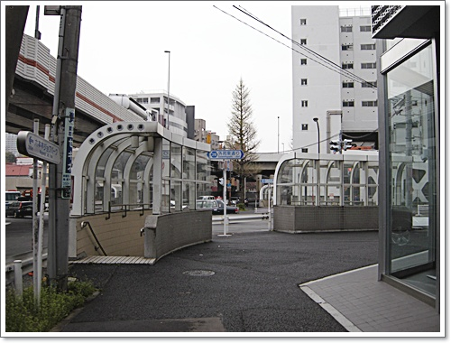

\- 모퉁이를 돌고,

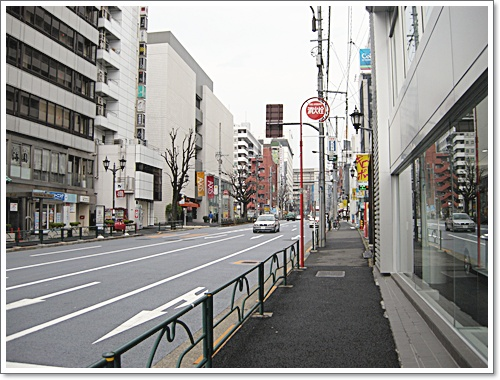

\- 이게 롯본기 거리다.  아침은 역시 한산하다.

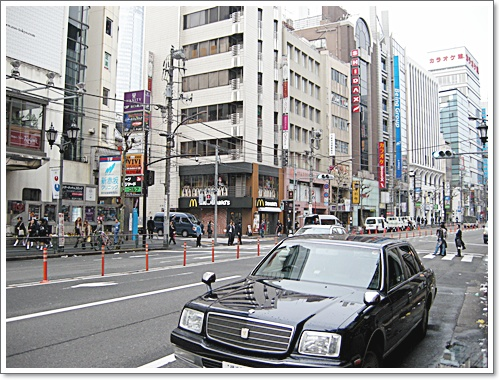

\- 여기가 목적지 돈키호테 롯본기점 근처.

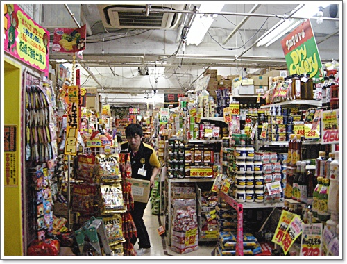

\- 돈키호테 내부.

쌓여있는 형태로는 쌀 것 같은데, 일본 물가 자체가 비싸서 그런가 싼 게 없다.

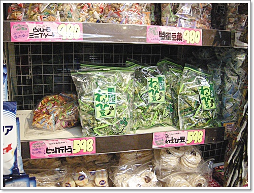

\- 식료품코너에서 와사비 과자를 골랐다.  598엔.  우리돈 11,000원 정도 되는군.

저 와사비 과자가 내가 먹어본 일본 과자 중에서 제일 괜찮았다.

묘한 중독성이 있다.

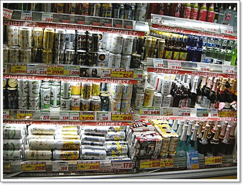

\- 우리나라에서 파는 일본맥주랑 일본에서 파는 맥주랑 맛이 다르다기에 맥주코너에 208엔짜리 맥주 두캔을 샀다.

아침시간 1시간을 산책시간으로 계획하였기에, 신속하게 돈키호테를 나와 다시 호텔로 향했다.

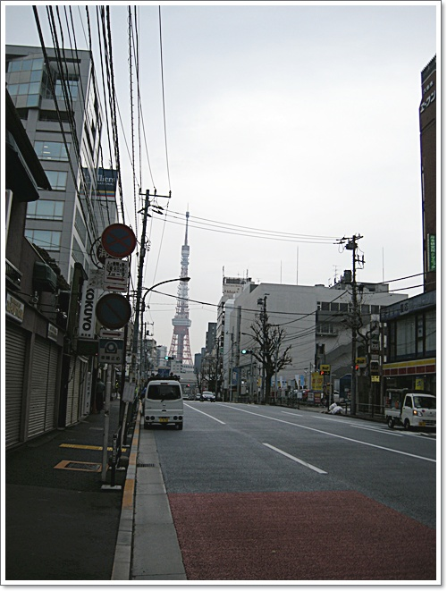

\- 호텔로 가는 길.  저 앞에 보이는게 도쿄타워인가 보다.

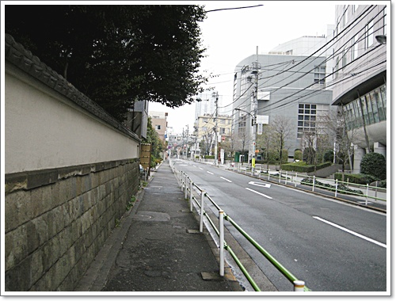

\- 호텔로 돌아가는 길은 뒷골목을 통해서.  인도가 많이 좁다.

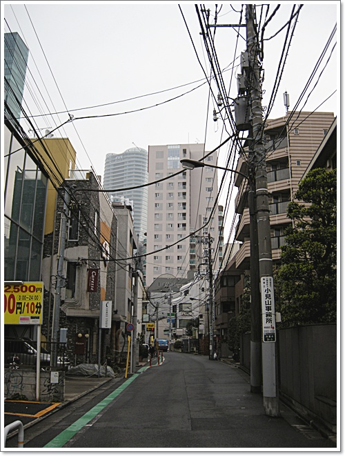

\- 전선줄도 지중선이 아닌 가공선인 걸로 봐서 아직 재개발은 안된 동네인가 보다.

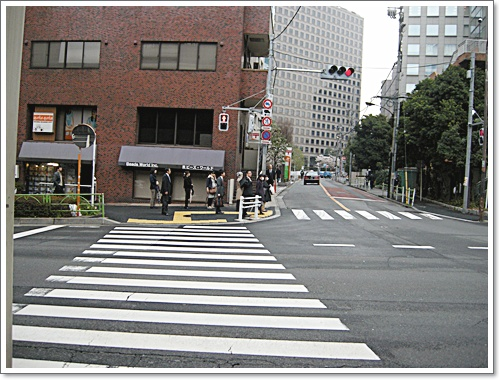

\- 올때 건넜던 횡단보도를 다시 건너, 올때와 다른 길은 뒷길로 직진했다.

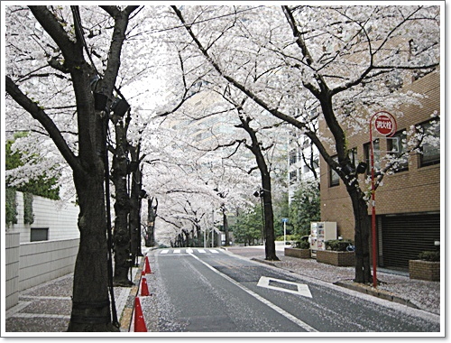

\- 뒷길에는 벛꽂이 그래도 이쁘게 펴 있어 운치있었다.

\- 벛꽃을 보니, 일본에 온 느낌이 조금 나더군.

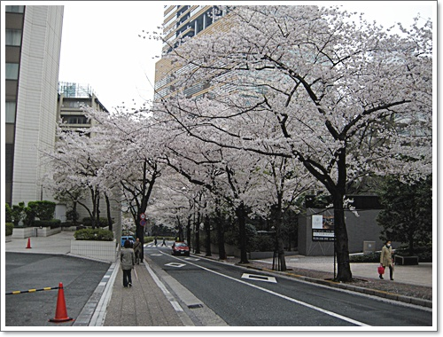

\- 종착지 호텔 뒤.

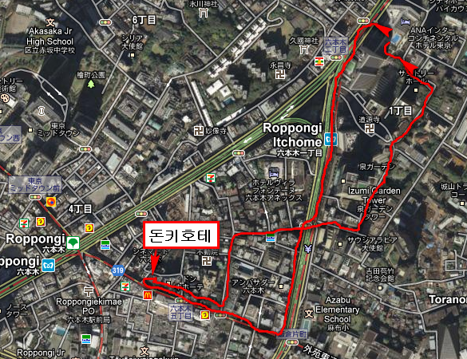

\- 호텔에서 롯본기 돈키호테까지 아침 산책 코스.

총 4km 정도 걸은 듯 하다.

시간은 쇼핑시간 포함 1시간.

