# 북경에서의 동네 탐험 - 호텔 뒷편 시장골목

투숙한 호텔 Jade 호텔이 있는 동네가 구경할 만한 것이 있는 곳이 아니라서, 그리 일찍 일어날 생각은 없었다.

헌데 북경의 시간이 우리나라가 한시간 느려, 북경시간 6시에는 더 잘려고 눈이 떠졌다.

눈이 떠 졌으면, 그래도 동네 탐험을 시작해야겠다는 생각이 자동으로 들었다.

지난 번 월마트 탐험을 했기에 이번에는 호텔과 대각선 방면에 있는 맥도날드쪽 뒷 골목을 탐험하기로 했다.

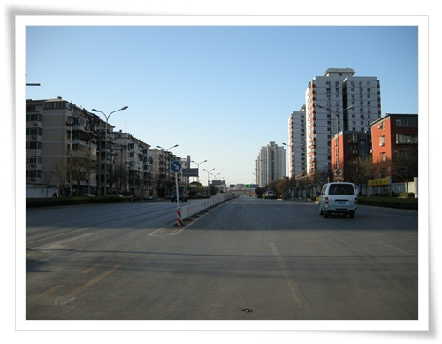

\- 호텔에서 동쪽으로 일단 차도를 건넌다.

중국의 공휴일이라 도로가 한산하다.

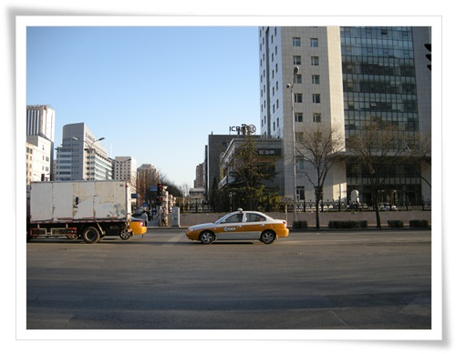

\- 길 건너고 있는 도중

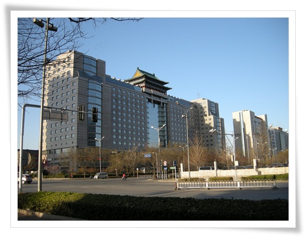

\- 호텔에서 대각선으로 건넜다.

맥도날드앞에서 호텔을 바라보니 외형은 제법 멋있군.

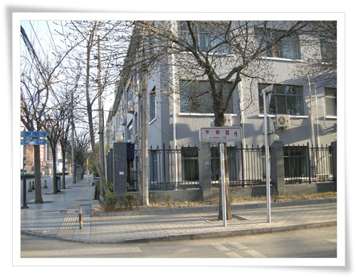

\- 북쪽으로 가다가 첫 골목에서 우회전하여 들어갔다.

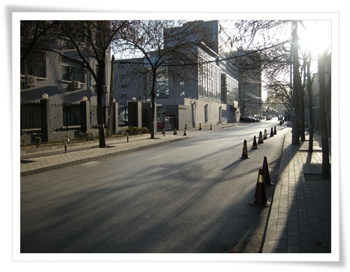

\- 역시 한산한 골목.

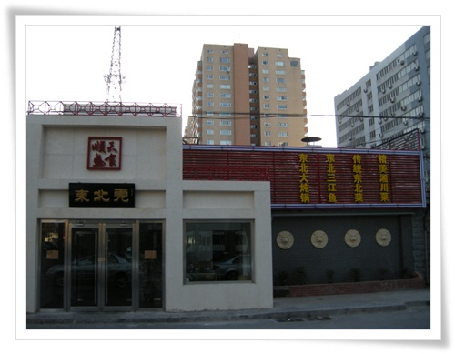

\- 뭔가 식당이 있다.

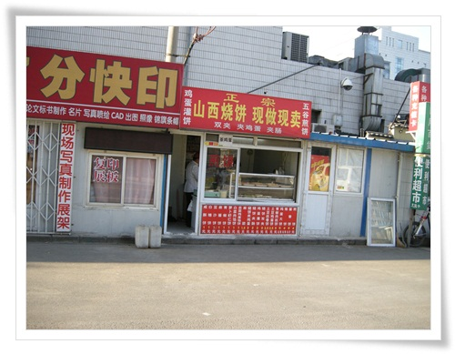

\- 내가 좋아 하는 현지인들이 주로 먹는 식당들이 몇개 있다.

가격 1~3위안으로 싸 보이는군.

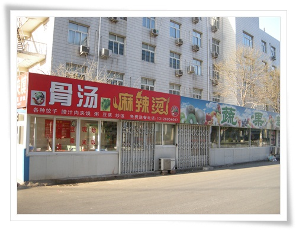

\- 여기도 식당이 있다.  골탕이라데 뭘 파는 식당일까?

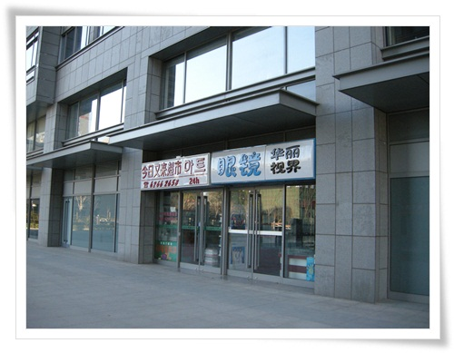

\- 마트라고 한글로 씌여진 상점도 있군.

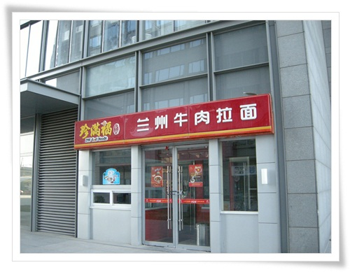

\- 이 건물에도 뭔가 맛있어 보이는 식당이 있군.

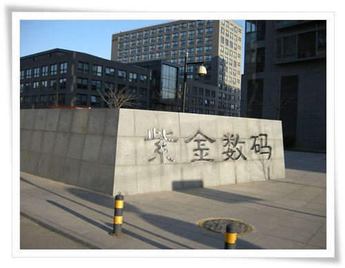

- 디지털컴퓨터 라는 뜻이 나오는 것을 보니, 무슨 연구 단지인 듯 하다.

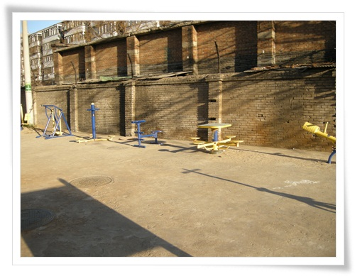

\- 체력 단련시설도 있다.  우리랑 크게 다르지 않다.

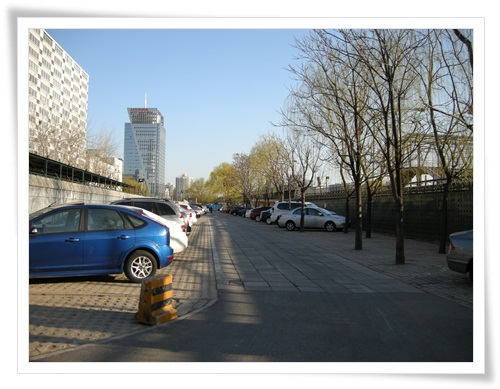

\- 여기는 연구단지 주차장인 듯 싶다.

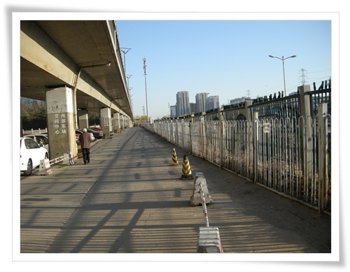

\- 주차장으로 계속 가도 철길 따라 별 볼 것 없어 보이는 길만 펼쳐져 있어 여기서 길을 돌렸다.

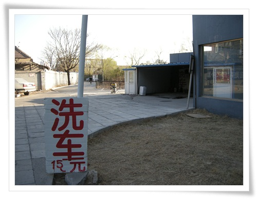

\- 손세차장.  15위안이니 우리돈 3천원정도.  싸군.

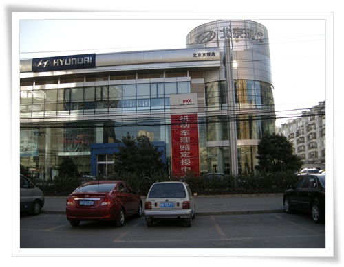

\- 현대자동차 건물도 보이고.

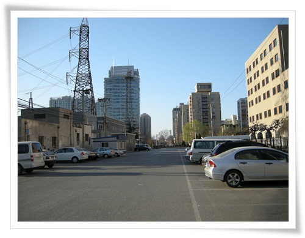

\- 왼쪽의 큰 건물 뒷편이 월마트.

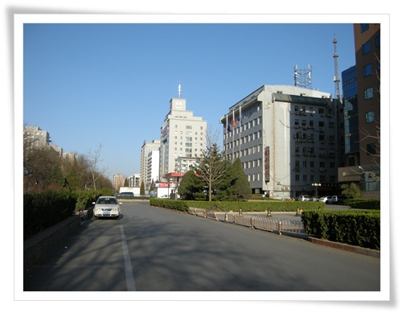

\- 이제 호텔방향으로 직진.

조용한 동네였다.

아침 식사용 식당 몇개 연 것 빼놓고는 별 거 없다.

다시 호텔까지 왔는데, 산책 시간이 채 30분 밖에 안 걸려, 호텔 뒷 동네로 더 걸어갔다.

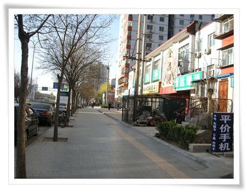

\- 호텔 뒷 골목을 향해 걸어가는 중.

골목에 드디어 내가 원하는 풍경이 나타났다.

좁은 골목길 사이에 기다란 시장이 펼쳐져 있었다.

맛있어 보이는 식당들도 많이 있고,

1위안짜리 양꼬치집도 많이 있었다.

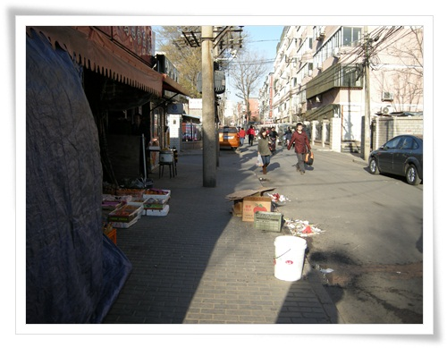

\- 뒷골목의 시장거리 시작.

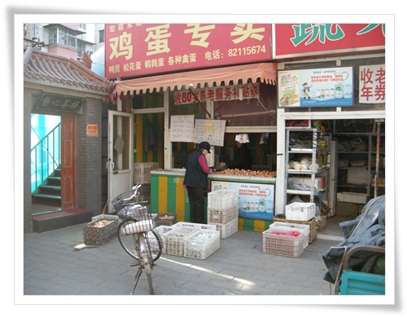

\- 여긴 계란가게.

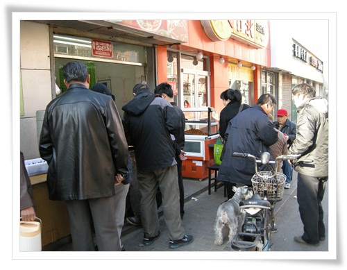

\- 여긴 맛집인가 보다.  사람들이 줄서서 뭘 사간다.

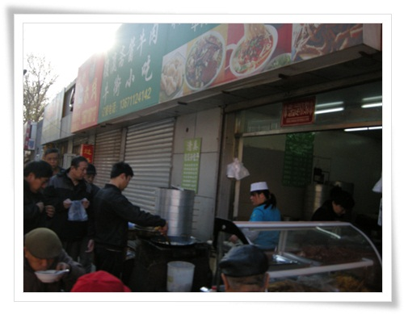

\- 여기도 역시 사람들이 줄서서 사는군.

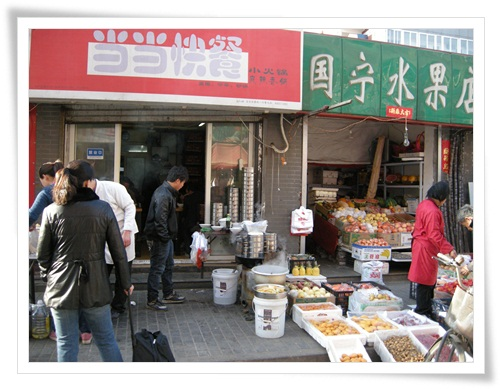

\- 이 시장에서 주로파는 것들은 과일들.

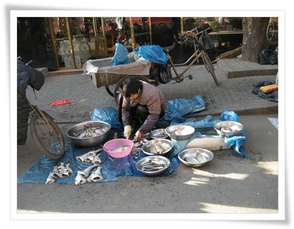

\- 생선도 직접 손질하여 판다.

북경이 내륙이다 보니, 물고기는 대부분 민물고기같아 보였다.

이 시장에서 주로 파는 것은 청과물과 어류였다.

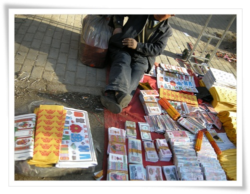

\- 불태우는 용도로 쓰는 가짜돈과 부적도 판다.

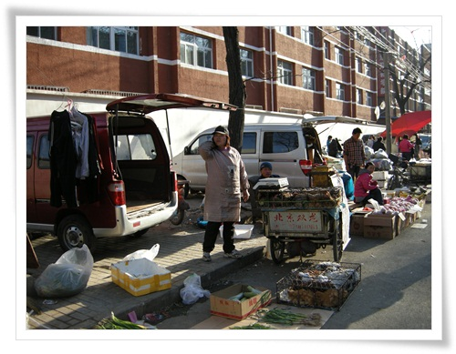

\- 옛날 청계천에 있는 황학동 중고시장을 보는 듯한 풍경이다.

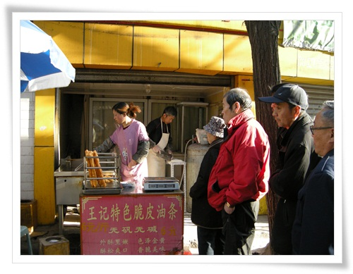

\- 저 기다린 튀김을 중국사람들의 아침 주식이라고 하는데, 나중에 먹어봐야겠다.

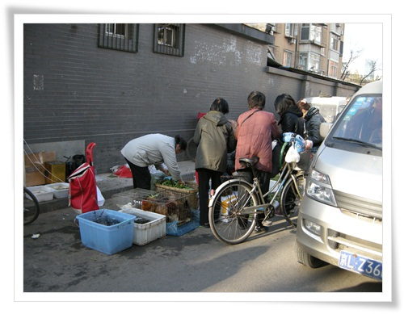

\- 닭장속의 닭도 팔고.

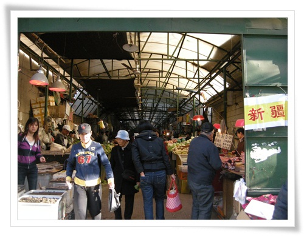

\- 여기는 노점이 아닌 청과물 집합소.

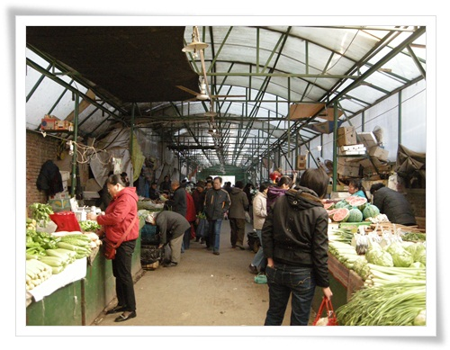

\- 채소등을 주로 판다.

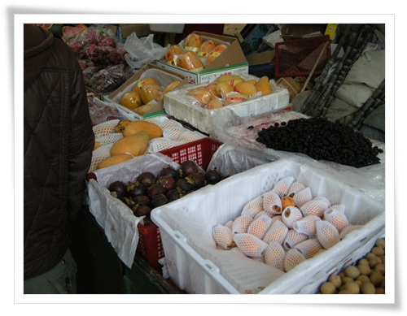

\- 이곳에서 망고스틴 발견.

과일중에 망고스틴이 보였다.

다른 과일 가게들은 가격표를 붙여놨는데, 망고스틴을 파는 이 가게는 가격표가 없었다.

그래서 잠시 망설이다가 가격을 물어봤다.

1근에 20위안이라고 한다.  우리돈 4천원가량.

샀다.  1근이 딸랑 4개.

역시 비싼 과일답게 비싸군.

하지만, 그래도 우리나라에서는 냉동 망고스틴밖에 먹을 수 없고, 싱싱한 망고스틴을 먹을 수 있는 기회는 이때 뿐이겠다 싶어 샀다.

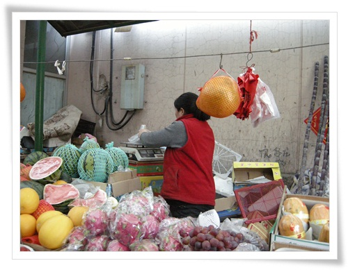

\- 아줌마가 저울에 재는 중.

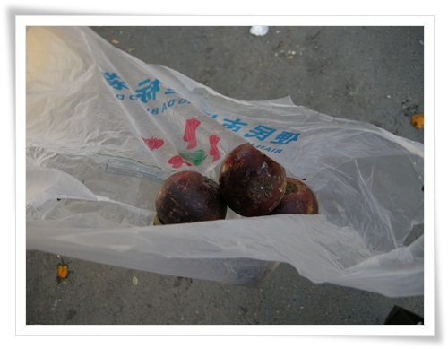

\- 구입한 망고스틴 4개.

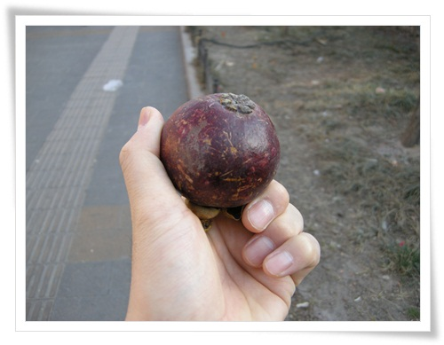

\- 하나를 꺼내들고 취식보행을 한다.  싱싱하니 맛 있더군.

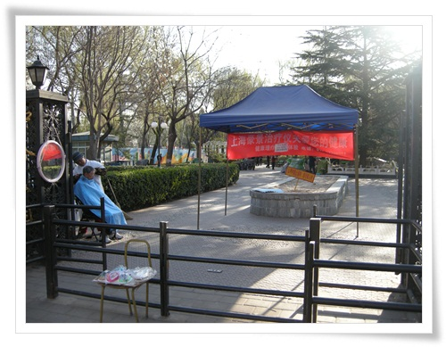

\- 마지막코스로 지춘공원.

호텔앞 도로가 지춘로인데, 그래서 이 공원이름도 지춘공원인가 보다.

입구에는 아침일찍부터 이발하는 사람이 보인다.

- 공원의 규모는 우리 동네 근린공원 정도로 아주 작았다.

그곳에서도 춤을 추는 중국 현지인들을 볼 수 있다.

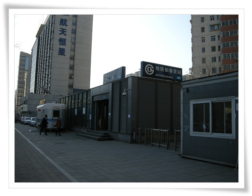

\- 이제 호텔로 향한다.

호텔이 쯔춘리역에서 가까이 있더군.

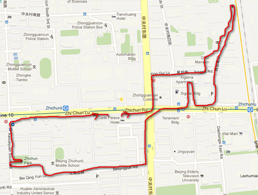

\- 이날 아침의 산책코스.

대략 5km 정도 걸은 듯 하다.

산책시간은 1시간.

