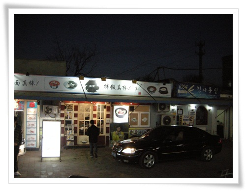
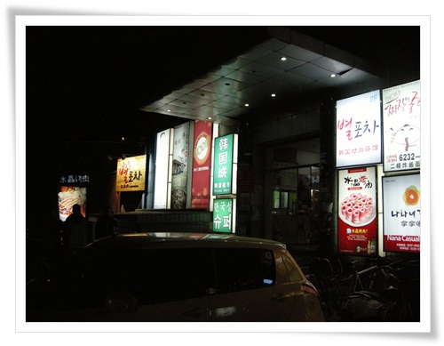

# 7년만의 중국 북경 출장 - 우다코의 水晶 烤肉

2005년 3월이 마지막 중국 출장이후, 7년만에 중국 북경으로 출장왔다.

2002년 12월 크리스마스 연휴 직전에 중국 쑤조우로 간 것이 첫 해외 출장이자, 첫 중국에 가 본 것이었다.

고로 중국도 나에게는 10년라는 역사가 있는 셈이다.

간만에 중국 출장을 앞두고, 모처럼 가슴에 설레였다.  첫출장의 기억도 되살아 나고, 맛있는 중국 음식도 먹을 수 있겠다라는 기대감, 그리고 출장의 목적이 회의라서 체류기간이 일주일이내였고, 내가 책임지고 있는 부분이 아니라, 책임감으로 인한 스트레스트도 별로 없는 편이었다.

가벼운 짐가방을 들고 3시10분발 북경행 아시아나 비행기에 타기 위해 인천공항으로 갔다.

\- 탑승구 37번에서 탑승.  비행기 에어버스기종.

\- 이륙하고 얼마 안 있어 나온 기내식.  역시 기내식은 아시아나가 최고인 듯 하다.

지난 번 별로 맛이 없던 일본행 대한항공 밥을 먹다가 아시아나껄 먹어서 그런가 아주 맛있었다.

\- 비행기는 2시간을 날아서 베이징 서우두 공항에 도착했다.

\- 7년에만에 온 중국은 너무나 낯설었다.

\- 올림픽전후로 무인전철도 생겼나 보다.

\- 무인전철을 타고 입국심사대로 이동중.  공항이 상당히 커졌더군.

\- 입국심사대와 세관을 통과하여 택시승강장으로 이동

\- 택시는 대기없이 바로바로 타면 되었다.

\- 그다지 좋아 보이지 않은 택시를 탔다.

운전사는 '니취 날~'이라며 어디가냐고 물었고,  나는 목적지가 적힌 종이를 보여주었다.

운전사는 호텔까지 이동하는 50여분 내내 전화통화를 하고 있어다.

꽤나 수다스런 남자인 듯 하다.

\- 택시밖 풍경.  잿빛 공기가 이게 중국이구나라는 점을 느끼게 해준다.

\- 올림픽 경기장으로 보이는 건물도 보이고..

\- 길도 예전과 많이 달랐다.

예전 NGT china가 공항가는 길 근처에 있었던 것 같아, 익숙한 풍경이 나오나하고 열심히 창 밖을 봐도 모든 것이 낯설었다.

\- 무슨 공원같은 것도 지나갔다.

\- 목적지 Jade Palace Hotel.  현지 이름은 翠宮飯店(췌꿍판디엔).

그런데 좀 세월이 되었는지 좀 낡았다.

\- 공항에서 호텔까지 오는 거리를 runkeeper로 재 보았다.  거리가 30km정도 되는군.

택시비는 톨케이트비 포함하여 102위안이라고 했다.

그래서 100위안짜리 지폐 두장을 주니, 뭐라뭐라 중국말로 했다.

그래서 이게 잔돈없냐는 말인줄 알고, 없다고 '부짜이'라고 말하려는 것이 잘못 나와 '부야오'라고 발음하여 운전사는 200위안을 다 가지라는 것으로 알아들어 실랑이가 있었다.

결국 100위안 돌려받았지만, 그 정신없는 사이에 영수증 받는 것을 깜빡하고 내렸다.

결국 회사에 청구할 2만원이 날려먹었다.

\- 호텔 프런트에 체크인하는 중.

\- 내 방 462호.  역시 중국답게 방은 크다.

좁은 일본 호텔을 최근 경험해서 더 커 보이는지도 모르겠다.

짐을 놓고, 다들 저녁을 먹기 위해 로비에 모였다.

무엇을 먹을까 다 같이 고민을 했다.

중국에 왔으니, 중국음식 그 중 가장 유명한 음식 베이징카오야를 먹자는 의견이 나와 호텔 직원에게 근처의 베이징카오야 식당을 추천요청했더니, 택시로 4분거리에 있다고 하였다.  중국식당에서 주문하는 게 어려울 거라는 의견으로 포기하였다.

한국 유학생이 모여있다는 칭화대옆 우다코에서 대충 둘러보고 먹자고 하여, 우다코로 향했다.

우다코로 가는 길도 시련이 있었다.

택시기사에서 '우다코짠'이라 하였는데, 뭔가 뜻이 안 통한 것 같았다.

이것도 결국 지도를 꺼내 우다코역을 짚어서야 제대로 갈 수 있었다.

\- 우다코의 한 식당가에 들어갔다.

\- 한국요리집들이 쭉 모여있는 곳이었다.

\- 이중에서 들어간 곳은 고기집인 수정고기집으로 갔다.

\- 이름이 수정으로 되어 있는 이유가 불판을 수정을 사용한 때문이다.

\- 메뉴판을 보니 불고기가 800g에 80위안.  우리돈 15,000원.  싸지는 않다.

실내는 뭐 우리나라 식당 분위기이고, 손님들도 반정도는 우리나라 유학생으로 추정된다.

\- 불판에 소기기 4인분을 구워먹고,

삼겹삽 3인분 구워먹고,

밥 2개 볶아먹었다.

반주로는 몽고주라는 38도짜리 중국술 시켜먹었다.

\- 계산서 모양.

나중 계산을 하니 총 금액인 450위안.

7명이서 8만원어치를 먹은 것이니 먹은 것에 비해 한국보다 싸지는 않은 듯 하다.

출장을 왔으면, 현지인들이 먹는 현지음식을 먹어야 하는데, 출장 온 첫날부터 한국음식을 먹어 많이 아쉽다.

호텔로 돌아가는 길은 걸어가기로 했다.

택시 탈때 대충 보니까, 걸어가다 그리 멀지 않겠다 싶었다.

\- 우다코에서 호텔까지 2.5km를 걸었다.

무려 35분을 걸었다.

걷던 도중 아무래도 길을 잃은 것 같아, 지나가는 행인에게 물으며 찾아 왔다.

역시 대륙의 커서 그런가 제법 멀더군.

\- 호텔 근처 사거리에 있는 맥도날드.  이 맥도날드가 보여서야 안심이 되더군.

이상 중국 출장 첫날 끝.

내가 과연 북경을 와 본적이 있었던가하는 의심이 들 정도로 낯익은 지형지물이 없었다.

그동안 중국이 많이 바뀌었는지, 아니면 나의 기억력이 쇠퇴했는지..

암튼 9년전 무려 8개월이나 학원까지 다니며 배운 중국어도 제대로 못 알아듣고, 길도 헤매어 출발전의 설레임이 많아 사라진 하루다

.

