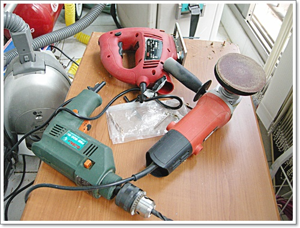
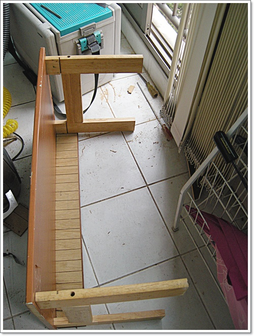
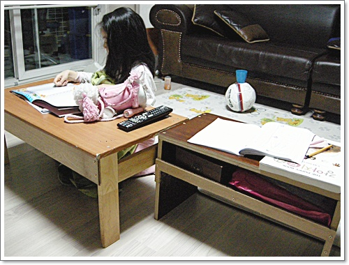

# 베란다공방- 독서테이블 만들기

봄도 되고 하여, 내 공구들이 제대로 동작하는지 시험을 해 보고 싶었다.

공구 욕심이 있어, 공구들을 제법 많이 사 놓은 편이다.

공구를 산 이유를 곰곰히 생각해 보니, 물론 "선지름 후합리화"로 샀으므로, 무엇을 만들기 위한 도구로서 필요한 한게 아니라, 공구 자체가 목적인 것 같았다.

공구를 보며 그냥 흐뭇한 눈길로 쳐다보고 쓰다듬어주는게 다였다.

그래도 공구인데, 잘 동작하는지 결과물로서 만들어봐야겠다는 생각이 들어, 베란다에서 작업을 시작했다.

주제는 독서테이블.

재료는 버려진 침대에서 떼온 MDF, 역시 버려진 장농에서 떼온 MDF 문짝, 그리고 다른 사람에게 얻어온 식탁에서 떼낸 지지대.

뭔가 그럴듯한 도면부터 그리는게 정상이지만, 아직 도면 자체가 익숙하지 않아, 대충 눈 짐작으로 선을 긋고, 나무를 잘랐다.

\- 작업 시작전에는 사진을 찍을 생각을 못 하고 있다가,

거의 다 완료할 때 쯤에야 기록을 남겨야겠다는 생각이 들어, 그제서야 찍었다.

이번 작업에 출동한 전동공구들.

\- 뭘 대충 만든 것 치고는 그럭지럭 된 것 같다.

뭐 2~3mm정도는 안 맞음은 내게 당연한 거고,..

\- 2주에 각각 2시간씩 들여, 총 4시간에 걸쳐 만든 독서대 2개.

딸내미가 사용예를 보이고 있다.

각기 다른 자투리 나무를 사용하여 만든거다 보니 색깔 안 맞긴 하다.

페인트를 칠해볼까하는 고민을 하고 있다.

페인트 칠을 하려면, 사포질도 해야하고, 틈도 메꿈제로 메꿔야 하고, 젯소로 칠한 후 페인트 칠해야 하니 일의 규모가 꽤 커지겠다는 생각과, 페인트값을 들여야하는 계산을 하게 된다.

주어온 목재라 여기까지 만드는데는 돈이 안 들었는데, 페인트 칠하는데 돈을 들어야하는 갈등 중.

