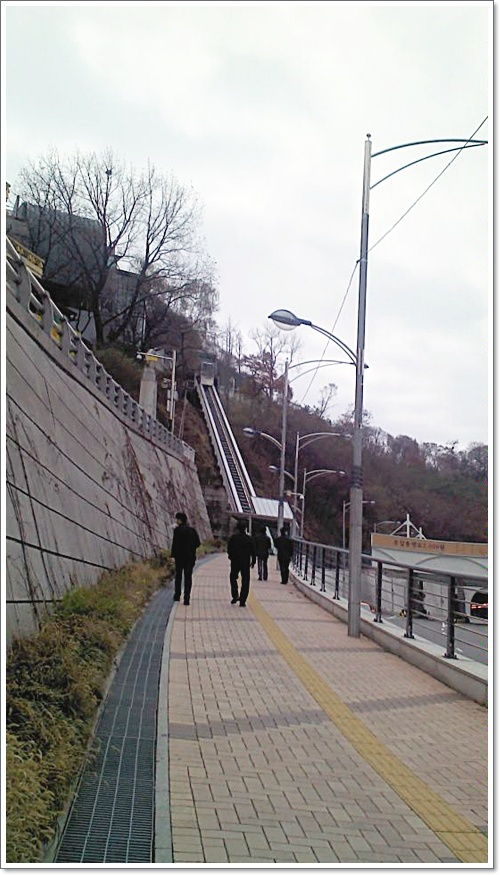
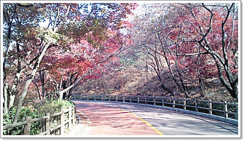
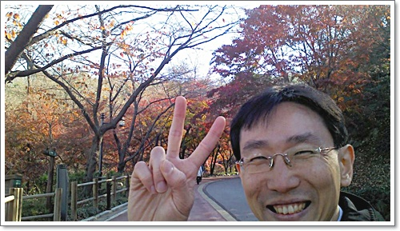
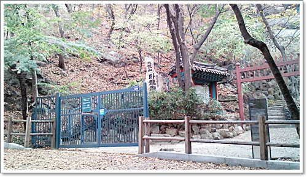
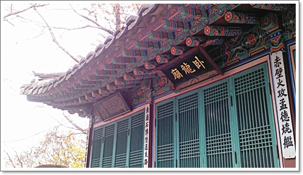
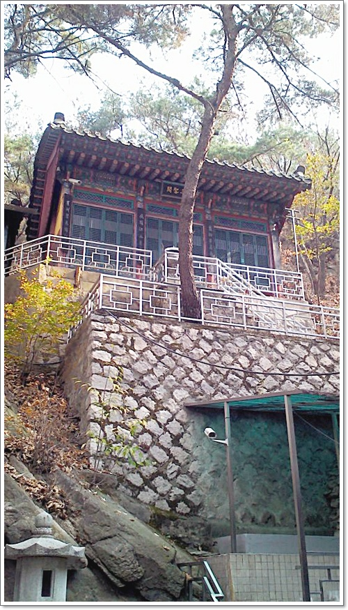
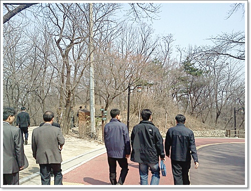

# 매일의 일상 - 점심 시간 남산 산책

명동으로 출근한지 이제 어언 14개월.

남산 자락에 위치한 터라, 점심 시간때 크게 바쁜 일 없으면 남산을 향해 걷는다.

여름 빼고는 어지간하면 갔었던 듯 싶다.

여름에는 아무래도 걷다보면 땀이 나고, 땀이 나면 마땅한 대책이 없어서...

대신 한 겨울에도 거의 안 빠지고 산책했다.

문득 생각난 것이 RunKeeper.

예전 뒷산을 오를때 RunKeeper를 켜고 걸었는데, 남산도 RunKeeper켜고 걸어 궤적을 담아봐야겠다는 생각이 들었다.

\- 점심후 산책.  2.78km, 43분.  저 붉은 색이 나의 산책 표준 코스.

\- 코스의 시작은 경사형 에스컬레이터를 탑승하면서 부터.

\- 케이블카타는 곳에서 좀 더 올라가면 남산 산책길이 나온다.

\- 작년 가을 단풍때 찍은 사진.  어지간히 귀찮아서인지 사진 찍어 놓은 것을 찾아보려 했는데 최근 것이 없더군.

\- 렌즈앞으로 얼굴을 들이민 천진난만한 표정의 조재희과장.

작년 초반 산책 멤버는 조재희과장, 김득중과장 이렇게 세명.

작년 후반 멤버는 조재희과장, 구본용과장 이렇게 세명.

올해 멤버는 구본용과장과 단 둘.

같이 산책하는 동료가 있다는 점이 좋다.

예전 삼성동에서 근무할 때는 심상민과 코엑스를 산책했었고,

양재동에서 근무할 때는 대여섯명이서 양재천을 산책했었다.

가산에서 근무할 때는 그냥 걷기만으로도 척박한 동네라 산책 자체를 못하다가, 이곳 명동에 와서 다시 산책을 시작할 수 있었다.

\- 산책로를 따라 가다보면, '와룡묘'라고 제갈공명 사당이 있다.

서울시 지방민속자료라고 하는군.

관우를 모신 사당은 우리나라에 몇개 있는 것 같은데, 제갈공명을 모신 사당은 여기 밖에 못 본 것 같다.

\- 중심 건물이 와룡묘.  내부에는 제갈공명이 모셔져 있다.

\- 제일 높은 곳에 위치한 삼성각.

내부에는 도성, 칠성, 산신이 모셔져 있었다.

\- 와룡묘 안.  밖에서 봤을 때는 이정도로 있을거로 여겨지지 않았는데,

좁은 장소에 건물이 제법 많이 있다.

\- 3월 말인데, 아직 새순이 없어 갈색의 남산.  그래도 완연한 봄날이라, 사람들이 많이 산책하고 있었다.

