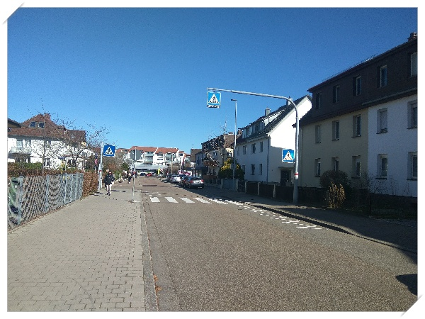

# 독일 칼스루에 유성호씨 동네 구경가기

한동한 의욕이 떨어져 블로그도 방치했었는데, 다시 포스팅을 재개한다.

방치한 사이의 일들을 복기해가는 것으로 시작하며, 그 시작을 작년 독일 여행으로 써 본다.

독일은 예전 한달반동안 Badsaarow 지역으로 출장가 있으면서 지냈던 좋은 기억이 있어 언제 다시 여행해보고 싶은 나라이다.

하지만, 유럽이라는 거리와 여행경비를 생각하지 않을 수 없기에 그냥 희망사항으로만 가지고 있다가 실행에 옮긴게 2019년 2월이다.

무려 한달반이라는 여행 계획을 세웠다.  열흘은 필리핀 보홀에서 스쿠버 다이빙, 그리고 거기서 독일로 가서 3주 보내는 것.

마침 독일 칼스루에에는 친구 유성호씨가 있는 곳이라 숙박을 해결할 수 있다.

최저가 항공편으로 택했기에 가는 길은 멀고도 험했다.

보홀에 있는 클락공항에서 마닐라공항으로 가서, 싱가폴 창이공항으로 환승했고, 다시 베를린 테겔 공항으로 환승해서, 프랑크푸르트 공항에 도착했다.  이동에만 30시간을 썼다.

프랑크푸루트 공항은 무료 wifi가 되어서, 성호씨와 왓츠앱으로 통화했고, 곧 만났다.

프랑크푸루트공항에서 성호씨 동네인 칼스루에까지는 고속도로 한시간 반을 달려 갔다.

가는 동안 한국식 중국집인 중화루에서 짬뽕밥을 점심으로 먹었다.  짬뽕밥 10유로.  역시 유럽이니 밥값이 비싸군.

\- 걸어서 5분 거리인 Ettinglen Was역

\- 한달짜리 정액권을 샀다.  10.3유로.

\- 독일은 중국발 미세먼지가 없어서, 하늘이 참 파랗다.

\- 집 앞을 나서만 바로 보이는 골목길

\- 3주를 보낸 내 침대.

방, 거실, 화장실, 부억 이렇게 구성된 집인데, 내가 거실을 차지했다.

칼스루에서 어떻게 지냈는가는 다음 포스트로 정리할 예정이다.

주로 대학 도서관을 갔다.  완전 현지인처럼 보냈다.

