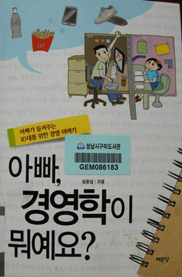

# [책] 아빠, 경영학이 뭐예요

[포사장님](../6166895.html) 이 출판한 "아빠, 경영학이 뭐예요?".

도서관에 구입 신청을 하고서 두달이 지나니, 구입되었다는 문자 메시지가 왔다.

바로 도서관으로 가 책을 빌렸다.

180여페이지 가볍게 읽을 수 있는 분량으로, 40대의 경영컨설턴트가 중학생이 되는 딸에게 이야기하는 방식으로 구성되어 있더군.

"아빠, OOO가 뭐예요?"  형식의 책이 몇개 보이길래, 이게 무슨 시리즈인 줄 알았는데, 죄다 출판사가 다르더군.

쉽게 설명되어 술술 익혀, 1시간만에 마지막 페이지를 넘길 수 있었다.

한 챕터가 끝나면, 경영학 관련 용어 설명이 되어 있는 점이 괜찮더군.

책의 내용은 좋은데, 왜 우리나라에서 성공한 기업들의 현실은 왜 그렇지 않은지가 불편하다.

최근 뉴스 기사에 삼성과 LG등 대기업들의 담합으로 인해 공정위가 과징금을 부과하긴 했지만, 그로 인한 부당이익까지는 환수하지 않는다는 허점과 그 점을 잘 이용하는 기업들의 사례를 보면 이상과 현실은 다르구나라는 점을 느끼지만, 청소년들에게 그런 어두운 면까지 알려줄 필요는 없겠지..

