# 금산여행 - 보석사, 개삼터

회사 동호회의 3월 여행지는 충남 금산.

코스는 보석사와 인삼기념관, 인삼시장, 칠백의총.

이번에도 출발은 명동에서 아침 7시.

조금 시간 여유가 있어, 잠시 회사 사무실에 들렀다.

회사 출근할 때 같이 따라가겠다는 딸내미한테, 아빠 일하는 곳이 어떻게 생겼는지 한 번 보여주고 싶었다.

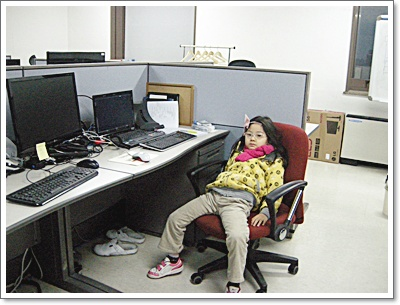

\- 토요일 아침 텅빈 사무실 내 의자에 앉은 딸내미.  영 일 잘하는 자세가 아니군.

버스를 타고, 2시간 반을 달려 충남 금산에 도착했다.

문화해설사의 안내를 받으며 보석사부터 관람을 시작했다.

보석사는 승병장 영규대사의 의병승장비과 의선각, 그리고 한 10년전쯤 한석규가 통신사 광고에 등장했던 숲길로 유명한 사찰이다.

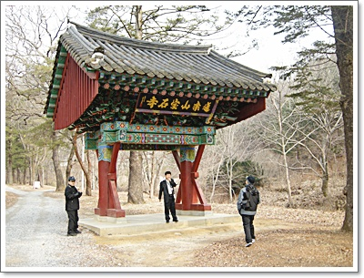

\- 보석사로 들어가는 일주문.  현판은 "진악산 보석사"

보통 큰 절은 일주문-사천왕문-불이문 세개로 되어 있는데, 보석사는 규모가 작아서 그런가 일주문만 있었다.

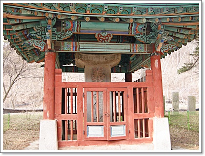

-의병승장비.

조선 선조 때 승려 영규대사가 임진왜란때 금산전투에서 700명을 이끌고 전투하여 전원 순절한 것을 기리는 비다.

일제강점기에 글자 훼손하고, 땅에 묻었다가 나중 다시 파내 제자리 위치한 거라고 한다.

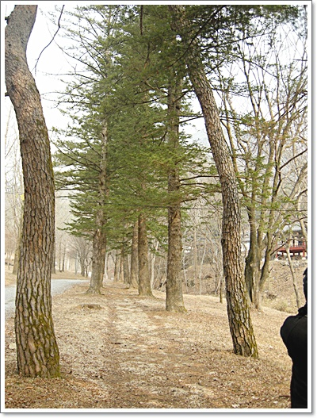

\- 이게 유명한 소나무 숲길.  아직 이른 봄이라서 그런가 그렇게 좋은 줄은 모르겠군.

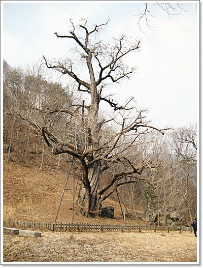

\- 우리나라에서 가장 오래된 은행나무로 용문사앞에 있는 은행나무보다 더 나이가 많다고 한다.

천년정도 된 나무인데, 지금도 은행이 열린다고 하는군.

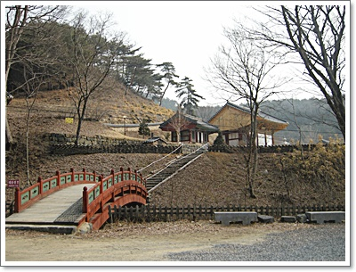

\- 은행나무 뒤로 보석사로 건너는 다리가 있다.

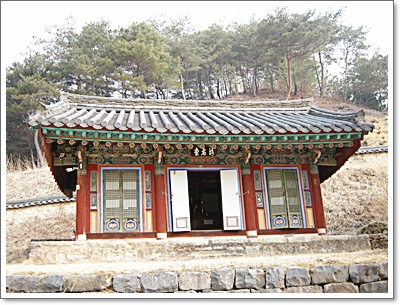

\-  영규대사를 모신 기허당.

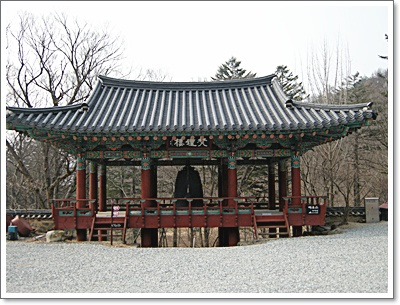

\- 범종루

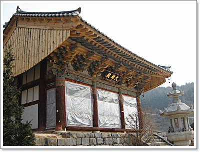

\- 복원수리중인 대웅전

\- 보석사 경내.  오른쪽이 영규대사가 머물렀다는 의선각.

좋게 말하면 참 아담한 사찰이지만, 규모 너무 아담하여 볼거리는 좀 부족하긴 하다.

\- 아담한 대신, 관람객도 적어 산새와 어울어진 경내가 운치가 있긴 하다.

\- 되돌아가며 밖에서 본 범종루.  뭔가 예전에는 좀 더 규모가 컸을 것 같은 느낌이 든다.

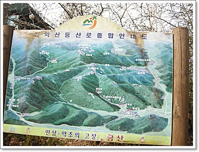

\- 진악산 등산 안내도.  관리가 안되서 그런가 보수가 많이 필요해 보인다.

다음 코스는 개삼터.

금산은 인삼으로 유명하다.

우리나라 인삼의 시작지라고 하고, 그 전설의 시작지를 문화시설로 복원하여 개삼터라고 만들어 놓았다.

아직 공사가 다 끝나지는 않았다.

개삼터의 전설은, 1,500년전 효성깊은 강처사가 아픈 홀어머니 병을 낫게 하기 위해 굴에서 백일기도를 드렸는데, 꿈에 산신령이 나타나 바위벽에 붉은 열매 3개 달린 풀을 달여 먹으면 나을거라 하여, 그 약초를 찾아 달였더니 홀어머니 병이 나았고, 강처사는 그 약초의 씨앗을 금산군 남이면 성곡리 개안마을에 뿌린게 지금의 인삼이라고 한다.

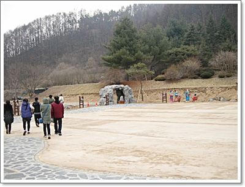

\- 아직 휑한 개삼터.  강처사 전설을 꾸며 놓았다.

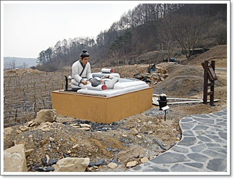

\- 홀어머니 모시는 강처사.

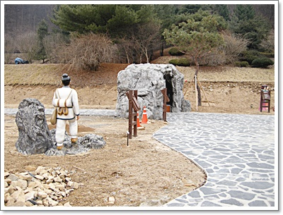

\- 백일기도하러 가는 강처사.

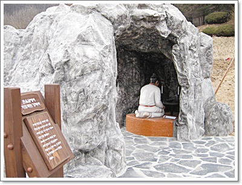

\- 백일기도하는 강처사.

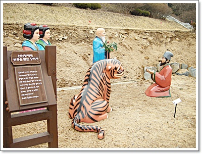

\- 꿈에 인삼 위치를 듣는 강처사.

\- 인삼을 재배하는 강처사.

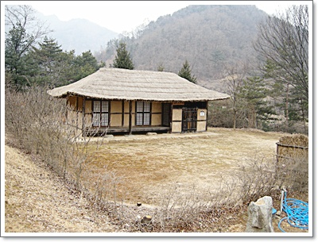

\- 강처사의 집.

개삼터 다음으로 간 곳은 금산인삼관.  인삼박물관인셈이다.

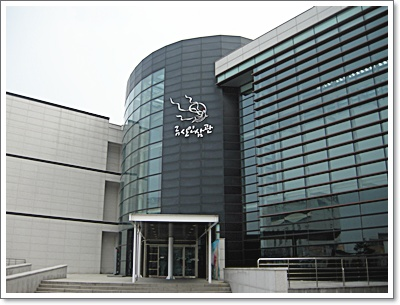

\- 금산인삼관.

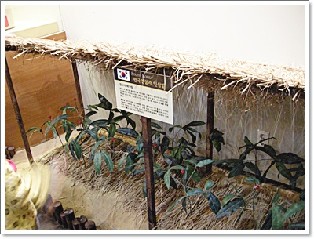

\- 우리나라, 중국, 미국의 일본의 인삼을 설명되어 있고, 수삼,백삼,홍삼 여러가지 설명이 되어 있다.

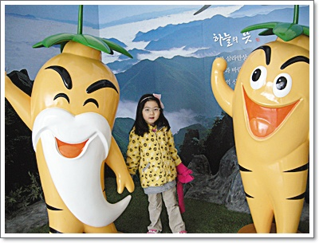

\- 기념관에서 딸내미 사진.

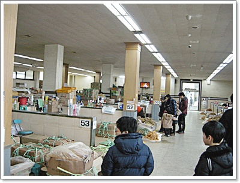

\- 점심먹은 후, 인삼시장 구경.

인삼 나오는 철이 아니라서 그런가 시장은 한산했다.

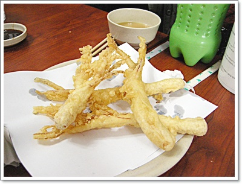

\- 금산 인삼시장에 가면 꼭 먹어야 하는 인삼튀김.

한뿌리에 1,500원.

크기도 크고 맛있다.

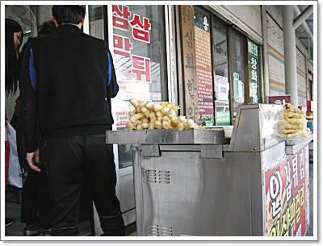

\- 이 집에서 먹었는데, 주인 아저씨가 여간 친절하지 않았다.

다음에도 금산에 오면 꼭 이 식당 들러 튀김과 막걸리 먹어야겠다.

그런데, 식당이름이 영 외우기 힘들군.

상호명이 "금산(토종)인삼튀김"이군.  위치가 인삼농협 옆 98호.

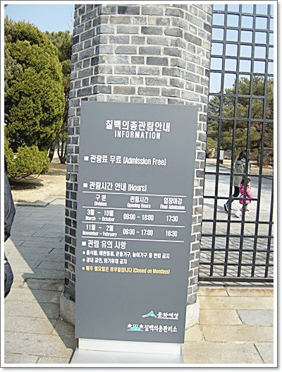

\- 마지막 코스로 칠백의총.

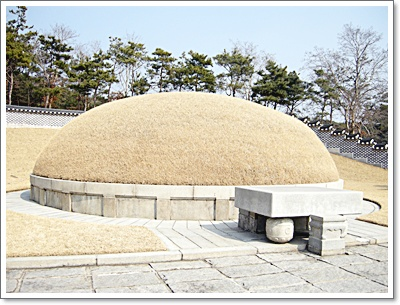

\- 임진왜란때 금산전투에 전사한 칠백의병을 수습한 무덤.

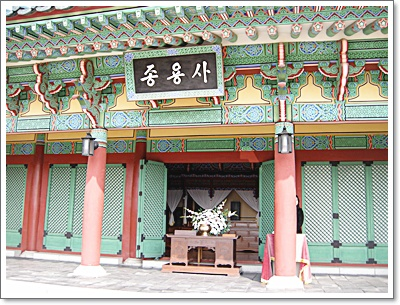

임진왜란 후 인조때 '종용사'로 건립되었다가 일제강점기에 파괴되었다.

그 후 박정희때 복원되었는데, 박정희의 친일행각을 덮을 의도였는지 모르겠지만,

이순신장군 영웅화와 함께 이 곳 칠백의총도 박정희의 지시로 성역화되었다는 사실이 씁쓸하게 느껴진다.

현판 글씨도 박정희의 글씨라고 하는군.

