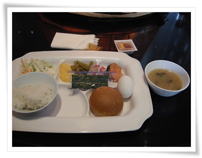
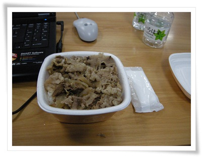
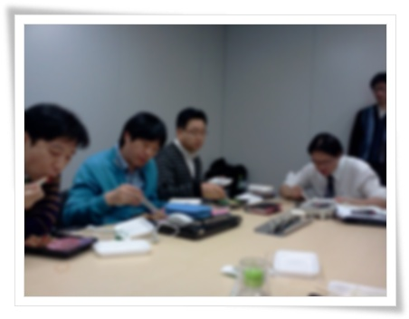
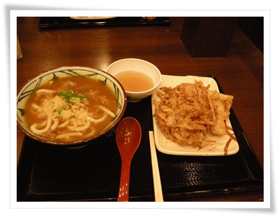
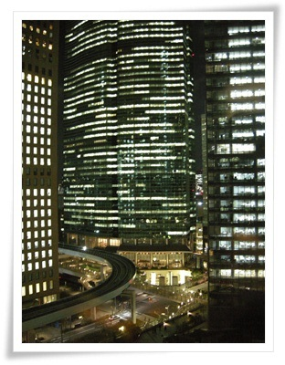
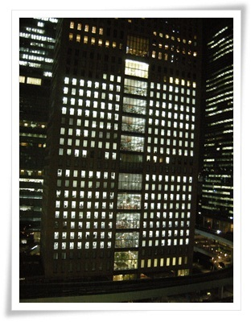
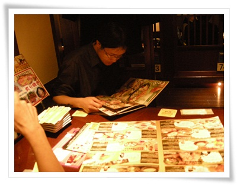

# 일본에서 먹은 일식

내 입맛은 동남아에 가까운 편이다.

한창 중국 출장 다녔을 때, 같이 갔던 사람들은 고추장없이 밥을 못 먹을 때도, 혼자서도 맛있다고 중국 구내 식당 음식 참 맛있게 먹었다.  가장 좋아 하는 음식은 태국의 음식들.  태국 음식은 그냥 상상만 해도 침이 나온다.

일식은 별로 좋아하지 않는다.

그런데 일본 출장이다.

회도 그다지 좋아하지 않아, 회는 그는 초장맛으로나 몇 점 먹는 정도고, 특히 초밥은 무슨 맛으로 먹는지조차 이해 못하는 상태인데 말이다.

일본 음식중에 유일하게 좋아하는 음식이 나가사키짬봉.

암튼, 일본 출장을 갔다.

먹는 것에 대해서는 기대를 버리고 간 상태.

\- 아침은 호텔 로비에서 부페식 식사.  8시 30분에서 먹었다.

그나마 세끼중 가장 먹을 만한 상태.

\- 점심은 보통 이렇게 도시락.  500엔짜리 소고기 덮밥.

\- 점심은 이렇게 골방에 모여 10분만에 후딱 먹고, 또 다시 회의.

\- 한번은 바깥 식당에서 먹은 400엔짜리 우동과, 튀김 250엔어치.

튀김은 맛있었지만, 우동 국물은 짰다.

출장 목적이 회의였기에, 매일 같이 아침부터 저녁 8시까지 쭉 회의 했다.

다행히 저녁 8시가 회의실 전기가 강제로 차단되는 시각이었기 망정이었지, 안 그랬으면 밤새 회의할 뻔 했다.

\- 저녁 8시시 무렵 바깥 풍경.

\- 앞 건물에도 사무실에 불이 다 들어와 있고, 야근을 하고 있다.

야근하는 분위기는 어찌보면 우리나라도 더 한 듯 싶다.

퇴근해서야 드디어 저녁을 먹으러 간다.

9시 넘어서는 호텔 근처 식당이 없었기에, 근처 유흥가로 식사겸 반주를 하러 갔다.

\- 산바시역 근처 술집에서 저녁겸 안주를 고르고 있는 장면.

나오는 안주들이 하나같이 양도 작고, 맛도 내 입맛에 안 맞던지..

