# 도쿄 동네 탐험 - 쓰키지 중앙어시장

도쿄에는 내가 관심있는 볼거리가 없다.

그래도 호텔과 사무실에서만 지내다 귀국하기는 아깝기도 하거니와, 그래도 호텔이 있는 동네가 어떻게 생겼는지 봐야겠기에, 동네 탐험을 나섰다.

호텔이 있는 시오도메.

근처의 관광지로는 쓰키지 중앙어시장과 하마리큐온시정원가 있었다.

정원은 입장료도 있거니와, 개장시간도 오전 9시에야 여는 거라, 시장만 가 보기로 했다.

지도를 보니, 호텔에서 한 2km정도 거리 밖에 안 돼 보였다.

일본 사무실로 9시반까지 가는 거라, 아침에는 시간 여유가 있었다.

아침 7시, 중앙어시장을 향해 호텔을 나섰다.

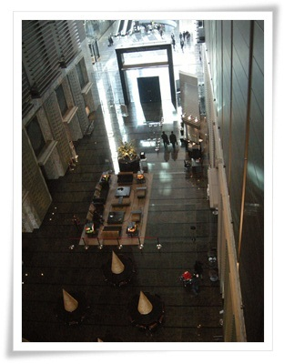

\- 호텔의 아침 풍경.

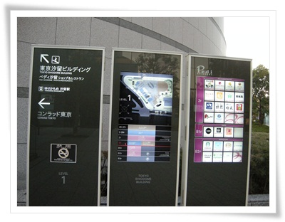

\- 표지판을 잘 보면서 간다.

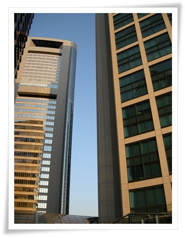

\- 시오도메는 초고층 상업빌딩이 많아 지형지물 분간이 잘 되지는 않았다.

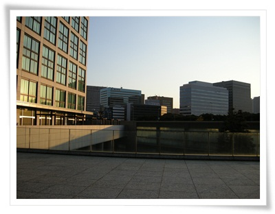

\- 해가 있는 동쪽, 저 쪽이 중앙 어시장.

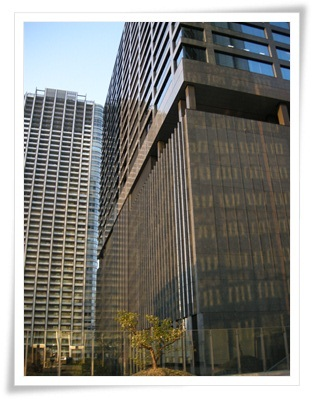

\- 빌라퐁텐 호텔의 바깥은 이렇게 생겼다.

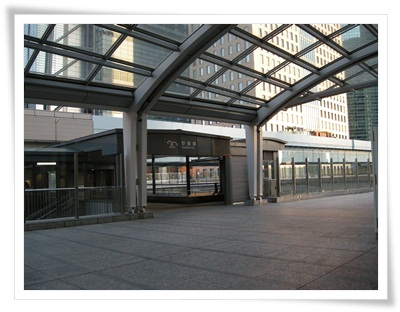

\- 시오도메역을 지나

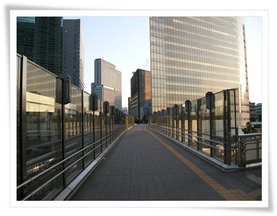

\- 육교를 건넌다.

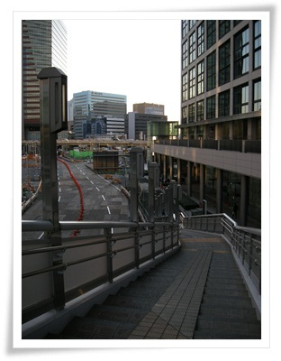

\- 저 방향이 중앙어시장.

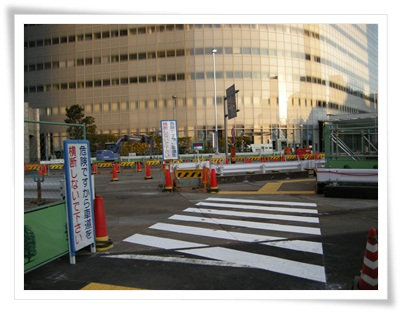

\- 횡단 보도를 건너고,

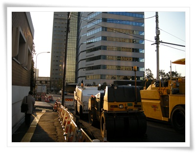

\- 공사중인 길도 지나

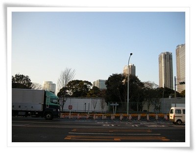

\- 정원을 오른편으로 두고 걷는다.

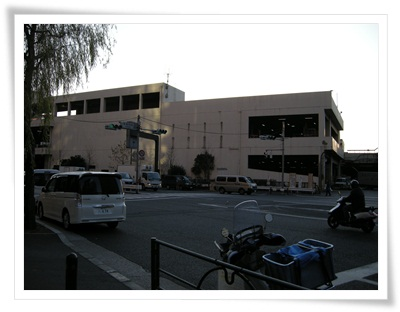

\- 이제 고층건물이 없는 지역이 나왔다.

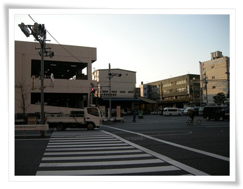

\- 저 건너편이 중앙시장.

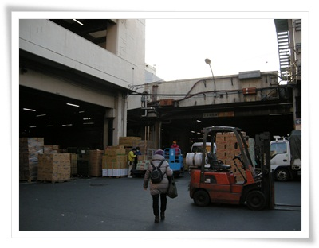

\- 시장 입구.  새벽 5시쯤이 가장 활기찬 시각이라고 했으니, 지금은 한가한 시간.

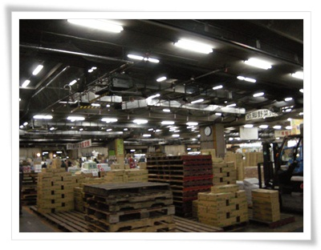

\- 초입부는 청과물 시장.

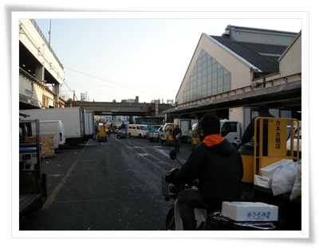

\- 어시장을 향해 계속 걷는다.

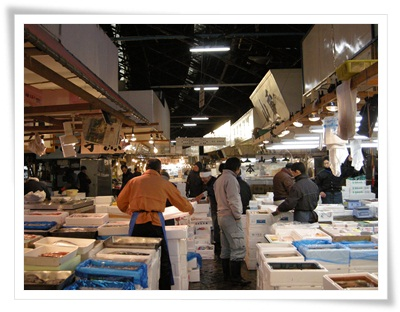

\- 이제 수산물시장

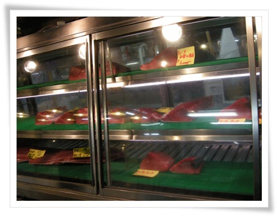

\- 노량진수산시장과 다른 점은 참치가 많이 있다는 점.

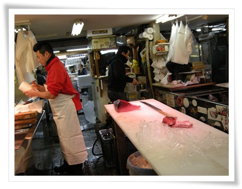

\- 참지 손질하는 집이 많았다.

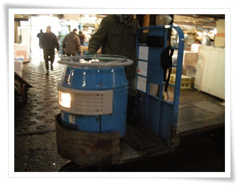

\- 그리고 드럼통모양 엔진으로 된 카트가 시장안을 질주한다.

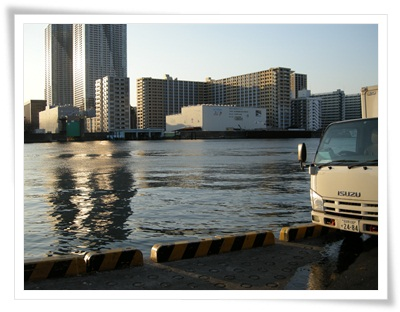

\- 수산시장 마지막은 강과 바다가 만나는 도쿄만이 등장했다.

도쿄만까지 왔으니, 이제 돌아갈 시간.

정원쪽으로 하여 호텔로 가기로 했다.

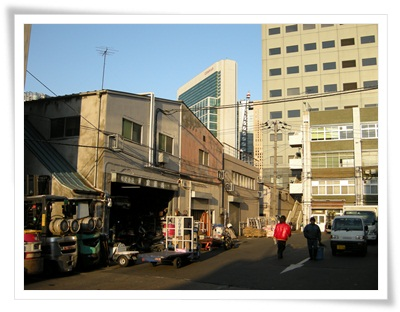

\- 시장내 오래된 건물을 지난다.

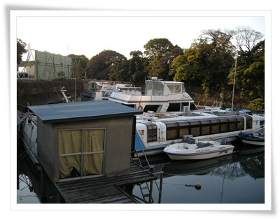

\- 온시정원 바깥 강에는 요트 클럽이 있더군.

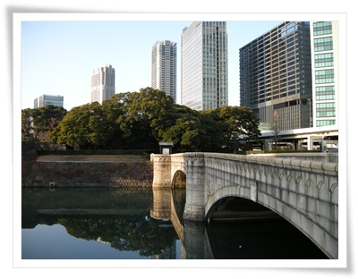

\- 그리고 하라쥬쿠 온시정원.  이 정원이 도쿄에서 제일 넓은 정원이라고 한다.

9시 개장이고, 입장료 300엔.

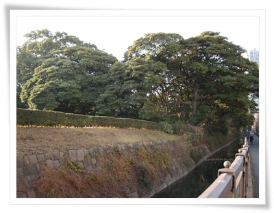

\- 정원 바깥은 사람이 만든 해자인 듯한 물로 둘러 쌓여 있다.

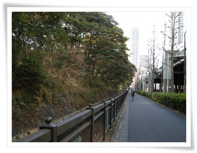

\- 호텔쪽으로 쭉 걸어간다.

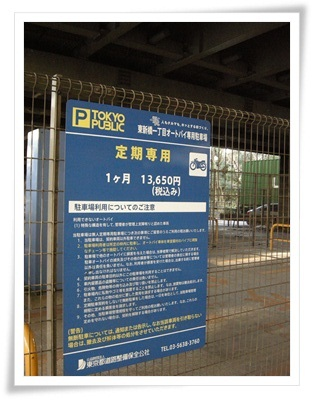

\- 고가도로 밑에 있는 공용주차장.

한달요금이 13,650엔이면 20만원.

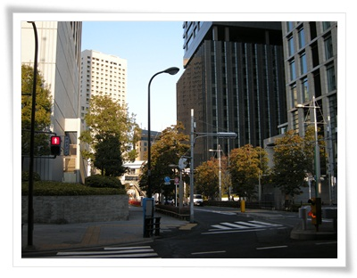

\- 아침 산책 40분 코스 완료하고, 호텔 복귀

