# 첫 일본 출장, 숙소 빌라퐁텐 호텔 찾아가기

2008년 독일이 마지막 출장이었다.

한동안 출장을 안가니, 몸이 근질근질하긴 했다.

4년만에 해외출장을 갔다.

그런데 장소가 하필 일본이다.

일본은 내게 출장이나 여행으로 별로 가고 싶은 동네가 아니다.

이유는 우리나라 서울 풍경과 별로 다를게 없다는 점과 내가 일본음식을 좋아하지 않는다는 점.

그래도 여지껏 간 출장중에서는 제일 짧은 출장이다.

월요일 출국하여, 금요일 귀국하는 4박 5일 일정.

짧은 출장하나만큼은 좋다.

예전에는 출장 갈때면, 많은 준비를 했었는데, 나이를 먹어 귀찮아져서 그런가, 준비도 열심히 안하고 출발하여 자꾸 뭔가 빠뜨리고 가는 듯한 느낌이다.

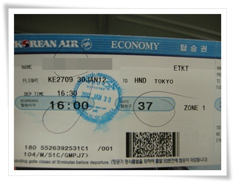

\- 김포공항에서 하네다공항으로 가는 4시반 비행기.

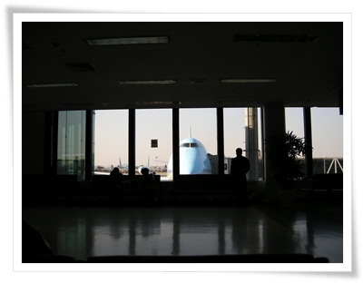

\- 공항에 일찍 도착하여, 그냥 비행기 쳐다보고 있었다.

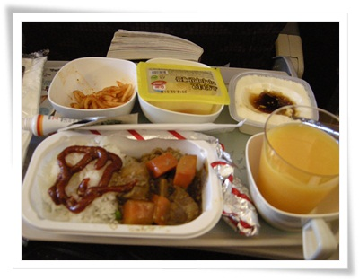

\- 비행기 기내식을 좋아라하는데, 일본행 비행기 기내식이라 그런가 좀 부실하다.

비행기는 2시간을 날라갔다.

동경이 그냥 한시간 정도면 가는 거리인 줄 알았는데, 생각보다는 멀더군.

일본 입국심사를 통과하고, 숙소 Villa Fontaine가 있는 도쿄 시오도메로 향했다.

시오도메로 가기 위해서는 먼저 공항에서 모노레일을 타고 종점인 하마마츠쵸까지 가야 했다.

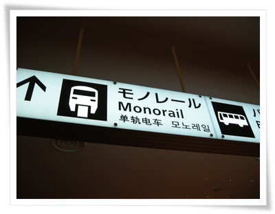

\- 공항엔 한글로도 안내가 되어 있어, 모노레일 방향을 따라 갔다.

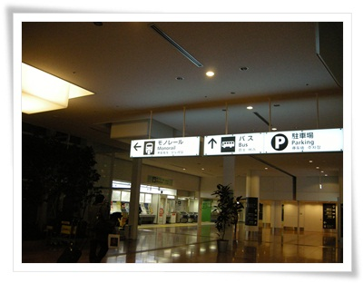

\- 계속 모노레일 표지판을 보고 전진.

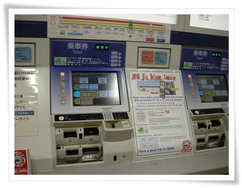

\- 모노레일을 파는 자판기.

그래도 영문 메뉴가 있어 쉽게 표를 구매했다.

하마마츠쵸역까지 470엔.  우리돈 7천원이니 역시 제법 비싸군.

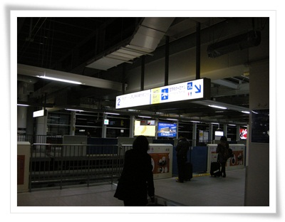

\- 모노레일 승강장은 우리 1호선 지상역 분위기가 난다.

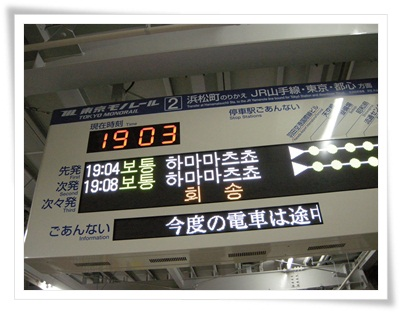

\- 여기도 한글로 안내가 된다.

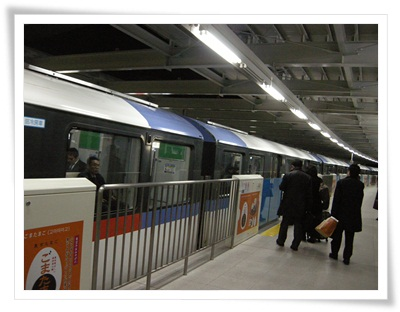

\- 곧 열차가 오고, 탑승.

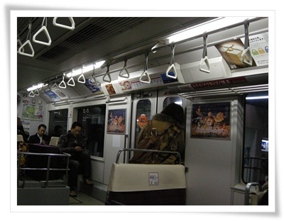

\- 내부 좌석배치는 우리와 좀 다르다.

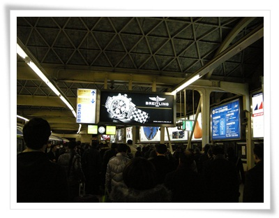

\- 한 20분을 달려 종착역 하마마츠쵸에 도착.

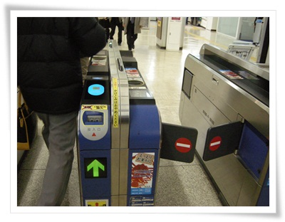

\- 티켓을 넣고 개찰구를 빠져 나왔다.

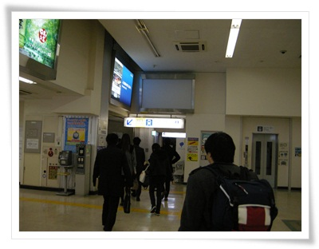

\- 이제 호텔가는 택시타기 위해 택시 표지판을 보고 간다.

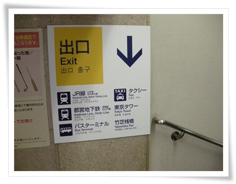

\- 여기도 한글 안내판 있다.  시선을 택시 표지.

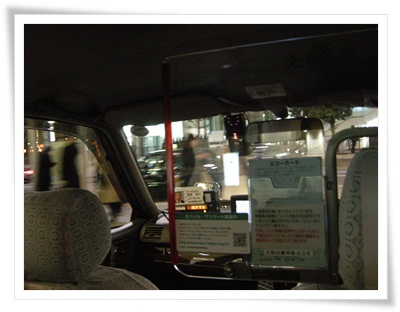

\- 택시를 타고 호텔로 간다.

\- 택시밖 풍경은 그냥 서울과 비슷하여 출장온 느낌은 없다.

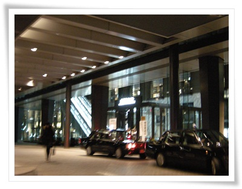

\- 목적지 빌라퐁텐 도착.

택시비는 기본료 710엔.  2km가 기본거리인데 우리돈 만원조금 넘는 돈.

역시 비싸군.

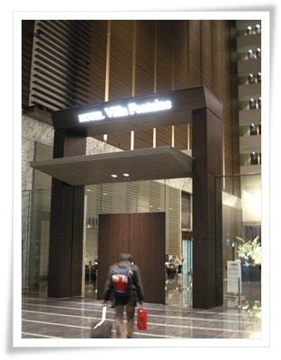

\- 호텔이 건물을 다 쓰는 것이 아니라, 반은 사무공간, 그리고 반이 호텔이었다.

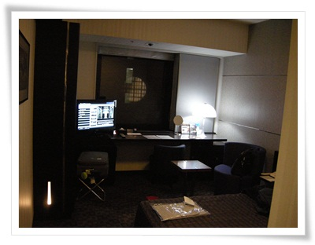

\- 체크인하고 들어온 방 317호.  역시 크기는 작다.

오전에 출발한 멤버들의 회의가 끝난 10시에야 같이 저녁을 먹으로 긴자방향으로 갔다.

너무 늦은 시각이라, 식사하는 곳은 없어 술집으로 갔다.

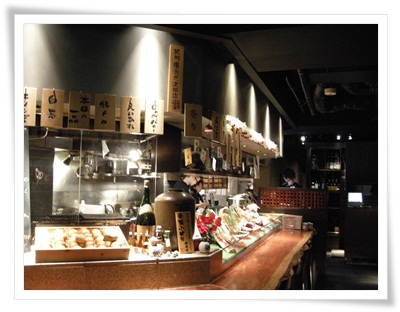

\- 첫 일본에서 식사.

그냥 맥주와 안주를 6명이서 먹었는데 16,770엔.

1인당 4만원2천원이 나왔다.

역시 비싸긴 하다.

맛도 없는데, 가격만 비싸, 영 불만이다.

