# 춘천 신포리 얼음 낚시

처음으로 얼음낚시를 하러 떠났다.

장소는 춘천 신포리.

날씨도 따뜻하고, 화창한 주말, 춘천 신포리를 향해 출발했다.

신포리까지는 2시간 운전을 하니 도착했다.

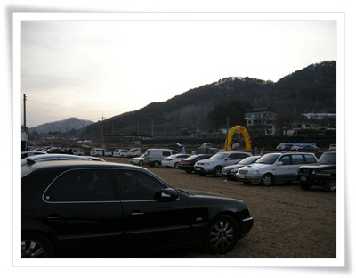

\- 근처 논을 주차장으로 제공했고, 주차장는 충분히 넓었다.

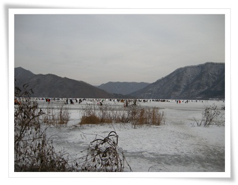

\- 저 넓은 얼음판이 다 낚시 장소

신포리로 가는 도중, 길가에 낚시채비를 싸게 팔았었는데, 그걸 안 사고 도착해서 사니까 제법 비쌌다.

낚시채비와 미끼인 구더기 한상자 사는데 6천원 들었다.

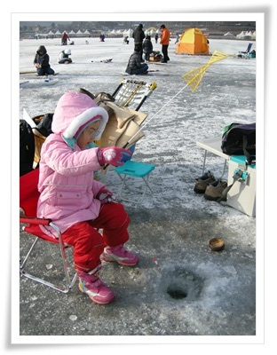

\- 얼음에 구멍을 뚫고 낚시 시작.

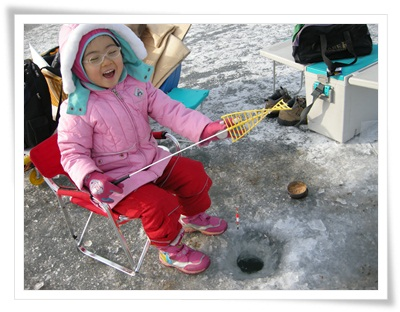

\- 초반이라 고기도 안 잡혀도 즐거운 딸내미.

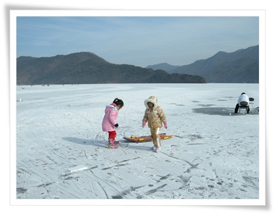

\- 하지만 고기가 안 잡히니 얼마 안 있어 싫증내고, 얼음판에서 논다.

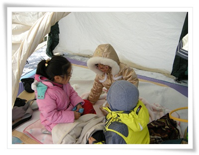

\- 추우면 텐트안에 들어가 놀고,

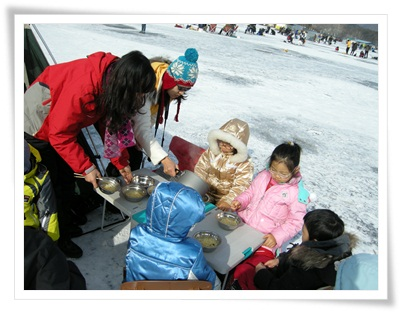

\- 그리고 라면도 먹고,

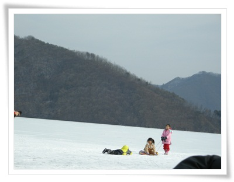

\- 또 썰매 타고 논다.

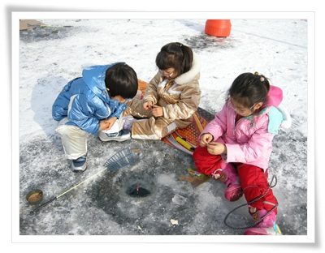

\- 다시 낚시도 해 보고...

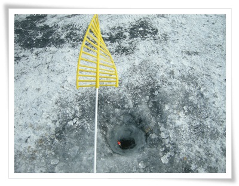

\- 낚시를 하지만, 고기는 한 마리도 못 잡았다.

따뜻한 날씨, 빙어가 전부 깊은 물속으로 들어간 모양이었다.

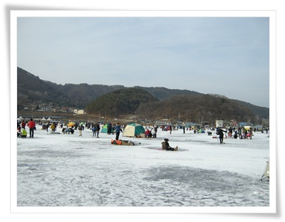

\- 신포리 얼음낚시에온 사람들.

하루 종일 빙어 한 마리 못 잡긴 했지만, 낚시 자체가 목적이 아니었기에 재미있는 하루를 보냈다.

그리고 이런 행사를 준비하는 신포리 마을에 고마움도 있다.

주차도 무료고, 따로 입장료가 있는 것도 아닌, 완전 무료에 이런 행사를 마련해줘서 감사하다.

그런데, 즐겁게 보낸 얼음낚시의 후유증은  컸다.

아내와 딸이 감기에 걸리더니, 그 다음 내가 걸렸고, 어찌나 독하게 걸렸던지, 설 연휴 내내 앓아 누워야만 했었다.

