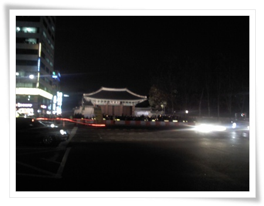
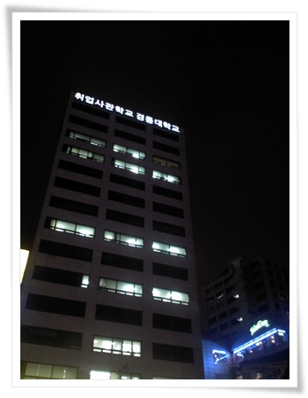

# 12월 20일 저녁 대한문 앞 

퇴근하고 시청 앞 대한문을 향해 걸어 갔다.

영하의 날씨이긴 하지만, 그래도 요 며칠에 비해 그래도 풀린 날씨다.

대한문, 그리고 시청앞 광장.

크리마스트리가 있고, 그 옆 스케이트장에서는 음악소리와 스케이트 타는 사람들이 보인다.

기독교 국가도 아닌데, 트리위에는 십자가가 있다.

미국에서도 교회말고는 십자가는 안단다고 하는데 말이다.

명칭도 해피크리스마스가 아닌 해피홀리데이라는데 말이다.

20일 저녁 8시, 대한문 앞.

추워서 그런가, 김정일이 죽어서 일체의 뉴스가 다 덮어져서 그런가, 사람이 그리 많지는 않다.

22일 BBK 대법원 선고를 앞두고, 마지막이 될 수도 있는 '정봉주 응원메시지 촬영대회'가 시작되었다.

사람들은 계속 모여들어, 초반의 빈구석은 다 메워졌다.

정봉주, 김용민, 주진우, 김어준 차례로 사람들의 박수를 받으며 들어섰다.

갑자기 계획된 거라, 무대시설, 음향시설이 제대로 갖춰지지 않아 소리가 잘 안들리기도 했다.

뭐하는 놈들인지 모르겠다고 하여 90년대 초 붙여진 X세대.

386세대와 88만원세대 사이에 있는 존재라 하여 386-88=298하여 298세대.

X세대였던, 그리고 298세대인 내가 갔다.

쫄지 말라고 하던 그의 지친 모습이 찍힌 사진과 글을 읽었다.

**짠했다.**

그 4인방에게 고마움과 미안함을 느낀다.

내가 할 수 있는 최선이 자리 수라도 채워, 나를 대신함에 고마움을 표하고, 그들이 결코 혼자가 아님을 느끼게 해주는 것이라 생각한다.

고개를 들어 옆을 보니, ' **취업사관학교**'라는 글자가 보인다.

최근 어린 학생들의 장래 희망을 조사했더니 **대기업 '정규직'** 이 1위였었다라는 게 생각난다.

