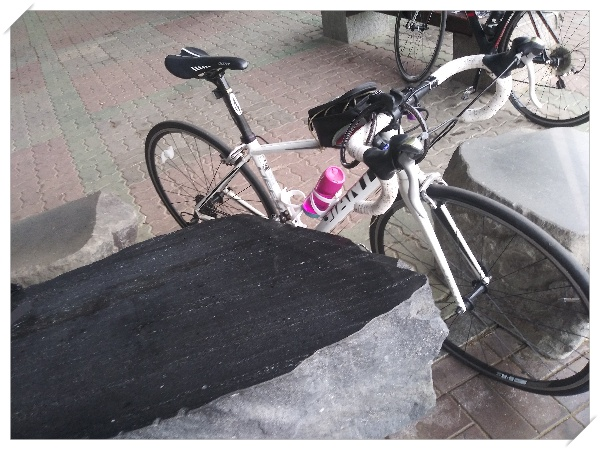

# 1년만의 자전거로 출근

간만에 자전거로 출근했다.

문 앞을 나서는게 제일 힘든 일이다.

3년전까지만 해도 자전거로 거의 매일 60km를 출퇴근하면서 튼튼한 체력을 유지했었는데, 그걸 그만두고서 체력은 체력대로 바닥을 치고, 몸무게는 계속 불어났다.  수치화된 과체중을 인지하면서도 실행에 옮기지는 못했다.  옮기려는 동기조차도 없었다.

작년 가산으로 출퇴근을 하면서 한번 자전거출퇴근을 시도해 본 적이 있다.

청계산 언덕을 넘어 가는는 장장 40km에 달하는 거리였다.

가는데 2시간이 걸렸었다.  가는 동안 펑크도 두번이나 나서 도중에 펑크까지 떼우고 힘들게 갔었다.

그게 마지막 시도였군.

코로나바이러스로 인한 사회적 거리두기도 완화되는 이 때, 나도 다시 한번 의지를 살려보고 다이어트도 시작하기로 했다.

그 첫걸음으로 자전거로 출근

15km.  약 50분 정도 걸렸다.  로드자전거라서 간만에 탔음에도 별로 힘들지 않게 왔다.

5월 2일 토요일 아침 8시 탄천 풍경.  역시 나오니 좋다.

그리고 내 자전거.

