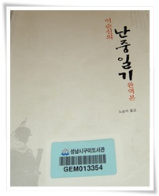
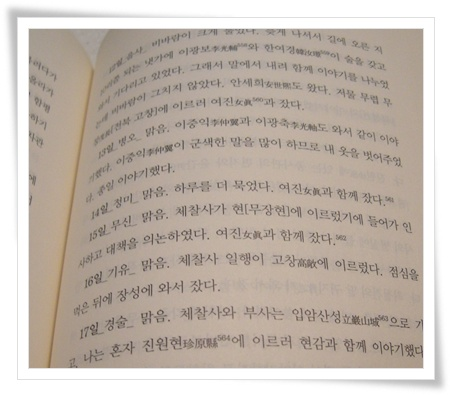
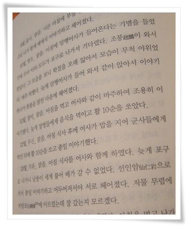

# [책] 난중일기

도서관에서 무슨 책을 읽어볼까 책을 고르는 중 '난중일기'가 눈에 들어왔다.

너무나 유명한데, 정작 한 번도 읽어본 적이 없었다.

읽어보지도 않았는데, 꼭 읽어본 듯 한 책 중 하나가 난중일기가 아닌 듯 싶다.

읽으면서 전화번호부를 읽는 듯 했다.  이순신 장군의 일기에 등장하는 인물들에 대한 배경지식이 없기에, 문맥을 제대로 이해하지 못하겠더군.

어머니와 아들에 대한 깊은 애정이 일기 곳곳에 나온다.

그런데, 아내에 대한 내용은 한구절도 안 보이더군.

혹시 아내가 일찍 죽어서 그런가 싶은 검색을 해 봤는데, 아내에 대한 내용은 정실 방연화 외에는 아내가 언제 태어나 사망했는지에 대한 기록은 안 보이더군.

조선시대 여인들은 어머니로서의 존재감은 있어도, 아내로서의 존재감은 별로 없어서 그런가?

​

\- 읽다가 좀 자극적인 내용이 있었는데, 계집종 여진과 세번 잤다는 내용.

조선시대는 이게 전혀 부끄러운 것이 아니구라는 생각과, 아니면 일기를 정말 정직하게 썼구나라는 생각이 들었다.

\- 학질에 걸린 암행어사를 맞이하던 장면.

암햄어사의 뽀대가 영 안 난다.  학질이라니...

TV에서 보던 '암행어사 출두요'하며 마패를 꺼내들던 위엄있는 모습이 아니더군.

그래서 조선시대 어사에 대해 찾아보니, 어사 대부분이 강도를 만나 죽거나, 이질같은 질병에 걸려 고생했다고 하더군.

조선의 왕 제사날은 휴무일이라 공무를 보지 않는다는 것도 알게 되었다.

위대한 장군이고 충신인데, 선조에게 큰 신임을 받지 못한 것 같고, 그 이유로 사망에 대해 여러가지 설이 있다.

정말 본인이 전쟁 영웅으로 있으면, 선조의 의심으로 가문에게도 화가 미칠 것을 우려하여 일부로 왜군 조총에 전사하는 방법을 택했다는 설에 동조된다.

