# 고운사 여행

의성에 메뚜기 잡기 체험하러 1박2일로 내려간 그 여행의 2일차 여정이 고운사를 찾았다.

단풍이 시작되기 건 한 여행이었는데, 초겨울이 곧 시작되는 이제서야 정리를 해 본다.

의성에서의 숙박은 만경촌.

그때는 아직 개장전인 숙박시설이었는데, 지금은 정식 영업시작하고, 홈페이지도 만들어졌더군.

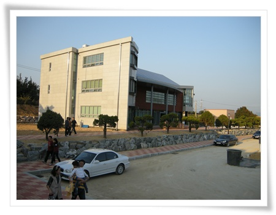

\- 이게 만경촌 본관 건물.

폐교를 리모델링한 펜션+식당+세미나시설+운동시설이다.

운영자가 무슨영농 이렇게 되어 있는 것을 보니, 지역에서 운영하는 것인가 보다.

기억이 나는 것은 식당.

펜션 바로 옆이 식당인데, 오리주물럭을 하는 식당이었다.

식당주인아주머니가 매우 친절했다.  그 친절함에 일부러라도 매상을 올려주고픈 생각도 들도록.

음식도 깔끔하니, 맛있었다.

그 식당에서 저녁과 아침을 먹었다.

고운사.

조계종 16교구 본사 답게, 사찰이 크고 볼 게 많았다.

교구가 지역 사찰의 중심이라고 하며, 조계종이 25교구가 있다고 하더군.

사찰의 조직은 어떻게 되나하는 궁금증이 들더군.

천주교에 주교, 대주교 이런 것처럼, 승려도 계급이 있는 건가?

고운사로 들어가는 곳의 흙길이 참 좋았다.

오랜만에 밟아보는 흙의 느낌도 좋고..

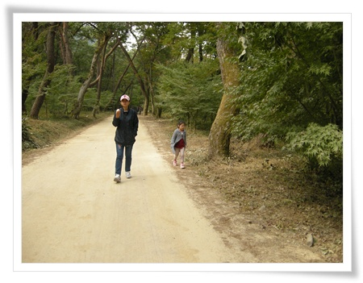

\- 고운사로 향하는 아내와 딸내미.

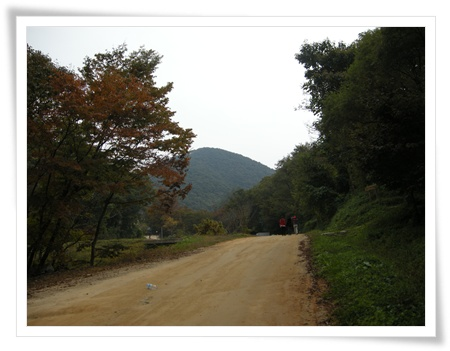

\- 진입로가 제법 길어, 산책로는 최고였다.  저 앞의 둥근 산이 고운사가 있는 곳.

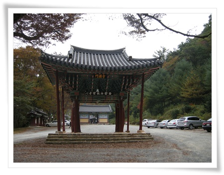

\- 절의 시작, 일주문

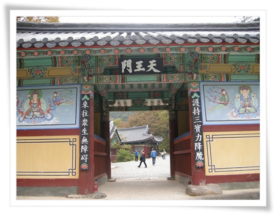

\- 일주문 다음에 있는 천왕문.

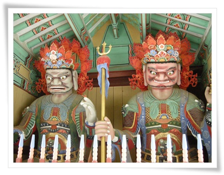

\- 악귀를 몰아주는 사천왕들.

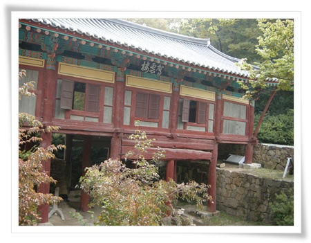

\- 가운루.  고운사에서 이게 제일 유명한 것인지 여행기들을 보면 가운루 사진이 제일 많아 나온다.

특이하면서, 아름다운 건물이다.  보고 있자니 담양소쇄원이 생각난다.

신라시대 최치원이 지은 거라고 하더군.

최치원의 호가 고은인데, 그래서 고은사인가?

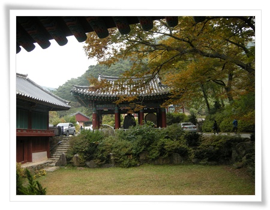

\- 가운루에서 경내쪽을 보면, 이런 풍경.

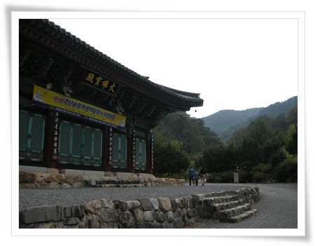

\- 본당인 대웅보전.  석가모니불과 문수보살, 보현보살을 모신 법당.

92년에 완공된 건물이라서 그런가 새건물 티가 난다.

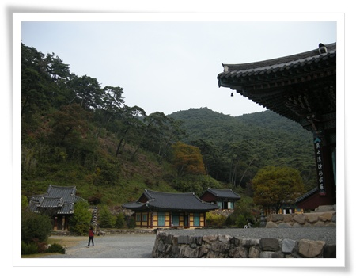

\- 대웅전 왼쪽으로 보이는 경내.  대웅전과 대비대어 아담한 전각들이 있다.

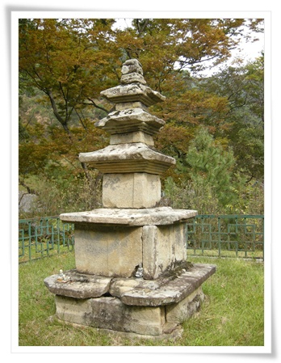

\- 고운산 3층 석탑.

통일신라시대꺼라고 하는데, 국보나 보물은 아니고 문화재자료로 등급되어 있군.

문화재 보는 눈이 없어, 눈을 높힌 후 나중 다시 감상해봐야겠다.

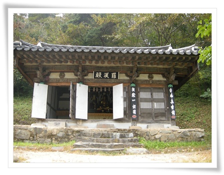

\- 석가모니불과 그의 제자 16나한을 모신 나한전.

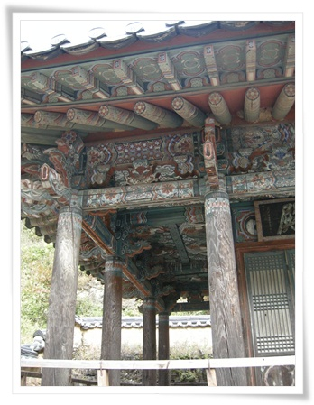

\- 연수전.

영조가 내린 어첩을 보관하던 장소인데, 사찰에서 보니 궁궐분위기 건물이라 특이했다.

그런데, 빛바램이 너무 심한데, 관리가 안되는 듯 해 보인다.

이유가 궁금하군...

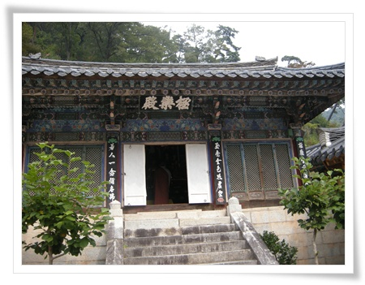

\- 아마타부처와 관세음, 대세지 보살을 모신 극락전.

대웅보전이 신축되기 전까지 이 극락전이 고운사의 중심법당이었다고 하는군.

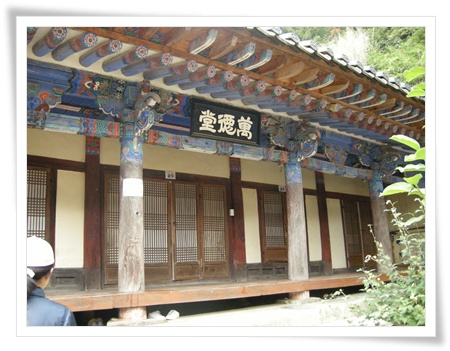

-만덕당.  기둥에는 "이곳에 앉아서 등운산을 바라보세요"라 써 있다.

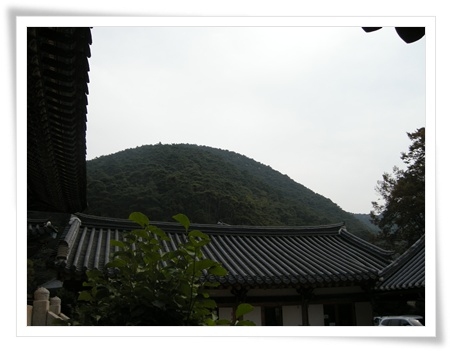

\- 만덕당에 앉아 바라본 둥근 등운산.

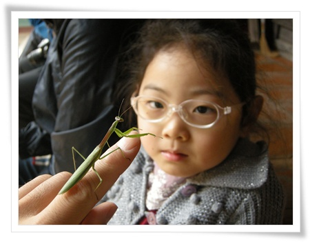

\- 나와 같이 만덕당에 앉아 있던 사마귀를 딸내미에게 보여줬다.

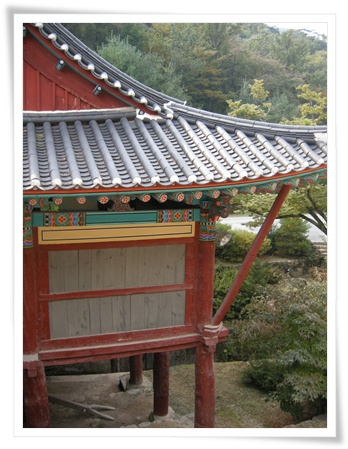

\- 가운루 잎에 있는 우화루.

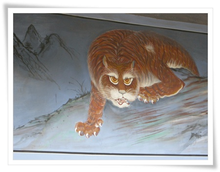

\- 우화루 있는 호랑이 그림.

눈동자가 항상 보는 사람을 응시한다고 한다.

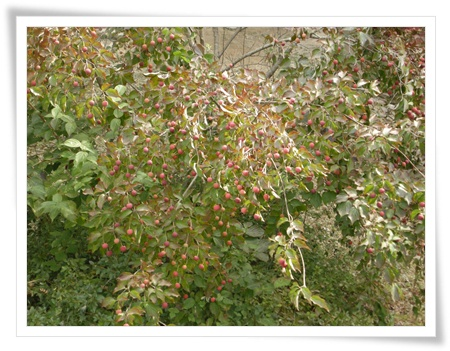

\- 우화루 앞 열매를 가득 매달고 있는 산딸나무.

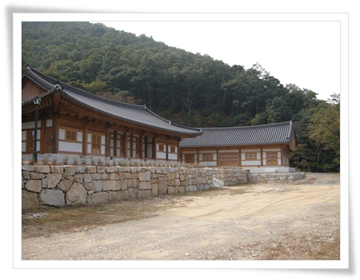

\- 되돌아 와, 일주문 밖 새로 난 길을 따로 올라가 보니, 막 지어진 건물이 있다.  무슨 건물일까?

고운사, 정말 볼 게 많다.

그런데, 일정상 시간이 너무 짧았다.

다시 한번 와 보고 싶은 절이다.

사찰에 관한 책에서 봤던 온갖 전각들이 여기는 거의 대부분 있는 듯 하다.

서울로 올라가기 전, 의성까지 내려온 아쉬움을 덜하고자 총무께서 코스 한 곳을 추가하셨다.

경북산림과학박물관.

위치는 안동.

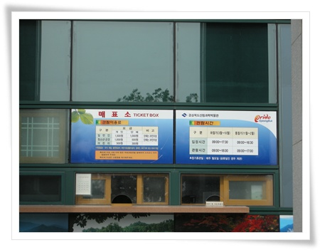

\- 입장료는 천원.  대신 건물만 입장료만 있고, 들어가지 않아도 볼 게 많다.

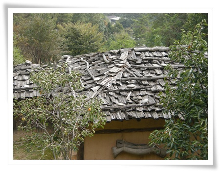

\- 굴피지붕으로 된 집들을 포함한 여러 집들이 재구성 해 놓았다.

서울로 올라가기 전 점심식사로 간 곳은 안동찜닭.

\- 안동시장으로 들어가,

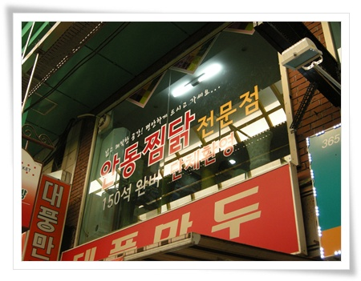

\- 이 곳에서 먹었다.

본진에 와서 찜닭을 먹는구나.

찜닭하면, 2001년 의성에 같은 직장 동료 배완직씨랑 록스타 사러 와서, 처음 먹었던 기억이 떠오르더군.

2000년 초반 엄청난 유행을 하며, 안동찜닭, 봉추찜닭, 그리고 춘천닭갈비에서도 찜닭메뉴가 있었는데, 그 인기도 순식간에 사라져 버리고 없군.

