# 월정사 늦가을 여행

단풍 절정은 이미 지난 11월 둘째주, 월정사를 처음 가 봤다..

단풍이 그렇게 멋있다는 그 오대산을 여태 한 번도 못 가 봤다.

용평 스키장을 가거나, 동해로 가기 위해 영동고속도로를 타면 월정사라는 이정표를 매번 보는데, 그 때마다 저기 한번 가봐야지만 하다가, 이제서야 가 봤다.

일요일 아침 방동면 기린면에 있는 펜션에서 일어나 아침식사를 한 후, 버스로 2시간 반을 달려 도착한 오대산국립공원.

주차장은 사찰의 첫문인 일주문보다 더 깊숙이 있었다.

주차장에서 다리만 건너면 바로 월정사 사천왕문이었다.

조계종 4교구의 본사답게, 사찰의 규모가 큰 것 같았다.

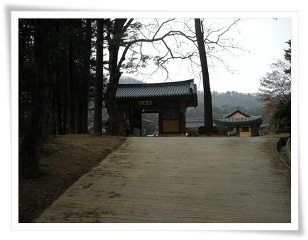

\- 주차장에 이어진 다리 건너 바로 있는 사천왕문.

매번 사찰로 여행을 갈 때 느끼는 너무 아는 게 없어, 제대로 감상을 할 수 없었던 점을 보완하고자 이번엔 월정사에 대해 예습을 하고 출발했다.

특히 사천왕을 구별해보고자, 미리 사천왕에 대한 예습을 주로 했다.

사천왕은 동서남부 네개의 하늘을 다스리는 왕들로서, 부처가 오신 후, 불교에 귀의하여 불법을 수호하는 역할을 하는 존재라고 하며, 불도를 닦는 사람들을 보호하고자 사찰의 입구에 사천왕문이 있다고 한다.

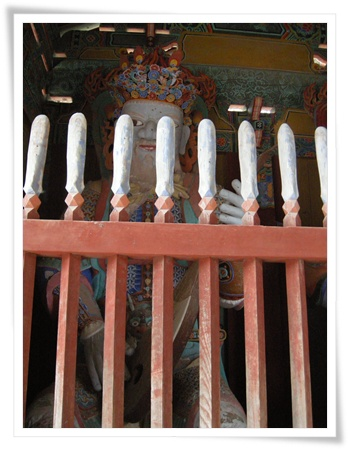

\- 비파를 들고 있는 북방의 다문천왕

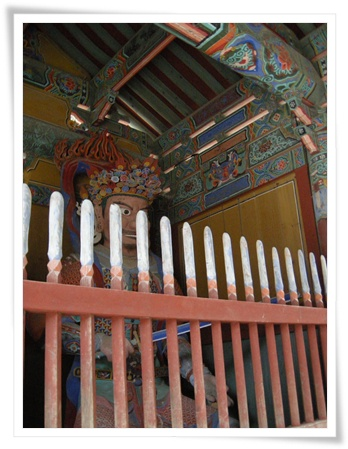

\- 칼을 든 동쪽의 지국천왕

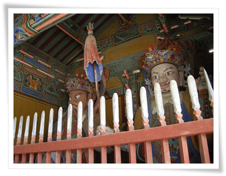

\- 용을 쥔 서쪽 광목천왕과 창을 든 남쪽 증장천왕

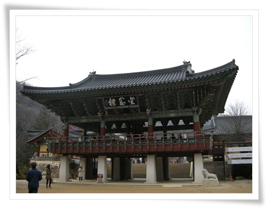

\- 사천왕문 다음 있는 금강루.

우리나라 사찰은 일주문-사천왕문-불이문 이렇게 세 문으로 배치하는게 일반적이라고 한다.

월정사는 금강문이 불이문자리에 있다고 한다.

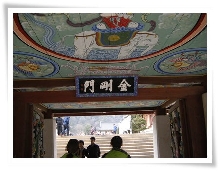

\- 금강문을 통과하면 사찰 본 건물이 나왔다.

금강문을 지키고 있는 금강역사에 대해서 공부를 하고 왔어야 하는데, 의미를 몰라 다음에 공부하고 다시 보기로 다짐하고 통과했다.

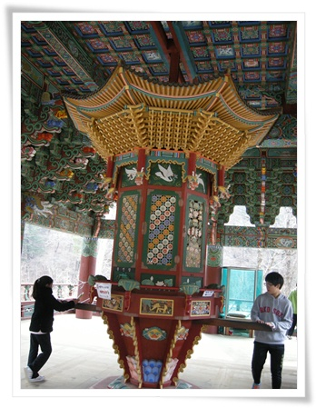

\- 금강루에 있는 윤장대.

저걸 한 번 돌리면, 경을 한번 읽는 것과 같다고 한다.

이건 내가 즐겨 보는 네셔널지오그라피방송에서 본 티벳불교의 특징이라고 하는데, 우리나라도 있는 거였군.

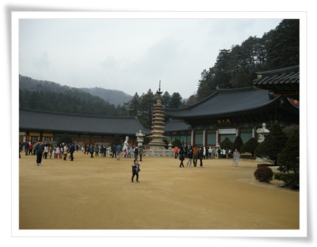

\- 월정사 경내.

중앙에 고려시대 팔각9층석탑이 있다.

6.25전쟁때 다 타고, 저 석탑만 남아 나머지 건물은 다 이후 새로 지은 건물이다.

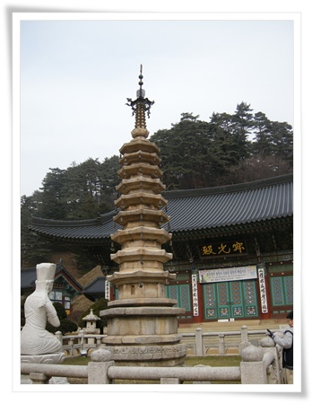

\- 9층석탑과 적광전.

대웅전은 석가모니불을 모시고, 적광전은 비로자나불을 모시는데, 여기 월정사는 특이하게 적광전에 석가모니불을 모신다고 한다.

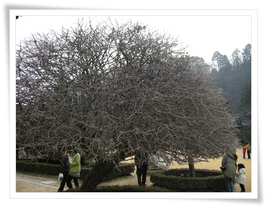

\-  적광전 옆에 있는 커다란 산사나무.  눈 꽃이 피면 참 멋질 것 같다.

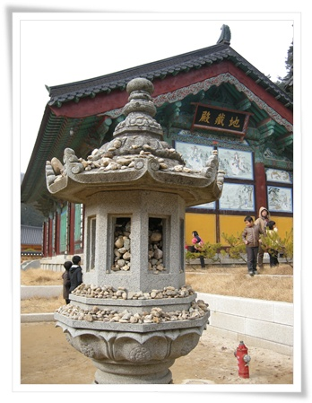

\- 삼성각 앞에 있는 석등.  안에 돌을 채워놓는 것은 무슨 의미일까?

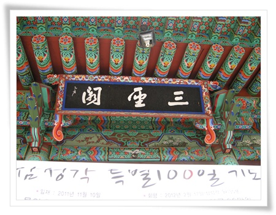

\- 수능이 바로 직전 끝나지 아직 철거하지않은 수능특별기도 현수막이 있는 삼성각.

사찰에 대해 좀 더 깊이 알고자 공부를 했음에도 역시 아는 게 없다.

명색이 불교재단 학교에서 10년을 보냈는데도 말이다.

아는 만큼 보인다라는데,

앞으로 여행에 앞서 좀 더 예습을 하고 떠나야겠다.

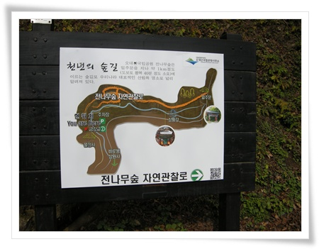

\- 월정사가 전나무숲길로 유명하다고 한다.

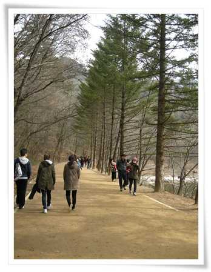

\- 넓직한 전나무숲 흙길이 일주문에서 사천왕문까지 이어져 있다.

단풍이 절정일때 오면 경치는 더욱 좋겠지만, 대신 사람 구경만 하다 가겠지..

오히려 지금이 여행에 더 좋은 시기인 듯하다.

