# 인제 밀리터리테마파크에서 서든어택 게임

11월의 여행으로 간 강원도 인제군.

인제군에 대한 기억은 내린천에서 래프팅을 해 봤고, 읍내 근처에 있던 예비군 훈련장에서 동원훈련을 갔었고, 아침가리골로 오프로드 여행을 갔었고, 진동계곡으로 놀러도 가고 하여 먼 거리에 비해 친숙하다.

특히 아침가리골의 풍광이 좋아, 인제군 이 지역을 좋아한다.

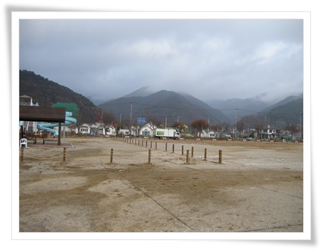

\- 인제군 읍내에 있는 넓직한 테마파크

이번 여행의 첫번째의 장소가  바로 인제군 읍내에 있는 [어드벤처 테마파크](http://www.inje-militarypark.go.kr/).

서든어택이라는 게임이 있나 보다.  그 게임으로 테마파크를 군에서 만들어 운영하는 곳이라 한다.

서바이벌 게임은 세 번째로 해 보는 거다.

2000년에 다음 다닐 때 워크샵가서 팀 단위로 했던 게 처음이었고,

2004년에 뉴젠 다닐 때 사내 여행 동호회였던 여행향기였나 여름향기였나 에서 남이섬에서 했던 게 두번째였다.

처음 서바이벌 게임을 한다고 했을 때 든 생각은, 왜 비싼 돈 주고 그런 쓰잘데 없는 짓을 하는 거지? 라는 거였다.

군대 제대한지도 얼마 되지 않았던 때라, 각개전투, 분대전투, 소대전투 등등 각종 훈련을 통해 했던 것을 왜 제대까지 해서 하나라는 생각이 강했다.

그리고 그 처음이 기억나는게, 아무래도 젊은 사람들이 많았던 회사여서, 병특도 많았고, 예비역도 제대한지 몇년 안된 사람들이 대부분이었다.  군대에서 정상적으로 교육을 받았던 사람들은 포복, 은폐, 엄폐 하다가 조기에 사살되었다.  가장 성적이 좋은 사람들은  병특으로 군대를 잘 모르는 상태에서, 그 시절 가장 인기 있었던 레인보우6를 열심히 했던 친구들이었다.

암튼, 그 때 예비역들은 조기 전멸했었다.

그 두번의 기억이 별로 재미없었던 터라, 이번에도 그리 기대를 하지는 않았다.

그런데 재미있었다.

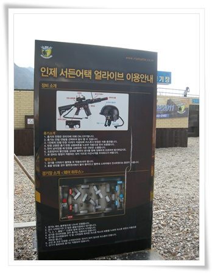

\- 서든어택게임장 사용법

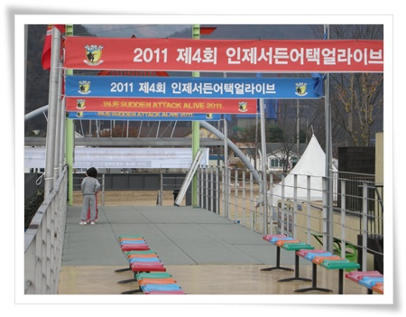

\- 이곳에서 단체 경기도 진행하는구나.

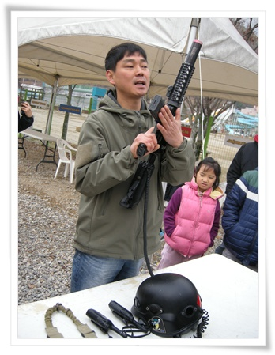

\- 총도 이제까지 했던 페이트탄이 아닌, 레이저로 사망이 판별되는 최첨단 장비.

총과, 센서가 부착된 헬멧이 한세트다.

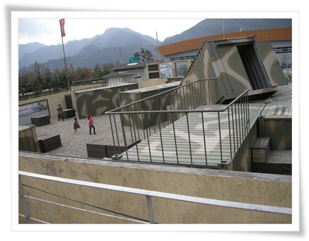

\- 경기장 들어가기전, 일단 위에서 봐본다.  이게 실제 게임과 동일하게 배치를 했다고 한다.

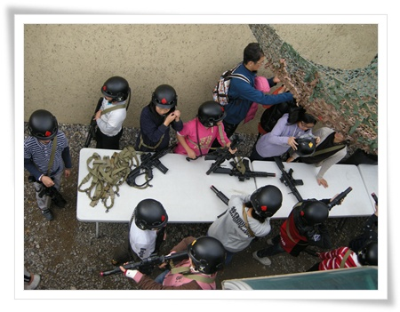

\- 총기 불출식.

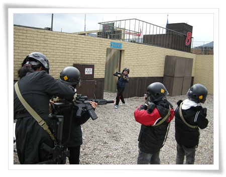

\- 내가 속한 노란색화이바 팀.  성인 남자는 나 혼자.

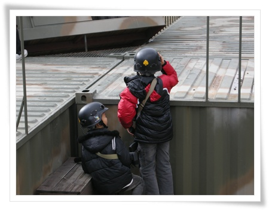

\- 그래도 본 것이 있어, 지형지물에 엄폐하는 꼬마병정들.

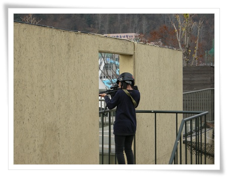

\- 저격수 자리에서 사격도 하고...

전반 10분하고 5분 쉬면서, 상대편과 자리를 바꾸어 후반 10분 하였다.

페인트탄과는 달리, 경기장에 있는 스피커에서 총 소리와 사살시 비명소리도 나고, 각 팀의 사살자수도 실시간으로 표시되었다.

특히 총을 쏘면 내 헬멧에서 총소리가 나고, 내가 명중하면, '나이스샷'이라는 소리가, 내가 사살되면 역시 사살되었다는 멘트가 나와, 진짜 게임을 하는 듯한 몰입이 생겼다.  그리고 사살되면, 경기장 밖의 안전지대로 가서 리스폰 버튼을 눌러 되살아난후, 다시 전투장에 들어가면 되었다.

처음 해 본 아이들과, 엄마들도 꽤 재미있어했다.

다른 서바이벌게임을 한 경험이 있는 아빠들도 이건 꽤 재미있네라는 반응이었다.

그렇게 전후반 전투를 마치고 나니, 이러저리 뛰어다니다녀 추위도 잊고 다들 땀을 흘렸다.

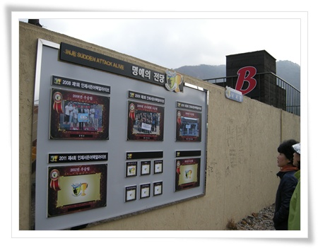

\- 이전 대회의 우승자들 사진이 있는 명예의 전당.

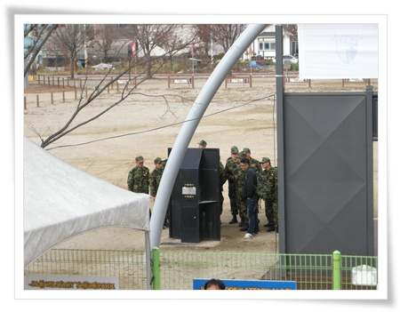

\- 게임을 마치고 나니, 한무리의 군인들이 등장했다.

토요일이라 외박을 나온 군인들이었다.

인제군이니, 위수구역이나 읍내를 벗어날 수 도 없을테고 하여 이 곳을 찾은 듯 하다.

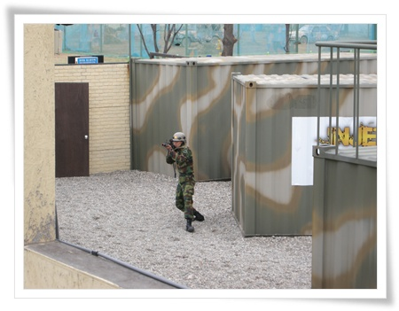

\- 진짜 군인이 하는 서든어택.

같이 온 사람들도 군인이 하는 게임에 흥미가 생겼는지, 다들 군인들이 하는 게임 구경에 빠졌다.

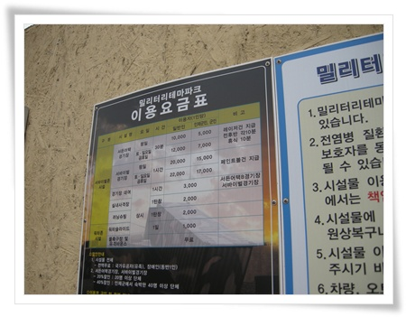

\- 요금을 보니 1인당 만원.

페이트탄을 쓰는 서바이벌과 비슷한 수준인지 모르겠지만, 재미는 이게 훨씬 재미있다.

