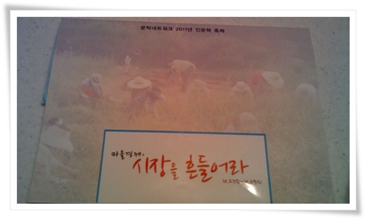
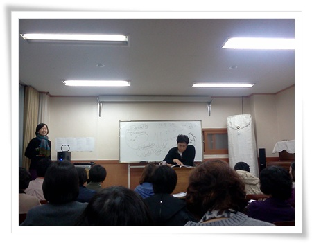

#  문탁네트워크

아내가 최근 다니고 있는 문탁네트워크.

무슨 세미나하는 곳이라고 하여, 강남대에서 하는 무슨 일반인 대상 강좌같은 것인 줄 알았다.

그 문탁네트워크에서 이번 주 인문학축제를 한다고 같이 가지고 나를 꼬드겼다.

심드렁한 나, 안간다고 했다.

아내 혼자 가라고 하고 나서, 그 곳 책자를 좀 넘기다 보니, 호기심이 발동했다.

\- 이번 인문학 축제의 교재.  "마을경제 시장을 흔들어라".

전문적인 강좌가 아닌, 자생적인 세미나 모임같은 거였다.

2년전 문탁이라는 아이디를 쓰시는 분(인터넷 검색해보니유명하신 분이더군)의 거실에서 시작했다고 한다.

지금은 용인시 수지구 동천동에 공간을 마련하여 그곳에서 인문학 학습, 공동살림, 텃밭, 마을경제생산 등을 하는 거였다.

동천동에 있는 건물 2층에 문탁네트워크 공간이 있었다.

토요일은 초청강사로 홍기빈씨를 모신 자리였다.

워낙에 인문학에 아는 게 없어, 이 분에 대해서도 사전 지식이 없었다.

\- 명사 초청 특강. 홍기반의 "마을경제 시장을 흔들어라"

나중에 검색해보니, 'mbc 라디오 손에 잡히는 경제 홍기빈입니다'의 진행자셨더군.

이 분도, 박경철, 윤도현, 김어준에 이어 명박 이념에 맞지 않은 인물로 분류되어 이번 가을 방송에서 퇴출되었다고 한다.

폴 칼리니에 대한 강의였는데, 인문학 지식이 없는 나에게 새로운 것을 알게 해 준 자리였다.

10평정도되는 방에서 2시간 넘는 강의여서, 양반다리로 줄곧 앉아야 해서 허리가 아프긴 했지만, 시장 경제만 있는 것이 아니구나라는 것을 알게 되었다.

강의중 생각나는 것은 살림경제와 돈벌이경제에 대해 설명하면서 나온 탁아소와 밥공장, 그리고 테라피스트.

7~80년대 기억을 되살려 설명을 해주어었는데, 초등학교 학교에 북한이야기 나올 때 애 엄마들이 탁아소에 애를 맡기고 공장에 나가는 비인간적인 사회, 그리고 밥을 집에서 먹는 게 아닌, 밥 공장에서 줄 서서 먹는다는 미친 사회가 바로 북한이다로 했었다는 것이다.  하긴 80년 초반을 초등학생으로 반공교육을 받은 나도 그 기억이 난다.

강사가 말하고자는 살림경제에서 돈벌이경제로 바뀌는 예에서는 벗어나긴 하지만, 요즘 애를 임신하자마자, 어린이집에 예약대기부터 시킨다는 뉴스와, 턱없이 부족한 보육시설이 떠오르더군.

특강이 끝나고, 그동안 자체 세미나를 한 세미나 조직의 발표시간이 있었고, 공동생산으로 화장품을 만들어내던 과정을 설명하는 시간도 있었다.

그리고 저녁 식사.

저녁도 공동 부엌에서 만든 음식으로 참석자 60 여명이 다 같이 먹었다.

많은 생각을 하게 한 자리였다.

이런 마을공동체를 만들고, 움직이게 하는 사람들이 멀리에만 있지 않다는 생각도 들었고,

그리고 나도 인문학을 한번 공부해보고 싶다라는 생각도 심어준 자리였다.

